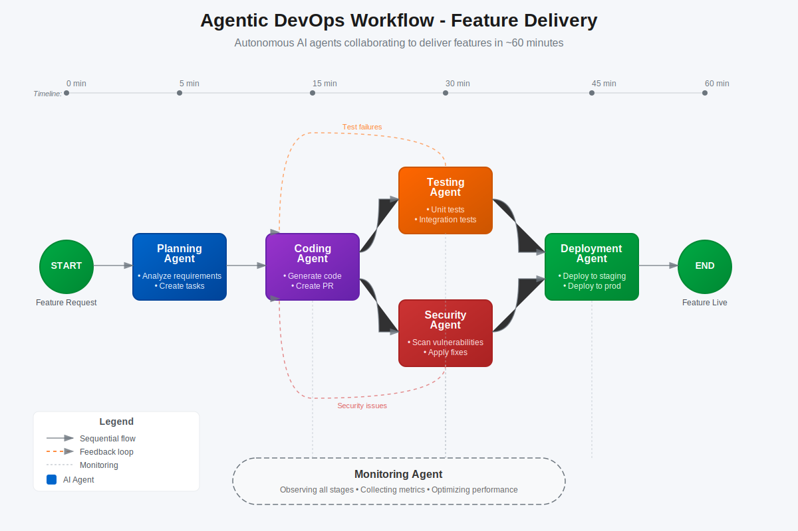

# 🚀 Code AI Develpment Workshop

Welcome to the **Enterprise Code AI Playbook** Workshop! This hands-on workshop guides you through implementing comprehensive AI-assisted development solutions for enterprise applications using GitHub Copilot, Azure AI tools, and agentic DevOps practices.

[](https://code-ai.dev) [](https://github.com/paulanunes85/Code-AI-Dev/stargazers) [](LICENSE)

## Agentic DevOps Workflow - AI-Assisted Development Implementation

<div align="center">
  
</div>

## 🌐 Official Workshop Website: [code-ai.dev](https://code-ai.dev)

## 📖 The Journey to AI-Enhanced Development

Welcome to the Enterprise AI-Assisted Code Optimization Workshop! This repository takes you on a transformative journey from traditional development to the world of AI-assisted optimization and agentic DevOps.

As a developer in today's enterprise environment, you face a critical challenge: **most of your time isn't spent creating new value**. According to our development productivity research:

* **60%** of time spent on non-coding tasks (planning, meetings, research)
* **30%** on maintaining existing code (bug fixes, refactoring)  
* **Only 10%** writing new code that delivers business value
* High cognitive load from context switching between different tasks
* Reactive problem-solving instead of proactive optimization

This workshop provides hands-on guidance to implement AI-assisted development using modern tools and practices. We'll demonstrate how GitHub Copilot, Azure AI, and agentic workflows can transform your development efficiency.

<div align="center">
  
</div>

> "AI-assisted development is not about replacing developers, but about amplifying their abilities to solve complex problems faster and more effectively."

## ⭐ Business Impact

Organizations implementing comprehensive AI-assisted development report significant benefits:

* **Faster Development Velocity**: Reduce routine development tasks by 50-70%
* **Higher Code Quality**: 30-40% improvement in code quality metrics  
* **Accelerated Time-to-Market**: 25-35% faster feature delivery
* **Enhanced Security**: 40-60% reduction in security vulnerabilities
* **Developer Satisfaction**: Shift from 60% maintenance work to 70% value creation

Advanced AI adoption enables the progression through four maturity stages:

1. **Manual**: Traditional development processes
2. **Assisted**: AI-powered code completion and suggestions
3. **Augmented**: Intelligent workflows and automated optimization
4. **Autonomous**: Self-optimizing systems and agentic operations

## 📋 Workshop Structure

The workshop is organized into progressive modules, allowing you to choose the depth of coverage based on your time and experience:

| Level          | Duration | Focus                           | Best For                               |
| -------------- | -------- | ------------------------------- | -------------------------------------- |
| **Essential**  | 90 min   | Core concepts and basic setup   | Beginners, time-constrained sessions  |
| **Standard**   | 2 hours  | Complete AI workflow implementation | Intermediate users, standard workshops |
| **Advanced**   | 3+ hours | Enterprise-scale solutions      | Experienced practitioners, deep dives  |

## 🗺️ Learning Path

### 1️⃣ Foundation to AI-Assisted Development

* Understanding the AI development paradigm
* GitHub Copilot fundamentals and capabilities
* Setting up your AI-enhanced development environment

### 2️⃣ Beginning Your AI Development Journey

* Workshop preparation and tool setup
* Creating your first AI-assisted optimization
* Exploring GitHub Copilot fundamentals

### 3️⃣ Code Optimization and Security

* Performance optimization techniques
* Security vulnerability detection and remediation
* Using AI for code quality improvements

### 4️⃣ Advanced GitHub Copilot Features

* Copilot Chat and workspace features
* Custom AI workflows and automation
* Advanced code generation patterns

### 5️⃣ Enterprise Integration

* CI/CD pipeline integration
* Azure AI services integration
* Enterprise governance and compliance

### 6️⃣ Agentic DevOps Implementation

* GitHub Copilot Coding Agent setup
* Autonomous development workflows
* Multi-agent collaboration patterns

### 7️⃣ Production Optimization

* Performance monitoring and optimization
* AI-powered incident response
* Continuous improvement strategies

### 8️⃣ Hands-On Challenge Labs

* Real-world optimization scenarios
* End-to-end implementation exercises
* Java and .NET practical examples

### 🧩 Troubleshooting Guide

* Common setup issues and solutions
* Advanced debugging techniques
* Performance optimization strategies

## 🔑 Prerequisites

### Required Accounts

* GitHub account with GitHub Copilot access (trial available)
* Azure subscription (free tier available)
* Access to development environment (VS Code recommended)

### Technical Requirements

* Development environment: VS Code, Git, Node.js/Java/.NET
* Basic understanding of software development
* Familiarity with either Java or C# programming

## 🛠️ Getting Started

1. **Fork and Clone this Repository**
   ```bash
   git clone https://github.com/YourUsername/Code-AI-Dev.git
   cd Code-AI-Dev
   ```

2. **Register for Workshop Access**
   * Visit [code-ai.dev](https://code-ai.dev) to register
   * Set up GitHub Copilot access

3. **Follow the Workshop Structure**
   * Start with Foundation to AI-Assisted Development
   * Progress through the modules based on your experience level
   * Use the Troubleshooting Guide if needed

## 🌟 Key Features

* **AI-Enhanced Development**: Learn to implement GitHub Copilot for intelligent code optimization
* **Multi-Language Support**: Build skills with both Java and .NET examples
* **Real-World Scenarios**: Practice with authentic production-like challenges
* **Progressive Learning**: Start from basics and advance to enterprise-scale solutions
* **Agentic Workflows**: Use AI agents to automate development processes

## 📱 Connect With Us

* **Official Website**: [code-ai.dev](https://code-ai.dev)

## 🔗 Related Repositories

### Azure AI Ops Observability Workshop

A comprehensive guide for implementing AI-enhanced observability solutions for cloud applications. This workshop provides hands-on guidance for Azure Monitor, Application Insights, and Azure SRE Agent implementation with practical workflows and enterprise-scale solutions.

### Design-to-Code Playbook

A complete guide for transforming Figma designs into production-ready code. This playbook provides a structured approach to converting design assets into high-quality, accessible, and maintainable code with modern tools and AI assistance.

## 👤 Credits

This Enterprise AI-Assisted Code Optimization Workshop was developed by Paula Silva, Developer Productivity Global Black Belt at Microsoft Americas. The workshop provides a comprehensive approach to implementing AI-assisted development practices and agentic DevOps workflows for modern software applications.
