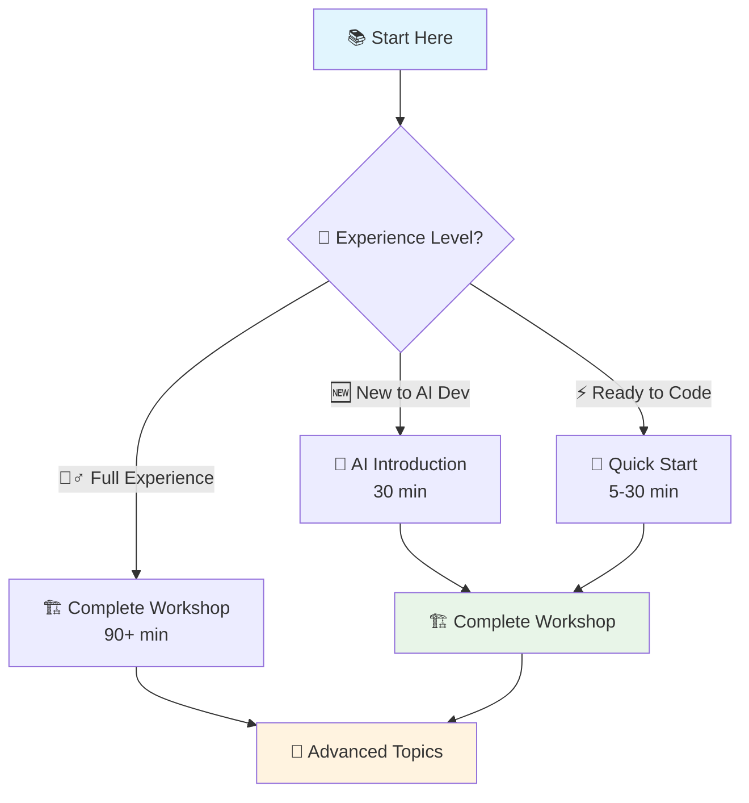

# 📚 Workshop Documentation

This directory contains comprehensive documentation for the **AI-Powered Development Workshop**, providing structured learning paths from beginner to enterprise-level implementation.

## 📋 Overview

The documentation provides a complete learning framework for AI-assisted development, including:

- **Progressive Learning Modules** from basic concepts to enterprise deployment
- **Hands-On Workshops** with real code examples and exercises
- **Troubleshooting Guides** for common issues and enterprise scenarios
- **Quick Start Guides** for immediate implementation
- **Best Practices** for enterprise AI governance and security

## 🚀 Quick Navigation

### 📖 Core Documentation Modules

| 📚 Module | 🎯 Purpose | ⏱️ Duration | 👥 Target Audience |
|-----------|------------|-------------|---------------------|
| [🚀 Quick Start](QUICK_START.md) | Immediate setup and first AI code | 5-30 minutes | All participants |
| [🤖 AI Introduction](ai-dev-introduction.md) | Understanding AI-powered development | 30 minutes | Beginners |
| [🏗️ Complete Workshop](complete_workshop_guide.md) | Comprehensive hands-on implementation | 90+ minutes | All levels |
| [🆘 Troubleshooting](troubleshooting_guide.md) | Problem resolution and diagnostics | As needed | All participants |
| [🏢 Workshop Structure](workshop_structure.md) | Instructor guide and facilitation | Variable | Instructors/Facilitators |
| [🤔 Workshop FAQ](workshop-faq.md) | Comprehensive Q&A for all topics | As needed | All participants |

### 🎯 Learning Paths

## 📊 Workshop Success Framework

### 🎯 Learning Outcomes

By following this documentation, participants will achieve:

| 🏆 Outcome | 📖 Description | 📈 Measurable Result |
|------------|----------------|---------------------|
| **🤖 AI Tool Mastery** | Proficient with GitHub Copilot and AI-assisted development | 3x faster code generation |
| **⚡ Performance Optimization** | Identify and fix performance bottlenecks | 10x+ improvement in critical operations |
| **🔒 Security Implementation** | Apply enterprise-grade security patterns | Zero SQL injection vulnerabilities |
| **🏢 Enterprise Ready** | Deploy production-ready AI solutions | Full CI/CD pipeline implementation |

### 📈 Skill Progression Matrix

| ⏱️ Time Investment | 🎯 Skill Level | 🏆 Achievements | 🔗 Next Steps |
|-------------------|---------------|-----------------|---------------|
| **5-30 min** | 🆕 Beginner | Working GitHub Copilot setup | [🚀 Quick Start](QUICK_START.md) |
| **60-90 min** | 🥈 Intermediate | Performance & security patterns | [🏗️ Complete Workshop](complete_workshop_guide.md) |
| **2+ hours** | 🥇 Advanced | Enterprise deployment ready | [🏢 Workshop Structure](workshop_structure.md) |

## 🛠️ Technical Requirements

### Prerequisites for All Workshops

- **GitHub Account** with Copilot access (30-day free trial available)
- **Development Environment**: Visual Studio Code with extensions
- **Programming Language**: Choose Java 17+ OR .NET 8+ 
- **Internet Connection** for AI services and repositories

### 🤖 Automation Resources Integration

All documentation integrates with automated setup tools in the [`/resources`](../resources/) directory:

- **🏗️ Infrastructure Setup**: [`setup-azure-infrastructure.sh`](../resources/setup-azure-infrastructure.sh)
- **✅ Environment Validation**: [`validate-setup.sh`](../resources/validate-setup.sh)
- **🔄 CI/CD Templates**: [`github-actions-workflow.yml`](../resources/github-actions-workflow.yml)
- **💻 Code Examples**: [`DatabaseConnection.java`](../resources/DatabaseConnection.java) | [`DatabaseConnection.cs`](../resources/DatabaseConnection.cs)

## 🎓 For Instructors and Facilitators

### 📋 Workshop Delivery Guide

- **[🏢 Workshop Structure](workshop_structure.md)**: Complete instructor framework with timing, facilitation tips, and enterprise rollout strategies
- **[🆘 Troubleshooting](troubleshooting_guide.md)**: Advanced diagnostics and issue resolution for workshop environments
- **Assessment Framework**: Built-in success metrics and completion checklists

### 🎯 Customization Options

- **Modular Design**: Pick and choose modules based on audience needs
- **Time Flexibility**: Scale from 30-minute sessions to multi-day workshops
- **Skill Levels**: Content appropriate for beginners through enterprise architects
- **Language Choice**: Full support for both Java and .NET ecosystems

## 🔗 External Resources

| 🌐 Resource | 📖 Description | 🔗 Link |
|-------------|----------------|---------|
| **GitHub Copilot Docs** | Official documentation and best practices | [docs.github.com/copilot](https://docs.github.com/copilot) |
| **Azure AI Services** | Enterprise AI platform documentation | [docs.microsoft.com/azure/ai](https://docs.microsoft.com/azure/ai) |
| **Workshop Website** | Official workshop portal | [code-ai.dev](https://code-ai.dev) |

## 🆘 Support and Community

- **📖 Comprehensive Troubleshooting**: [troubleshooting_guide.md](troubleshooting_guide.md)
- **🐛 Issues and Questions**: [Repository Issues](https://github.com/your-repo/issues)
- **💬 Community Discussions**: [GitHub Discussions](https://github.com/your-repo/discussions)
- **📧 Enterprise Support**: Contact information in main [README](../README.md)

---

**🎯 Ready to transform your development workflow?** Start with the [🚀 Quick Start Guide](QUICK_START.md) or dive into the [🏗️ Complete Workshop](complete_workshop_guide.md) for the full experience!