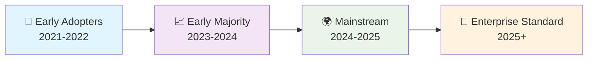
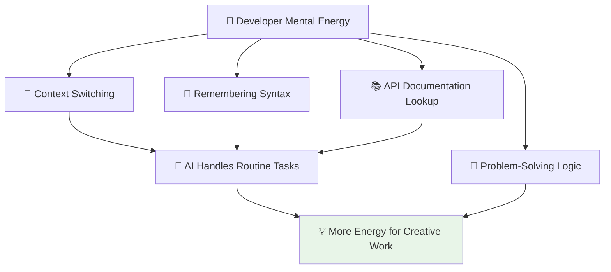
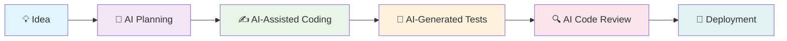
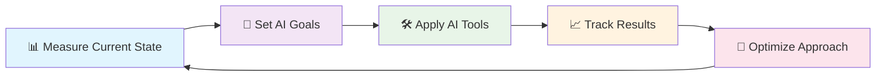

# 🚀 Introduction to AI-Powered Development

> **🎯 Transform your development workflow with intelligent AI assistance that can boost productivity by 50-70%**

---

## 📋 Table of Contents

| 📚 Section | 🎯 Focus | ⏱️ Read Time |
|------------|----------|-------------|
| [🌟 What is AI-Powered Development?](#-what-is-ai-powered-development) | Core concepts and paradigm shift | 5 min |
| [🤖 The Developer Revolution](#-the-developer-revolution) | Industry transformation | 3 min |
| [⚡ Key Benefits & Impact](#-key-benefits--impact) | Productivity gains and ROI | 4 min |
| [🛠️ Essential Tools](#-essential-tools) | GitHub Copilot and ecosystem | 3 min |
| [🎯 Getting Started](#-getting-started) | Your first steps | 2 min |

---

## 🌟 What is AI-Powered Development?

### 🔄 The Paradigm Shift

AI-powered development represents a fundamental transformation in how software is created, moving from purely manual coding to intelligent collaboration between developers and AI systems.

| 📊 Development Era | 🎯 Primary Approach | 🤖 AI Involvement | 📈 Productivity Impact |
|-------------------|-------------------|------------------|---------------------|
| **📝 Traditional** | Manual coding, line by line | None | Baseline (1x) |
| **🔍 Tool-Assisted** | IDEs with autocomplete | Syntax suggestions | 1.1-1.2x |
| **🤖 AI-Assisted** | GitHub Copilot suggestions | Code completion | 1.5-2x |
| **🚀 AI-Augmented** | Intelligent workflows | Context-aware assistance | 2-3x |
| **⚡ Autonomous** | AI agents doing tasks | Full task automation | 3-5x |

### 🧠 Core Concepts

#### 🎯 **1. Context-Aware Assistance**
AI understands your codebase, patterns, and intent to provide relevant suggestions.

```java
// Instead of writing from scratch...
public class UserService {
    // Type: "// Method to validate user email"
    
    // AI suggests complete implementation:
    public boolean validateUserEmail(String email) {
        if (email == null || email.trim().isEmpty()) {
            return false;
        }
        
        String emailRegex = "^[A-Za-z0-9+_.-]+@[A-Za-z0-9.-]+\\.[A-Za-z]{2,}$";
        Pattern pattern = Pattern.compile(emailRegex);
        return pattern.matcher(email).matches();
    }
}
```

#### 🔄 **2. Intelligent Code Generation**
Transform natural language descriptions into working code.

```csharp
// Natural language comment:
// Create a method that calculates compound interest with principal, rate, time, and compounds per year

// AI generates:
public double CalculateCompoundInterest(double principal, double rate, int time, int compoundsPerYear)
{
    double ratePerPeriod = rate / 100.0 / compoundsPerYear;
    double totalPeriods = compoundsPerYear * time;
    
    return principal * Math.Pow(1 + ratePerPeriod, totalPeriods) - principal;
}
```

#### 🛡️ **3. Proactive Error Prevention**
AI identifies potential issues before they become problems.

```java
// AI detects potential SQL injection
String query = "SELECT * FROM users WHERE name = '" + userInput + "'"; // Dangerous!

// AI suggests secure alternative:
String query = "SELECT * FROM users WHERE name = ?";
PreparedStatement stmt = connection.prepareStatement(query);
stmt.setString(1, userInput); // Safe parameterized query
```

---

## 🤖 The Developer Revolution

### 📊 Industry Transformation

The software development industry is experiencing its most significant transformation since the introduction of high-level programming languages.

#### 🔢 By the Numbers

| 📈 Metric | 📊 Traditional Development | 🚀 AI-Powered Development | 🎯 Improvement |
|-----------|---------------------------|---------------------------|----------------|
| **⏱️ Code Writing Speed** | 100 lines/day | 150-200 lines/day | **+50-100%** |
| **🐛 Bug Density** | 15-50 bugs/KLOC | 8-25 bugs/KLOC | **-40-50%** |
| **🕰️ Time to First Working Code** | 2-4 hours | 30-60 minutes | **-75%** |
| **📚 Learning New APIs** | 2-3 days | 4-6 hours | **-80%** |
| **🔒 Security Vulnerabilities** | Baseline | -40-60% reduction | **Significant** |

#### 🌊 Adoption Wave



### 🎯 Who's Leading the Change?

| 👥 Developer Segment | 📊 Adoption Rate | 🚀 Primary Use Cases |
|---------------------|------------------|---------------------|
| **🔬 Individual Developers** | 85% | Code completion, learning new languages |
| **👥 Small Teams (2-10)** | 70% | Rapid prototyping, pair programming |
| **🏢 Medium Companies** | 55% | Standardized development practices |
| **🏛️ Large Enterprises** | 35% | Governance-controlled AI assistance |

---

## ⚡ Key Benefits & Impact

### 💰 Business Value

#### 🎯 **Immediate Benefits**

| 📈 Benefit Category | 💰 Value Proposition | 📊 Typical ROI |
|---------------------|---------------------|----------------|
| **⚡ Faster Development** | Reduce feature delivery time | 25-50% time savings |
| **🛡️ Better Security** | Fewer vulnerabilities in production | 40-60% reduction in security issues |
| **📈 Higher Quality** | Consistent coding patterns | 30-40% fewer bugs |
| **🎓 Accelerated Learning** | Faster onboarding and skill development | 50-70% reduction in ramp-up time |

#### 📊 **Long-term Strategic Impact**

```yaml
Competitive Advantages:
  Time-to-Market: "Deliver features 2-3x faster than competitors"
  Innovation Capacity: "Free up 40-60% developer time for creative work"
  Talent Retention: "Modern tools attract and retain top developers"
  Technical Debt: "AI helps maintain code quality during rapid development"

Cost Reductions:
  Development: "30-50% reduction in development costs"
  Maintenance: "25-40% reduction in bug fixes and refactoring"
  Training: "60-80% reduction in new developer onboarding time"
  Technical Debt: "Proactive prevention vs reactive fixes"
```

### 🎓 Developer Experience Benefits

#### ⚡ **Productivity Gains**

| 🎯 Task Category | ⏱️ Before AI | ⏱️ With AI | 🚀 Improvement |
|------------------|-------------|------------|----------------|
| **✍️ Writing boilerplate code** | 2-4 hours | 15-30 minutes | **85-90% faster** |
| **🔍 Learning new API/framework** | 2-3 days | 4-6 hours | **80-85% faster** |
| **🐛 Debugging complex issues** | 4-8 hours | 1-2 hours | **70-75% faster** |
| **📝 Code documentation** | 1-2 hours | 10-20 minutes | **80-90% faster** |
| **🧪 Writing unit tests** | 1-3 hours | 20-45 minutes | **70-85% faster** |

#### 🧠 **Cognitive Load Reduction**



### 🎯 Quality Improvements

#### 🛡️ **Security Enhancements**

| 🔒 Security Aspect | 📊 Traditional Approach | 🤖 AI-Assisted Approach | 📈 Improvement |
|-------------------|------------------------|------------------------|----------------|
| **🚨 Vulnerability Detection** | Manual code review | Real-time AI scanning | **10x faster detection** |
| **🛡️ Secure Coding Patterns** | Developer knowledge | AI suggests best practices | **60% fewer vulnerabilities** |
| **🔍 Code Review Efficiency** | 2-4 hours per review | 30-60 minutes | **75% time reduction** |
| **📚 Security Knowledge** | Training and experience | On-demand AI guidance | **Immediate expert advice** |

---

## 🛠️ Essential Tools

### 🤖 GitHub Copilot Ecosystem

#### 🎯 **Core Components**

| 🔧 Tool | 📖 Description | 🎯 Primary Use Case | 💰 Cost |
|---------|----------------|-------------------|---------|
| **🤖 GitHub Copilot** | AI pair programmer | Code completion and generation | $10/month |
| **💬 Copilot Chat** | Conversational AI assistant | Code explanation and debugging | Included |
| **🏢 Copilot for Business** | Enterprise features | Team collaboration and governance | $19/user/month |
| **🚀 Copilot Workspace** | AI-powered development environment | End-to-end project assistance | Coming soon |

#### 🔌 **Integration Ecosystem**

```yaml
Supported IDEs:
  Primary: "Visual Studio Code (best experience)"
  Professional: "Visual Studio, JetBrains IDEs, Neovim"
  Web: "GitHub Codespaces, GitPod"

Programming Languages:
  Tier 1: "Python, JavaScript, TypeScript, Java, C#, Go"
  Tier 2: "C++, PHP, Ruby, Swift, Kotlin, Rust"
  Emerging: "150+ additional languages with varying support levels"

Cloud Platforms:
  Microsoft: "Azure integration and services"
  Multi-Cloud: "AWS, Google Cloud compatibility"
  Hybrid: "On-premises and edge deployment options"
```

### 🔄 Development Workflow Integration

#### ⚡ **AI-Enhanced Development Pipeline**



| 🔄 Pipeline Stage | 🤖 AI Assistance | 📈 Benefit |
|-------------------|------------------|------------|
| **💡 Planning** | Requirements analysis, architecture suggestions | Better project structure |
| **✍️ Coding** | Real-time code completion and generation | 2-3x faster implementation |
| **🧪 Testing** | Automated test case generation | 90% test coverage in minutes |
| **🔍 Review** | Intelligent code analysis and suggestions | Catch issues before production |
| **📚 Documentation** | Auto-generated docs and comments | Always up-to-date documentation |

---

## 🎯 Getting Started

### 🚀 Your AI Development Journey

#### 📅 **30-Day Transformation Plan**

| 📅 Week | 🎯 Focus | 🛠️ Actions | 📊 Expected Results |
|---------|----------|------------|-------------------|
| **1️⃣ Foundation** | Setup and basic usage | Install tools, complete first exercises | Basic AI assistance working |
| **2️⃣ Integration** | Workflow incorporation | Use AI for daily tasks | 20-30% productivity gain |
| **3️⃣ Optimization** | Advanced features | Custom workflows, team practices | 40-50% productivity gain |
| **4️⃣ Mastery** | Best practices | Governance, advanced patterns | 50-70% productivity gain |

#### 🎯 **Immediate Next Steps**

```yaml
Step 1 - Account Setup:
  Action: "Create GitHub account and enable Copilot trial"
  Time: "10 minutes"
  Outcome: "AI assistance ready to use"

Step 2 - Tool Installation:
  Action: "Install VS Code and GitHub Copilot extension"
  Time: "15 minutes"
  Outcome: "Development environment configured"

Step 3 - First Experience:
  Action: "Complete workshop Module 1 exercises"
  Time: "30 minutes"
  Outcome: "Working code generated with AI assistance"

Step 4 - Daily Practice:
  Action: "Use AI for real work tasks"
  Time: "Ongoing"
  Outcome: "Measurable productivity improvements"
```

### 📊 Success Metrics

Track your progress with these key indicators:

| 📈 Metric | 📊 Baseline (Week 1) | 🎯 Target (Week 4) | 📏 How to Measure |
|-----------|---------------------|-------------------|------------------|
| **⏱️ Coding Speed** | Current lines/hour | +50-100% improvement | Time tracking during coding sessions |
| **🐛 Bug Rate** | Current bugs/feature | -30-50% reduction | Bug tracking in your issue system |
| **🎓 Learning Speed** | Time to learn new API | -70-80% reduction | Time to implement new features |
| **😊 Satisfaction** | Current satisfaction score | Improved rating | Personal reflection and feedback |

### 🔄 Continuous Improvement



---

## 🎉 Ready to Transform Your Development?

> **🚀 The future of software development is here, and it's powered by AI.**

### 🎯 What's Next?

1. **📚 Take the Workshop**: Start with our hands-on exercises
2. **🤝 Join the Community**: Connect with other AI-powered developers
3. **📈 Measure Your Progress**: Track your productivity improvements
4. **🔄 Share Your Experience**: Help others in their AI journey

### 💪 Your AI-Powered Future Starts Now

The question isn't whether AI will transform development—it's whether you'll lead the transformation or follow it. Join thousands of developers who are already building the future with AI assistance.

**🎯 Ready to get started?** → [Begin Workshop](complete_workshop_guide.md)

---

*💡 **Remember**: AI doesn't replace developers—it amplifies their capabilities. The goal is to spend more time on creative problem-solving and less time on repetitive tasks.*