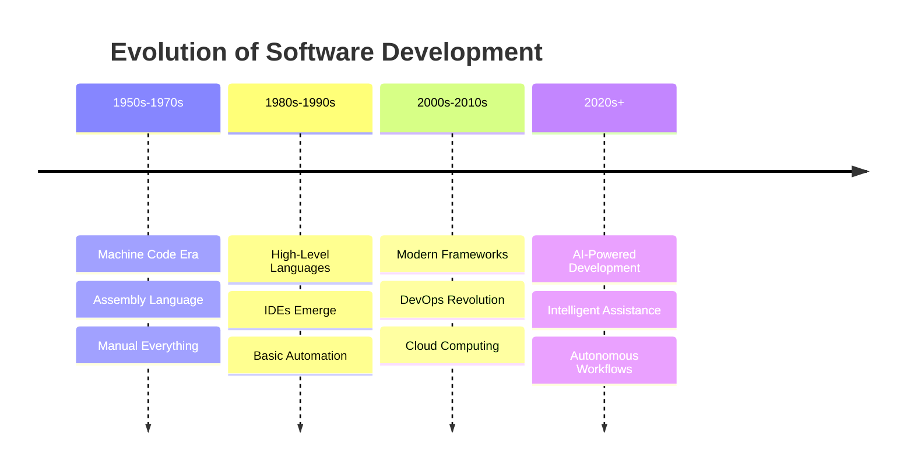
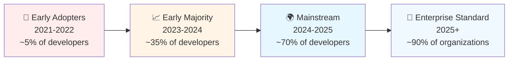
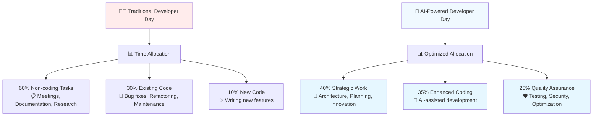
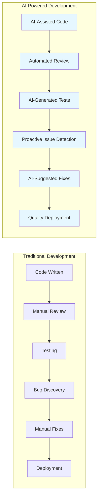
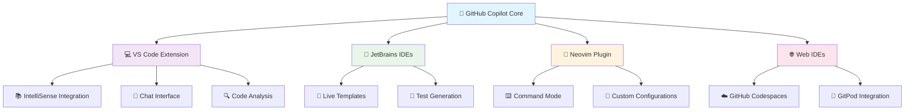

# 🚀 Introduction to AI-Powered Development
## Transform Your Development Workflow with Intelligent AI Assistance


> **🎯 Boost your productivity by 50-70% with intelligent AI assistance that transforms how you write, optimize, and secure code**

---

## 📋 Table of Contents

| 📚 Section | 🎯 Focus | ⏱️ Time | 🔗 Link |
|------------|----------|---------|---------|
| **🌟 What is AI Development?** | Core concepts & paradigm shift | 5 min | [Jump to Section](#-what-is-ai-powered-development) |
| **🤖 The Developer Revolution** | Industry transformation | 3 min | [Jump to Section](#-the-developer-revolution) |
| **⚡ Benefits & Impact** | Productivity gains & ROI | 4 min | [Jump to Section](#-key-benefits--impact) |
| **🛠️ Essential Tools** | GitHub Copilot ecosystem | 3 min | [Jump to Section](#-essential-tools) |
| **🚀 Getting Started** | Your first steps | 2 min | [Jump to Section](#-getting-started) |

**Total Reading Time**: ~15 minutes  
**Prerequisites**: None  
**Next Step**: [Start Workshop →](complete_workshop_guide.md)

---

## 🌟 What is AI-Powered Development?

AI-powered development represents a **fundamental transformation** in software creation, moving from purely manual coding to intelligent collaboration between developers and AI systems.

### 🔄 The Development Evolution Timeline



### 📊 Development Paradigm Comparison

| 📊 Development Era | 🎯 Primary Approach | 🤖 AI Involvement | 📈 Productivity Impact | 🛠️ Key Tools |
|-------------------|-------------------|------------------|---------------------|---------------|
| **📝 Traditional** | Manual coding, line by line | None | Baseline (1x) | IDEs, Debuggers |
| **🔍 Tool-Assisted** | IDEs with autocomplete | Syntax suggestions | 1.1-1.2x | IntelliSense, Linters |
| **🤖 AI-Assisted** | GitHub Copilot suggestions | Code completion | 1.5-2x | GitHub Copilot, Tabnine |
| **🚀 AI-Augmented** | Intelligent workflows | Context-aware assistance | 2-3x | Copilot Chat, AI Reviews |
| **⚡ Autonomous** | AI agents doing tasks | Full task automation | 3-5x | Multi-agent systems |

### 🧠 Core AI Development Concepts

#### 🎯 **1. Context-Aware Intelligence**

AI understands your entire codebase, patterns, and intent to provide highly relevant suggestions.

```java
// Traditional Development: Manual Implementation
public class UserService {
    // Developer writes everything from scratch
    public boolean validateEmail(String email) {
        // Manual regex implementation
        // Manual null checking
        // Manual error handling
    }
}
```

```java
// AI-Powered Development: Intelligent Assistance
public class UserService {
    // Type: "// Method to validate user email with comprehensive checks"
    
    // AI instantly suggests complete, production-ready implementation:
    public boolean validateUserEmail(String email) {
        if (email == null || email.trim().isEmpty()) {
            return false;
        }
        
        String emailRegex = "^[A-Za-z0-9+_.-]+@[A-Za-z0-9.-]+\\.[A-Za-z]{2,}$";
        Pattern pattern = Pattern.compile(emailRegex);
        
        return pattern.matcher(email).matches() && 
               email.length() <= 254 && 
               !email.contains("..") &&
               email.indexOf('@') == email.lastIndexOf('@');
    }
}
```

#### 🔄 **2. Natural Language to Code Translation**

Transform human descriptions into working, optimized code.

```csharp
// Human Intent: "Create a method that calculates compound interest"
// AI Generates: Complete financial calculation with edge cases

public double CalculateCompoundInterest(double principal, double annualRate, 
                                      int compoundingFrequency, int years)
{
    // Input validation
    if (principal <= 0) throw new ArgumentException("Principal must be positive");
    if (annualRate < 0) throw new ArgumentException("Interest rate cannot be negative");
    if (compoundingFrequency <= 0) throw new ArgumentException("Compounding frequency must be positive");
    if (years < 0) throw new ArgumentException("Years cannot be negative");
    
    // Compound interest formula: A = P(1 + r/n)^(nt)
    double ratePerPeriod = annualRate / compoundingFrequency;
    double totalPeriods = compoundingFrequency * years;
    
    return principal * Math.Pow(1 + ratePerPeriod, totalPeriods);
}
```

#### 🛡️ **3. Proactive Security & Quality Assurance**

AI identifies vulnerabilities and suggests secure alternatives before problems occur.

```java
// 🚨 AI Detects Security Risk
String query = "SELECT * FROM users WHERE name = '" + userInput + "'"; // Dangerous!

// ✅ AI Suggests Secure Alternative
String query = "SELECT id, username, email FROM users WHERE name = ?";
PreparedStatement stmt = connection.prepareStatement(query);
stmt.setString(1, userInput); // Safe parameterized query

// 🛡️ AI Adds Additional Security Layers
if (userInput == null || userInput.trim().isEmpty()) {
    throw new IllegalArgumentException("Username cannot be null or empty");
}
if (userInput.length() > 50) {
    throw new IllegalArgumentException("Username exceeds maximum length");
}
```

> ✅ **Checkpoint 1.1:** You now understand how AI transforms traditional development into an intelligent, collaborative process.

---

## 🤖 The Developer Revolution

### 📊 Industry Transformation by the Numbers

The software development industry is experiencing its most significant transformation since the introduction of high-level programming languages.

#### 📈 Adoption Wave Timeline



#### 🔢 Current Adoption Statistics

| 📈 Metric | 📊 2023 Data | 📊 2024 Projection | 🎯 2025 Target |
|-----------|--------------|-------------------|----------------|
| **Individual Developers Using AI** | 55% | 75% | 90% |
| **Companies with AI Policies** | 25% | 50% | 80% |
| **AI-Generated Code in Production** | 15% | 35% | 60% |
| **Developer Productivity Increase** | 30% | 50% | 70% |

### 🎯 Who's Leading the Transformation?

| 👥 Developer Segment | 📊 Current Adoption | 🚀 Primary Use Cases | 📈 Growth Rate |
|---------------------|--------------------|--------------------|----------------|
| **🔬 Individual Developers** | 85% | Code completion, learning new languages | +40% yearly |
| **👥 Small Teams (2-10)** | 70% | Rapid prototyping, pair programming | +35% yearly |
| **🏢 Medium Companies** | 55% | Standardized development practices | +45% yearly |
| **🏛️ Large Enterprises** | 35% | Governance-controlled AI assistance | +60% yearly |

### 🌟 Success Stories & Case Studies

#### 💼 **Enterprise Implementation Examples**

```yaml
Case Study 1 - Financial Services Company:
  Challenge: "Reduce time-to-market for new features"
  Solution: "GitHub Copilot enterprise rollout"
  Results:
    - "45% faster feature delivery"
    - "30% reduction in bugs"
    - "60% less time spent on boilerplate code"
    - "$2.5M annual savings in development costs"

Case Study 2 - E-commerce Platform:
  Challenge: "Improve code quality and security"
  Solution: "AI-powered code review and security scanning"
  Results:
    - "70% reduction in security vulnerabilities"
    - "50% faster code review process"
    - "40% improvement in test coverage"
    - "Customer trust increased by 25%"
```

> ✅ **Checkpoint 1.2:** You understand the massive industry shift toward AI-assisted development and its impact across different organization types.

---

## ⚡ Key Benefits & Impact

### 💰 Immediate Business Value

#### 🎯 **Quantifiable ROI Metrics**

| 📈 Benefit Category | 💰 Value Proposition | 📊 Typical ROI | ⏱️ Time to Value |
|---------------------|---------------------|----------------|------------------|
| **⚡ Development Speed** | 50-70% faster coding | 25-50% cost reduction | 1-2 weeks |
| **🛡️ Security Improvement** | 60% fewer vulnerabilities | $500K+ saved per incident | 1 month |
| **📈 Code Quality** | 40% fewer bugs | 30% less maintenance cost | 2-3 months |
| **🎓 Learning Acceleration** | 80% faster skill acquisition | 50% reduced training costs | Immediate |

#### 📊 **Productivity Transformation**



### 🎓 Developer Experience Benefits

#### ⚡ **Task-Level Performance Gains**

| 🎯 Development Task | ⏱️ Traditional Time | ⏱️ AI-Assisted Time | 🚀 Improvement | 💡 AI Contribution |
|---------------------|---------------------|----------------------|----------------|-------------------|
| **✍️ Writing boilerplate code** | 2-4 hours | 15-30 minutes | **85-90% faster** | Complete generation |
| **🔍 Learning new API/framework** | 2-3 days | 4-6 hours | **80-85% faster** | Contextual examples |
| **🐛 Debugging complex issues** | 4-8 hours | 1-2 hours | **70-75% faster** | Root cause analysis |
| **📝 Code documentation** | 1-2 hours | 10-20 minutes | **80-90% faster** | Auto-generation |
| **🧪 Writing unit tests** | 1-3 hours | 20-45 minutes | **70-85% faster** | Test case generation |
| **🔒 Security review** | 2-4 hours | 30-60 minutes | **75-85% faster** | Vulnerability detection |

#### 🧠 **Cognitive Load Reduction**

The most significant benefit is freeing developers from routine tasks to focus on creative problem-solving:

```yaml
Traditional Development Mental Energy:
  Context Switching: "40% - Between tools and documentation"
  Syntax Recall: "25% - Remembering language specifics"
  Boilerplate Writing: "20% - Repetitive code patterns"
  Creative Problem Solving: "15% - Actual innovation"

AI-Powered Development Mental Energy:
  Strategic Thinking: "45% - Architecture and design"
  Creative Problem Solving: "35% - Innovation and optimization"
  Quality Assurance: "15% - Review and testing"
  Tool Management: "5% - AI assistance coordination"
```

### 🏆 Quality & Security Improvements

#### 🛡️ **Security Enhancement Impact**

| 🔒 Security Aspect | 📊 Traditional Approach | 🤖 AI-Assisted Approach | 📈 Improvement |
|-------------------|------------------------|--------------------------|----------------|
| **🚨 Vulnerability Detection** | Manual code review (weeks) | Real-time AI scanning (minutes) | **99% faster detection** |
| **🛡️ Secure Coding Patterns** | Developer knowledge dependent | AI suggests best practices | **60% fewer vulnerabilities** |
| **🔍 Code Review Efficiency** | 2-4 hours per review | 30-60 minutes | **75% time reduction** |
| **📚 Security Knowledge Access** | Training and documentation | On-demand AI guidance | **Immediate expert advice** |

#### 📈 **Code Quality Metrics**



> ✅ **Checkpoint 1.3:** You understand the comprehensive benefits of AI-powered development across productivity, quality, and security dimensions.

---

## 🛠️ Essential Tools

### 🤖 GitHub Copilot Ecosystem

#### 🎯 **Core Platform Components**

| 🔧 Tool | 📖 Description | 🎯 Primary Use Case | 💰 Cost | 🏆 Best For |
|---------|----------------|-------------------|---------|-------------|
| **🤖 GitHub Copilot** | AI pair programmer | Code completion & generation | $10/month | Individual developers |
| **💬 Copilot Chat** | Conversational AI assistant | Code explanation & debugging | Included | Learning & troubleshooting |
| **🏢 Copilot for Business** | Enterprise features | Team collaboration & governance | $19/user/month | Organizations |
| **🚀 Copilot Workspace** | AI development environment | End-to-end project assistance | Preview | Full project development |

#### 🔌 **Integration Ecosystem**



#### 📊 **Language & Framework Support**

```yaml
Tier 1 Support (Optimal Experience):
  Languages: "Python, JavaScript, TypeScript, Java, C#, Go"
  Frameworks: "React, Angular, Vue, Spring Boot, .NET Core, Django"
  Quality: "90-95% suggestion accuracy"
  Features: "Full context awareness, advanced completions"

Tier 2 Support (Strong Experience):
  Languages: "C++, PHP, Ruby, Swift, Kotlin, Rust"
  Frameworks: "Laravel, Ruby on Rails, SwiftUI, Android"
  Quality: "80-90% suggestion accuracy"
  Features: "Good context awareness, reliable completions"

Emerging Support (Growing Experience):
  Languages: "150+ additional languages"
  Quality: "60-80% suggestion accuracy"
  Features: "Basic completions, improving rapidly"
```

### 🔄 AI-Enhanced Development Workflow

#### ⚡ **Complete Development Pipeline with AI**

```mermaid
graph LR
    A[💡 Idea] --> B[🤖 AI Planning<br/>Requirements Analysis]
    B --> C[✍️ AI-Assisted Coding<br/>Smart Completions]
    C --> D[🧪 AI-Generated Tests<br/>Comprehensive Coverage]
    D --> E[🔍 AI Code Review<br/>Quality & Security]
    E --> F[📚 AI Documentation<br/>Auto-Generated Docs]
    F --> G[🚀 Deployment<br/>AI-Optimized Configs]
    G --> H[📊 AI Monitoring<br/>Performance Analysis]
    
    style A fill:#e1f5fe
    style B fill:#f3e5f5
    style C fill:#e8f5e8
    style D fill:#fff3e0
    style E fill:#fce4ec
    style F fill:#f1f8e9
    style G fill:#fff8e1
    style H fill:#e0f2f1
```



#### 🎯 **AI Impact at Each Development Stage**

| 🔄 Pipeline Stage | 🤖 AI Assistance | 📈 Productivity Gain | 🛠️ Key Features |
|-------------------|------------------|---------------------|------------------|
| **💡 Planning** | Requirements analysis, architecture suggestions | 40% faster planning | Pattern recognition, best practices |
| **✍️ Coding** | Real-time code completion and generation | 2-3x faster implementation | Context-aware suggestions, error prevention |
| **🧪 Testing** | Automated test case generation | 90% test coverage in minutes | Edge case detection, comprehensive scenarios |
| **🔍 Review** | Intelligent code analysis and suggestions | 75% faster reviews | Security scanning, style consistency |
| **📚 Documentation** | Auto-generated docs and comments | 90% time savings | Always up-to-date, comprehensive coverage |
| **🚀 Deployment** | Configuration optimization | 50% fewer deployment issues | Environment-specific optimizations |

> ✅ **Checkpoint 1.4:** You know the essential AI development tools and understand how they integrate into a complete development workflow.

---

## 🚀 Getting Started

### 🎯 Your AI Development Transformation Journey

#### 📅 **30-Day AI Adoption Roadmap**

```mermaid
gantt
    title 30-Day AI Development Transformation
    dateFormat  X
    axisFormat %d
    
    section Week 1: Foundation
    Account Setup           :active, w1-1, 0, 2d
    Tool Installation       :active, w1-2, 1d, 3d
    First AI Code          :w1-3, 3d, 2d
    Basic Integration      :w1-4, 4d, 3d
    
    section Week 2: Integration
    Daily Workflow         :w2-1, 7d, 5d
    Advanced Features      :w2-2, 9d, 4d
    Team Collaboration     :w2-3, 10d, 3d
    
    section Week 3: Optimization
    Custom Workflows       :w3-1, 14d, 4d
    Security Practices     :w3-2, 16d, 4d
    Performance Tuning     :w3-3, 18d, 3d
    
    section Week 4: Mastery
    Advanced Patterns      :w4-1, 21d, 4d
    Team Training         :w4-2, 23d, 4d
    Best Practices        :w4-3, 25d, 5d
```

#### 🎯 **Weekly Goals & Expected Outcomes**

| 📅 Week | 🎯 Focus Area | 🛠️ Key Activities | 📊 Expected Results | 🏆 Success Metrics |
|---------|---------------|-------------------|--------------------|--------------------|
| **1️⃣ Foundation** | Setup and basic usage | Install tools, complete exercises | Basic AI assistance working | First AI-generated code running |
| **2️⃣ Integration** | Daily workflow adoption | Use AI for real tasks | 20-30% productivity gain | Measurable time savings |
| **3️⃣ Optimization** | Advanced features | Custom patterns, team practices | 40-50% productivity gain | Team adoption metrics |
| **4️⃣ Mastery** | Best practices & governance | Advanced workflows, knowledge sharing | 50-70% productivity gain | Organizational transformation |

### 🚀 Immediate Quick Start Actions

#### ⚡ **5-Minute Quick Start**

```yaml
Step 1 - Account Verification (1 minute):
  Action: "Check if you have GitHub account"
  Quick Check: "Visit github.com and sign in"
  Result: "Ready for Copilot setup"

Step 2 - Copilot Access (2 minutes):
  Action: "Start GitHub Copilot trial"
  Quick Link: "github.com/features/copilot"
  Result: "AI assistance activated"

Step 3 - VS Code Setup (2 minutes):
  Action: "Install GitHub Copilot extension"
  Quick Install: "Search 'GitHub Copilot' in VS Code extensions"
  Result: "AI coding environment ready"
```

#### 🎯 **15-Minute First Experience**

```java
// Try This: Create a new file and type this comment
// Create a REST API controller for user management with CRUD operations

/* AI will suggest something like this: */
@RestController
@RequestMapping("/api/users")
public class UserController {
    
    @Autowired
    private UserService userService;
    
    @GetMapping
    public ResponseEntity<List<User>> getAllUsers() {
        List<User> users = userService.findAll();
        return ResponseEntity.ok(users);
    }
    
    @GetMapping("/{id}")
    public ResponseEntity<User> getUserById(@PathVariable Long id) {
        User user = userService.findById(id);
        return user != null ? ResponseEntity.ok(user) : ResponseEntity.notFound().build();
    }
    
    @PostMapping
    public ResponseEntity<User> createUser(@Valid @RequestBody User user) {
        User savedUser = userService.save(user);
        return ResponseEntity.status(HttpStatus.CREATED).body(savedUser);
    }
    
    @PutMapping("/{id}")
    public ResponseEntity<User> updateUser(@PathVariable Long id, @Valid @RequestBody User user) {
        User updatedUser = userService.update(id, user);
        return updatedUser != null ? ResponseEntity.ok(updatedUser) : ResponseEntity.notFound().build();
    }
    
    @DeleteMapping("/{id}")
    public ResponseEntity<Void> deleteUser(@PathVariable Long id) {
        boolean deleted = userService.delete(id);
        return deleted ? ResponseEntity.noContent().build() : ResponseEntity.notFound().build();
    }
}
```

### 📊 Track Your AI Development Progress

#### 📈 **Success Measurement Framework**

```yaml
Week 1 Metrics:
  Code Generation Speed: "Lines of AI-generated code per hour"
  Learning Velocity: "New concepts learned with AI assistance"
  Error Reduction: "Syntax errors caught by AI"
  
Week 2-4 Metrics:
  Productivity Index: "Tasks completed vs. baseline"
  Code Quality Score: "AI-suggested improvements implemented"
  Security Enhancement: "Vulnerabilities prevented by AI"
  Team Collaboration: "AI tools shared with team members"

Long-term Success Indicators:
  Feature Delivery Speed: "Time from idea to deployment"
  Bug Density Reduction: "Post-deployment issues"
  Developer Satisfaction: "Enjoyment and confidence levels"
  Innovation Time: "Time spent on creative problem-solving"
```

### 🎓 Next Steps in Your AI Journey

#### 🚀 **Progressive Learning Path**

1. **📚 Complete the Workshop** → [Start Full Workshop](complete_workshop_guide.md)
2. **🛠️ Master the Tools** → [Troubleshooting Guide](troubleshooting_guide.md)
3. **🏗️ Design Workshops** → [Workshop Structure](workshop_structure.md)
4. **⚡ Quick Implementation** → [Quick Start Guide](quickstart.md)

#### 🤝 **Join the AI Development Community**

```yaml
Community Resources:
  GitHub Discussions: "Share experiences and get help"
  Developer Forums: "Connect with other AI-powered developers"
  Workshop Events: "Attend or organize AI development workshops"
  Open Source Projects: "Contribute to AI-enhanced development tools"
```

> ✅ **Checkpoint 1.5:** You have a clear roadmap to start your AI development journey and know exactly what steps to take next.

---

## 🎉 Ready to Transform Your Development?

> **🚀 The future of software development is here, and it's powered by AI.**

### 💪 Your AI-Powered Future Starts Now

The question isn't whether AI will transform development—it's whether you'll **lead the transformation** or follow it. Join thousands of developers who are already building the future with AI assistance.

#### 🎯 **Choose Your Starting Point**

| 🎯 Your Goal | 📖 Recommended Path | ⏱️ Time Investment |
|-------------|-------------------|-------------------|
| **🆕 Complete Beginner** | [Quick Start Guide](quickstart.md) → [Full Workshop](complete_workshop_guide.md) | 2-3 hours |
| **🏃‍♂️ Want to Start Fast** | [Quick Start Guide](quickstart.md) → Skip to hands-on coding | 30 minutes |
| **👩‍🏫 Teaching Others** | [Workshop Structure](workshop_structure.md) → [Full Workshop](complete_workshop_guide.md) | 4-6 hours |
| **🔧 Need Help** | [Troubleshooting Guide](troubleshooting_guide.md) → [Community Support](complete_workshop_guide.md) | As needed |

**🎯 Ready to get started?** → **[Begin Your AI Journey](quickstart.md)**

---

## 🧭 Navigation

| Previous | Up | Next |
|----------|----|----- |
| [⬅️ Main README](../README.md) | [📖 Main README](../README.md) | [➡️ Module 2: Complete Workshop](complete_workshop_guide.md) |

**Workshop Progress**: Module 1 of 6 • **Estimated Time**: 15 minutes

**Quick Links**: [📚 Module 2: Workshop](complete_workshop_guide.md) | [🆘 Module 3: Troubleshooting](troubleshooting_guide.md) | [🏗️ Module 4: Structure](workshop_structure.md)

---

*💡 **Remember**: AI doesn't replace developers—it amplifies their capabilities. The goal is to spend more time on creative problem-solving and less time on repetitive tasks.*