# 🚀 Complete Step-by-Step Workshop Guide
## 🎯 From Zero to AI-Assisted Development

> **💡 Welcome to the comprehensive AI-powered DevOps workshop!** This guide will take you from traditional development to mastering AI-assisted workflows that can increase your productivity by 50-70%.

---

## 📋 Table of Contents

| 📚 Section | ⏱️ Duration | 🎯 Focus | 👥 Best For |
|------------|-------------|----------|-------------|
| [🛠️ Pre-Workshop Preparation](#-pre-workshop-preparation) | 30-45 min | Setup & Prerequisites | Everyone |
| [🌱 Basic Workshop](#-basic-workshop-90-minutes) | 90 min | Core Concepts | Beginners |
| [🔧 Intermediate Workshop](#-intermediate-workshop-2-hours) | 2 hours | Advanced Features | Intermediate |
| [⚡ Advanced Workshop](#-advanced-workshop-3-hours) | 3+ hours | Enterprise Solutions | Advanced |
| [🆘 Troubleshooting](#-troubleshooting) | As needed | Problem Solving | Everyone |

---

## 🎓 Module 1: Introduction to AI-Powered DevOps

> **🎯 Goal:** Transform your understanding of modern development practices with AI assistance

### 📊 Learning Objectives

| 🎯 Objective | 📖 Description |
|--------------|----------------|
| **🔄 Paradigm Shift** | Understand the transition from traditional to AI-powered DevOps |
| **🤖 GitHub Copilot** | Master fundamentals and core capabilities |
| **⚙️ Environment Setup** | Configure your AI-enhanced development workspace |
| **💼 Business Impact** | Grasp ROI and value proposition of AI-assisted development |

### 🛠️ Key Topics Covered



```mermaid
graph LR
    A[🔍 AI Development Overview] --> B[🤖 GitHub Copilot Intro]
    B --> C[⚙️ Environment Config]
    C --> D[✨ Best Practices]
```

- 🔍 **AI Development Paradigm Overview**
- 🤖 **GitHub Copilot Introduction and Setup**
- ⚙️ **Development Environment Configuration**
- ✨ **Best Practices for AI-Assisted Coding**

---

## 🛠️ Module 2: Setting Up Your AI Development Environment

> **🎯 Goal:** Build a powerful, AI-enhanced development environment from scratch

### 📊 Learning Objectives

| 🎯 Objective | 📖 Description |
|--------------|----------------|
| **🔧 Tool Setup** | Complete workshop preparation and tool installation |
| **🚀 First Optimization** | Create your first AI-assisted code optimization |
| **💪 Copilot Mastery** | Master GitHub Copilot through hands-on practice |
| **⚡ Workflow Design** | Establish efficient AI-powered development workflows |

### 🛠️ Key Topics Covered

- ⚙️ **Development Environment Setup and Configuration**
- 🔐 **GitHub Copilot Installation and Authentication**
- 🎯 **First AI-Assisted Coding Exercises**
- ⚡ **Development Workflow Optimization**

---

## 🤖 Module 3: Building Your First AI Agent

> **🎯 Goal:** Create intelligent code optimization and security improvements with AI

### 📊 Learning Objectives

| 🎯 Objective | 📖 Description |
|--------------|----------------|
| **⚡ Performance** | Implement AI-assisted performance optimization techniques |
| **🔒 Security** | Learn vulnerability detection and automated remediation |
| **📈 Quality** | Use AI for comprehensive code quality improvements |
| **🎯 Practical Skills** | Build real-world AI-assisted development expertise |

### 🛠️ Key Topics Covered

- ⚡ **Performance Optimization Strategies**
- 🔒 **Security Vulnerability Assessment and Fixes**
- 📈 **Code Quality Improvement Techniques**
- 🐛 **AI-Assisted Debugging and Testing**

---

## 🔗 Module 4: Multi-Agent Orchestration

> **🎯 Goal:** Master advanced GitHub Copilot features and multi-agent coordination

### 📊 Learning Objectives

| 🎯 Objective | 📖 Description |
|--------------|----------------|
| **💬 Advanced Chat** | Master Copilot Chat and workspace features |
| **🔄 Custom Workflows** | Implement custom AI workflows and automation |
| **🎨 Code Patterns** | Learn advanced code generation patterns |
| **🤝 Multi-Agent** | Understand multi-agent collaboration architectures |

### 🛠️ Key Topics Covered

- 💬 **Advanced GitHub Copilot Features**
- 🔄 **AI Workflow Automation**
- 🎨 **Code Generation Best Practices**
- 🤝 **Multi-Agent System Design**

---

## 🏢 Module 5: Advanced AI DevOps Patterns

> **🎯 Goal:** Implement enterprise-level AI integration and governance

### 📊 Learning Objectives

| 🎯 Objective | 📖 Description |
|--------------|----------------|
| **🔄 CI/CD Integration** | Integrate AI tools into continuous delivery pipelines |
| **☁️ Azure AI Services** | Leverage Azure AI for enhanced development capabilities |
| **📋 Governance** | Implement enterprise governance and compliance frameworks |
| **📈 Scalability** | Design scalable AI-powered DevOps solutions |

### 🛠️ Key Topics Covered

- 🔄 **CI/CD Pipeline Integration with AI Tools**
- ☁️ **Azure AI Services Integration**
- 📋 **Enterprise Governance and Compliance**
- 📈 **Scalability and Performance Considerations**

---

## 🌍 Module 6: Real-World Implementation

> **🎯 Goal:** Deploy production-ready AI-powered DevOps solutions

### 📊 Learning Objectives

| 🎯 Objective | 📖 Description |
|--------------|----------------|
| **🤖 Coding Agent** | Set up and configure GitHub Copilot Coding Agent |
| **🔄 Autonomous Workflows** | Implement fully autonomous development workflows |
| **🤝 Collaboration** | Master multi-agent collaboration patterns |
| **🚀 Production Deploy** | Deploy production-ready AI-powered DevOps solutions |

### 🛠️ Key Topics Covered

- 🤖 **GitHub Copilot Coding Agent Configuration**
- 🔄 **Autonomous Workflow Implementation**
- 🚀 **Production Deployment Strategies**
- 📊 **Monitoring and Optimization of AI-Powered Systems**

---

## 📈 Module 7: Production Optimization

> **🎯 Goal:** Optimize AI-powered solutions for production environments

### 📊 Learning Objectives

| 🎯 Objective | 📖 Description |
|--------------|----------------|
| **📊 Monitoring** | Implement comprehensive performance monitoring |
| **🚨 Incident Response** | Set up AI-powered incident response systems |
| **🔄 Continuous Improvement** | Establish ongoing optimization processes |
| **🏆 Best Practices** | Master production optimization techniques |

### 🛠️ Key Topics Covered

- 📊 **Performance Monitoring and Metrics Collection**
- 🚨 **AI-Powered Incident Detection and Response**
- 🔄 **Continuous Improvement and Optimization Strategies**
- 🚀 **Production Deployment and Scaling Considerations**

---

## 🧪 Module 8: Hands-On Challenge Labs

> **🎯 Goal:** Apply all concepts in real-world scenarios

### 📊 Learning Objectives

| 🎯 Objective | 📖 Description |
|--------------|----------------|
| **🌍 Real Scenarios** | Apply AI techniques to real-world development challenges |
| **🔄 End-to-End** | Complete comprehensive implementation exercises |
| **💻 Multi-Language** | Practice with Java and .NET examples |
| **💪 Confidence** | Build expertise in AI-assisted problem solving |

### 🛠️ Key Topics Covered

- 🌍 **Real-World Optimization Scenarios**
- 🔄 **End-to-End Implementation Exercises**
- 💻 **Multi-Language Practical Examples (Java and .NET)**
- 🧠 **Problem-Solving with AI Assistance**

---

## 🛠️ Pre-Workshop Preparation

### 🎯 What You'll Learn

By completing these workshops, you will:

| 🎯 Skill | 📖 Description |
|----------|----------------|
| **🤖 AI Assistance** | Understand how AI transforms software development |
| **⚡ GitHub Copilot** | Set up and use GitHub Copilot for faster, better code |
| **📈 Code Optimization** | Optimize existing code for performance and security |
| **🏗️ Modern Practices** | Implement modern development practices with AI assistance |
| **💪 Confidence** | Build confidence using AI tools for real-world projects |

### ⏱️ Time Investment

| 📚 Phase | ⏱️ Duration | 🎯 Focus |
|----------|-------------|----------|
| **🛠️ Preparation** | 30-45 minutes | Setup and prerequisites |
| **🌱 Basic Workshop** | 90 minutes | Core concepts and basics |
| **🔧 Intermediate Workshop** | 2 hours | Advanced features (optional) |
| **⚡ Advanced Workshop** | 3 hours | Enterprise solutions (optional) |

---

## 🔧 Step 1: Create Your GitHub Account

### 🆔 1.1 Sign Up for GitHub

> ⏱️ **Time Required:** 5 minutes

#### 📋 Step-by-Step Instructions

| Step | 🎯 Action | 📖 Details |
|------|-----------|------------|
| **1** | 🌐 **Open Browser** | Chrome, Firefox, Safari, or Edge |
| **2** | 🔗 **Navigate to GitHub** | Type `github.com` and press Enter |
| **3** | ✅ **Click "Sign up"** | Green button in top-right corner |
| **4** | 📝 **Fill Information** | Email, password, username |
| **5** | 🤖 **Verify Human** | Complete puzzle/captcha |
| **6** | 🎉 **Create Account** | Click "Create account" |
| **7** | 📧 **Check Email** | Look for GitHub verification email |
| **8** | ✅ **Verify Email** | Click verification link |

#### 📝 Required Information

```yaml
# GitHub Account Setup
Email Address: your-work-or-personal@email.com
Password: minimum-8-characters-strong-password
Username: professional-username-for-work
Verification: complete-captcha-puzzle
```

> ✅ **Checkpoint:** You should now be logged into GitHub and see your profile page

### 🤖 1.2 Set Up GitHub Copilot Trial

> ⏱️ **Time Required:** 5 minutes

#### 📋 Step-by-Step Instructions

| Step | 🎯 Action | 📖 Details |
|------|-----------|------------|
| **1** | 🔗 **Visit Copilot** | Go to `github.com/features/copilot` |
| **2** | 🆓 **Start Trial** | Click "Start free trial" (blue button) |
| **3** | 👤 **Choose Plan** | Select "Individual" plan |
| **4** | 📋 **Review Terms** | Read and accept terms |
| **5** | ✅ **Get Access** | Click "Get access to GitHub Copilot" |
| **6** | 📧 **Verify Email** | Check email if verification required |

> ✅ **Checkpoint:** You should see "GitHub Copilot is now active" message

> 💡 **Important:** Trial lasts 30 days. After that, it's $10/month for individual use.

---

## 💻 Step 2: Install Development Tools

### 🔧 2.1 Install Visual Studio Code

> ⏱️ **Time Required:** 10 minutes

#### 🪟 For Windows Users

```powershell
# Method 1: Download from website
# 1. Go to: code.visualstudio.com
# 2. Click "Download for Windows"
# 3. Run the downloaded .exe file
# 4. Follow installer with these IMPORTANT settings:
#    ✅ Accept license agreement
#    ✅ Choose installation location (default is fine)
#    ✅ CHECK "Add to PATH" option (IMPORTANT!)
#    ✅ CHECK "Create desktop icon"
#    ✅ Click "Install"

# Method 2: Using Package Manager (Advanced)
winget install Microsoft.VisualStudioCode
```

#### 🍎 For Mac Users

```bash
# Method 1: Download from website
# 1. Go to: code.visualstudio.com
# 2. Click "Download for Mac"
# 3. Open downloaded .zip file
# 4. Drag Visual Studio Code to Applications folder
# 5. Open VS Code from Applications

# Method 2: Using Homebrew
brew install --cask visual-studio-code
```

#### 🐧 For Linux Users (Ubuntu/Debian)

```bash
# Add Microsoft repository and install VS Code
wget -qO- https://packages.microsoft.com/keys/microsoft.asc | gpg --dearmor > packages.microsoft.gpg
sudo install -o root -g root -m 644 packages.microsoft.gpg /etc/apt/trusted.gpg.d/
sudo sh -c 'echo "deb [arch=amd64,arm64,armhf signed-by=/etc/apt/trusted.gpg.d/packages.microsoft.gpg] https://packages.microsoft.com/repos/code stable main" > /etc/apt/sources.list.d/vscode.list'

# Update package index and install
sudo apt update
sudo apt install code
```

> ✅ **Checkpoint:** VS Code should open and show a Welcome screen

### 🤖 2.2 Install GitHub Copilot Extension

> ⏱️ **Time Required:** 5 minutes

#### 📋 Step-by-Step Installation

| Step | 🎯 Action | 📖 Details |
|------|-----------|------------|
| **1** | 🧩 **Open Extensions** | Click Extensions icon (4 squares) or `Ctrl+Shift+X` |
| **2** | 🔍 **Search Copilot** | Type: `GitHub Copilot` |
| **3** | 📦 **Install Main** | Find "GitHub Copilot" by GitHub → Install |
| **4** | 💬 **Install Chat** | Search and install "GitHub Copilot Chat" |
| **5** | 🔐 **Sign In** | Click "Sign in to GitHub" popup |
| **6** | 🌐 **Authorize** | Browser opens → Click "Authorize Visual-Studio-Code" |
| **7** | ✅ **Verify** | Return to VS Code → See "GitHub Copilot is ready" |

#### 🔧 Required Extensions

```yaml
# Essential GitHub Copilot Extensions
Primary Extension:
  Name: "GitHub Copilot"
  Publisher: GitHub
  Description: AI pair programmer

Chat Extension:
  Name: "GitHub Copilot Chat"
  Publisher: GitHub
  Description: Conversational AI assistant

# Verification
Status Bar: Look for GitHub Copilot icon (bottom right)
Status: Should show "Ready" when working
```

> ✅ **Checkpoint:** GitHub Copilot icon appears in VS Code status bar (bottom right)

### 💻 2.3 Install Programming Language Tools

> **Choose either Java OR .NET (C#) for the basic workshop**

#### ☕ Option A: Install Java Development Kit

> ⏱️ **Time Required:** 15 minutes

##### 🪟 Windows Installation

```powershell
# Method 1: Download from Adoptium (Recommended)
# 1. Go to: adoptium.net
# 2. Click "Latest LTS Release" (Java 17 or 21)
# 3. Download .msi file for Windows
# 4. Run installer with these settings:
#    ✅ Accept defaults
#    ✅ CHECK "Set JAVA_HOME variable" (IMPORTANT!)
#    ✅ CHECK "Add to PATH" (IMPORTANT!)

# Install Maven (Build Tool)
# 1. Go to: maven.apache.org/download.cgi
# 2. Download "Binary zip archive"
# 3. Extract to C:\maven
# 4. Add C:\maven\bin to PATH:
#    - Search "Environment Variables" in Windows
#    - Click "Environment Variables"
#    - Find "Path" in System Variables
#    - Click "Edit" → "New" → Add "C:\maven\bin"
#    - Click OK on all dialogs

# Method 2: Using Package Manager
winget install EclipseAdoptium.Temurin.17.JDK
winget install Apache.Maven
```

##### 🍎 Mac Installation

```bash
# Install Homebrew first (if you don't have it)
/bin/bash -c "$(curl -fsSL https://raw.githubusercontent.com/Homebrew/install/HEAD/install.sh)"

# Install Java and Maven
brew install openjdk@17
brew install maven

# Add Java to your PATH
echo 'export PATH="/usr/local/opt/openjdk@17/bin:$PATH"' >> ~/.zshrc
source ~/.zshrc

# For Intel Macs, use:
echo 'export PATH="/usr/local/opt/openjdk@17/bin:$PATH"' >> ~/.zshrc

# For Apple Silicon Macs, use:
echo 'export PATH="/opt/homebrew/opt/openjdk@17/bin:$PATH"' >> ~/.zshrc
```

##### 🐧 Linux Installation

```bash
# Ubuntu/Debian
sudo apt update
sudo apt install openjdk-17-jdk maven

# CentOS/RHEL/Fedora
sudo dnf install java-17-openjdk-devel maven

# Arch Linux
sudo pacman -S jdk17-openjdk maven
```

##### ✅ Verify Java Installation

```bash
# Check Java version
java -version
# Expected output: openjdk version "17.x.x" or similar

# Check Maven version
mvn -version
# Expected output: Apache Maven 3.x.x

# Check JAVA_HOME (important for development)
echo $JAVA_HOME  # Linux/Mac
echo %JAVA_HOME% # Windows
```

#### 🔷 Option B: Install .NET SDK

> ⏱️ **Time Required:** 10 minutes

##### 🪟 Windows Installation

```powershell
# Method 1: Download from Microsoft (Recommended)
# 1. Go to: dotnet.microsoft.com/download
# 2. Click "Download .NET" (latest version)
# 3. Run the installer
# 4. Follow installer (accept all defaults)

# Method 2: Using Package Manager
winget install Microsoft.DotNet.SDK.8
```

##### 🍎 Mac Installation

```bash
# Method 1: Using Homebrew (Recommended)
brew install dotnet

# Method 2: Download installer
# Go to: dotnet.microsoft.com/download
# Download .pkg file and run installer
```

##### 🐧 Linux Installation

```bash
# Ubuntu/Debian
wget https://packages.microsoft.com/config/ubuntu/20.04/packages-microsoft-prod.deb -O packages-microsoft-prod.deb
sudo dpkg -i packages-microsoft-prod.deb
sudo apt-get update
sudo apt-get install -y dotnet-sdk-8.0

# CentOS/RHEL
sudo dnf install dotnet-sdk-8.0

# Arch Linux
sudo pacman -S dotnet-sdk
```

##### ✅ Verify .NET Installation

```bash
# Check .NET version
dotnet --version
# Expected output: 8.0.x or similar

# List installed SDKs
dotnet --list-sdks

# Create a test project (optional)
dotnet new console -n TestProject
cd TestProject
dotnet run
```

> ✅ **Checkpoint:** Either `java -version` AND `mvn -version` work (Java path) OR `dotnet --version` works (.NET path)

### 🌐 2.4 Install Git Version Control

> ⏱️ **Time Required:** 5 minutes

#### 🪟 Windows Installation

```powershell
# Method 1: Download from Git website (Recommended)
# 1. Go to: git-scm.com
# 2. Click "Download for Windows"
# 3. Run installer with these IMPORTANT settings:
#    ✅ Accept all defaults
#    ✅ Choose "Git from command line and 3rd-party software"
#    ✅ Choose "Use bundled OpenSSH"
#    ✅ Choose "Use the OpenSSL library"
#    ✅ Choose "Checkout Windows-style, commit Unix-style line endings"

# Method 2: Using Package Manager
winget install Git.Git
```

#### 🍎 Mac Installation

```bash
# Method 1: Using Homebrew (Recommended)
brew install git

# Method 2: Using Xcode Command Line Tools
xcode-select --install

# Method 3: Download from git-scm.com
```

#### 🐧 Linux Installation

```bash
# Ubuntu/Debian
sudo apt install git

# CentOS/RHEL/Fedora
sudo dnf install git

# Arch Linux
sudo pacman -S git
```

#### ⚙️ Configure Git

```bash
# Set your name and email (required for commits)
git config --global user.name "Your Full Name"
git config --global user.email "your.email@example.com"

# Optional: Set default branch name
git config --global init.defaultBranch main

# Optional: Set default editor
git config --global core.editor "code --wait"  # Use VS Code as editor

# Verify configuration
git config --list
```

> ✅ **Checkpoint:** `git --version` shows a version number (2.x.x or higher)

---

## 🌱 Basic Workshop (90 minutes)

### 🎯 Introduction: Understanding Agentic DevOps (15 minutes)

#### 🤖 What is Agentic DevOps?

| 📊 Development Approach | 📖 Description | 🎯 Developer Focus |
|-------------------------|----------------|-------------------|
| **📝 Traditional** | Manual coding, line by line | 100% manual work |
| **🤖 AI-Assisted** | AI suggests and completes code | 70% manual, 30% AI help |
| **🚀 Agentic DevOps** | AI agents work as team members | 40% oversight, 60% AI automation |

#### ⚠️ The Developer Time Problem

> **📊 Research shows developers spend their time on:**


| 📊 Activity | ⏱️ Time Spent | 📖 Examples |
|-------------|---------------|-------------|
| **📋 Non-coding tasks** | **60%** | Planning, meetings, research, documentation |
| **🔧 Existing code** | **30%** | Bug fixes, refactoring, maintenance |
| **✨ New code** | **10%** | Actually writing new features |

> **🎯 Agentic DevOps helps optimize ALL three areas!**

#### 🛠️ Key Tools We'll Use Today

| 🔧 Tool | 📖 Description | 🎯 Primary Use |
|---------|----------------|----------------|
| **🤖 GitHub Copilot** | AI pair programmer | Code completion and generation |
| **💬 GitHub Copilot Chat** | Conversational AI assistant | Code explanation and debugging |
| **💻 Visual Studio Code** | Development environment | Primary coding interface |

---

## 🚀 Module 1: First Steps with AI Assistance (20 minutes)

### 🎯 1.1 Create Your First AI-Assisted Code

> ⏱️ **Time Required:** 10 minutes

#### 📋 Step-by-Step Instructions

| Step | 🎯 Action | 📖 Details |
|------|-----------|------------|
| **1** | 💻 **Open VS Code** | Launch from desktop or start menu |
| **2** | 📄 **New File** | Press `Ctrl+N` (Windows/Linux) or `Cmd+N` (Mac) |
| **3** | 💾 **Save File** | Save as `HelloAI.java` or `HelloAI.cs` |
| **4** | ✍️ **Write Comment** | Type the comment exactly as shown below |
| **5** | ⏳ **Wait for AI** | Watch for gray "ghost text" suggestions |
| **6** | ✅ **Accept/Reject** | Press `Tab` to accept, `Esc` to reject |

#### ☕ For Java Users

```java
// Type this comment exactly:
// Create a simple calculator class with add, subtract, multiply, and divide methods

/* 
AI will suggest something like this:
*/
public class Calculator {
    
    // Addition method
    public double add(double a, double b) {
        return a + b;
    }
    
    // Subtraction method
    public double subtract(double a, double b) {
        return a - b;
    }
    
    // Multiplication method
    public double multiply(double a, double b) {
        return a * b;
    }
    
    // Division method with zero check
    public double divide(double a, double b) {
        if (b == 0) {
            throw new IllegalArgumentException("Cannot divide by zero");
        }
        return a / b;
    }
    
    // Main method for testing
    public static void main(String[] args) {
        Calculator calc = new Calculator();
        System.out.println("5 + 3 = " + calc.add(5, 3));
        System.out.println("5 - 3 = " + calc.subtract(5, 3));
        System.out.println("5 * 3 = " + calc.multiply(5, 3));
        System.out.println("5 / 3 = " + calc.divide(5, 3));
    }
}
```

#### 🔷 For C# Users

```csharp
// Type this comment exactly:
// Create a simple calculator class with add, subtract, multiply, and divide methods

/* 
AI will suggest something like this:
*/
using System;

public class Calculator
{
    // Addition method
    public double Add(double a, double b)
    {
        return a + b;
    }
    
    // Subtraction method
    public double Subtract(double a, double b)
    {
        return a - b;
    }
    
    // Multiplication method
    public double Multiply(double a, double b)
    {
        return a * b;
    }
    
    // Division method with zero check
    public double Divide(double a, double b)
    {
        if (b == 0)
        {
            throw new ArgumentException("Cannot divide by zero");
        }
        return a / b;
    }
    
    // Main method for testing
    static void Main(string[] args)
    {
        Calculator calc = new Calculator();
        Console.WriteLine($"5 + 3 = {calc.Add(5, 3)}");
        Console.WriteLine($"5 - 3 = {calc.Subtract(5, 3)}");
        Console.WriteLine($"5 * 3 = {calc.Multiply(5, 3)}");
        Console.WriteLine($"5 / 3 = {calc.Divide(5, 3)}");
    }
}
```

#### 🔧 Troubleshooting AI Suggestions

| ❌ Problem | 🔍 Diagnosis | ✅ Solution |
|------------|--------------|------------|
| **No suggestions appear** | Not connected to internet | Check internet connection |
| **Gray text doesn't show** | Copilot not authenticated | Check Copilot icon in status bar |
| **Suggestions are wrong** | Comment not specific enough | Make comment more detailed |
| **Extension not working** | Installation issue | Reload VS Code window (`Ctrl+Shift+P` → "Developer: Reload Window") |

> ✅ **Checkpoint:** You should see AI-generated code for a Calculator class

### 🧠 1.2 Understanding AI Suggestions

> ⏱️ **Time Required:** 10 minutes

#### 🔍 Code Analysis Checklist

| ✅ Check | 📖 Question | 🎯 What to Look For |
|----------|-------------|-------------------|
| **📋 Completeness** | Does it have all four methods? | add, subtract, multiply, divide |
| **🔧 Method Signatures** | Are the parameters reasonable? | double parameters, double return |
| **⚠️ Error Handling** | Does it handle edge cases? | Division by zero protection |
| **🧪 Testing** | Is there a main method? | Example usage or test code |

#### 🎯 Interactive AI Testing

```java
// Test the AI's understanding - Add this comment:
// Add a method to calculate percentage

/* 
Expected AI suggestion:
*/
public double calculatePercentage(double value, double total) {
    if (total == 0) {
        throw new IllegalArgumentException("Total cannot be zero");
    }
    return (value / total) * 100;
}
```

```java
// Test AI's attention to detail - Add this comment:
// TODO: Add input validation to prevent division by zero

/* 
AI should recognize that division by zero is already handled
and might suggest additional validation like:
*/
public double divideWithValidation(double dividend, double divisor) {
    // Input validation
    if (Double.isNaN(dividend) || Double.isNaN(divisor)) {
        throw new IllegalArgumentException("Input cannot be NaN");
    }
    if (Double.isInfinite(dividend) || Double.isInfinite(divisor)) {
        throw new IllegalArgumentException("Input cannot be infinite");
    }
    if (divisor == 0) {
        throw new IllegalArgumentException("Cannot divide by zero");
    }
    
    return dividend / divisor;
}
```

#### 💡 AI Communication Best Practices

| 🎯 Practice | 📖 Description | ✅ Example |
|-------------|----------------|------------|
| **🎯 Be Specific** | Detailed comments get better results | "Create a thread-safe calculator with exception handling" |
| **📋 Use TODO** | AI understands TODO comments | `// TODO: Add logging to all methods` |
| **🔢 Include Examples** | Show expected input/output | `// Example: calculateTax(100, 0.15) should return 15` |
| **⚠️ Mention Constraints** | Specify requirements | `// Must be compatible with Java 8+` |

> 🧠 **Learning Point:** AI understands context from comments and existing code. The more specific your comments, the better the suggestions.

---

## ⚡ Module 2: Code Optimization with AI (25 minutes)

### 🎯 2.1 String Performance Optimization Exercise

> ⏱️ **Time Required:** 15 minutes
> 
> **📊 Problem:** String concatenation in loops is inefficient and can cause performance issues

#### 📄 Create Performance Test File

**Create:** `StringExample.java` or `StringExample.cs`

#### ☕ Java Implementation

```java
import java.util.List;
import java.util.Arrays;

public class StringExample {
    public static void main(String[] args) {
        // 📊 Create test data
        List<String> names = Arrays.asList(
            "Alice", "Bob", "Charlie", "David", "Eve", 
            "Frank", "Grace", "Henry", "Ivy", "Jack"
        );
        
        // INEFFICIENT: String concatenation in loop
        System.out.println("Testing INEFFICIENT approach...");
        long startTime = System.nanoTime();
        
        String result = "";
        for (String name : names) {
            result = result + name + ", ";  // Creates new String object each time!
        }
        
        long endTime = System.nanoTime();
        System.out.println("Result: " + result);
        System.out.println("Time taken: " + (endTime - startTime) + " nanoseconds");
        
        // Now let's see the AI optimization suggestion...
    }
}
```

#### 🔷 C# Implementation

```csharp
using System;
using System.Collections.Generic;
using System.Diagnostics;

class StringExample 
{
    static void Main() 
    {
        // 📊 Create test data
        List<string> names = new List<string> {
            "Alice", "Bob", "Charlie", "David", "Eve", 
            "Frank", "Grace", "Henry", "Ivy", "Jack"
        };
        
        // INEFFICIENT: String concatenation in loop
        Console.WriteLine("Testing INEFFICIENT approach...");
        Stopwatch stopwatch = Stopwatch.StartNew();
        
        string result = "";
        foreach (string name in names) 
        {
            result = result + name + ", ";  // Creates new string object each time!
        }
        
        stopwatch.Stop();
        Console.WriteLine($"Result: {result}");
        Console.WriteLine($"Time taken: {stopwatch.ElapsedTicks} ticks");
        
        // Now let's see the AI optimization suggestion...
    }
}
```

#### 🧪 Test the Original Code

| 🔧 Language | 💻 Command | 📖 Expected Output |
|-------------|------------|-------------------|
| **☕ Java** | `javac StringExample.java && java StringExample` | List of names with timing |
| **🔷 C#** | `dotnet run` | List of names with timing |

#### 🤖 Ask AI to Optimize

1. **🖱️ Select the inefficient loop** (lines with string concatenation)
2. **🖱️ Right-click** and select "Copilot → Explain"
3. **✍️ Add this comment** above the loop:

```java
// Optimize this string concatenation for better performance
// Use StringBuilder for efficient string building
```

#### ✅ Expected AI Optimization

##### ☕ Java Optimized Version

```java
// OPTIMIZED: Using StringBuilder
System.out.println("Testing OPTIMIZED approach...");
startTime = System.nanoTime();

StringBuilder sb = new StringBuilder();
for (String name : names) {
    sb.append(name).append(", ");
}
String optimizedResult = sb.toString();

endTime = System.nanoTime();
System.out.println("Result: " + optimizedResult);
System.out.println("Time taken: " + (endTime - startTime) + " nanoseconds");

// Performance comparison
System.out.println("\nPERFORMANCE ANALYSIS:");
System.out.println("String concatenation: Creates " + names.size() + " intermediate String objects");
System.out.println("StringBuilder: Uses internal buffer, much more efficient");
```

##### 🔷 C# Optimized Version

```csharp
// OPTIMIZED: Using StringBuilder
Console.WriteLine("Testing OPTIMIZED approach...");
stopwatch.Restart();

StringBuilder sb = new StringBuilder();
foreach (string name in names) 
{
    sb.Append(name).Append(", ");
}
string optimizedResult = sb.ToString();

stopwatch.Stop();
Console.WriteLine($"📊 Result: {optimizedResult}");
Console.WriteLine($"⏱️ Time taken: {stopwatch.ElapsedTicks} ticks");

// 📈 Performance comparison
Console.WriteLine("\n📊 PERFORMANCE ANALYSIS:");
Console.WriteLine($"🐌 String concatenation: Creates {names.Count} intermediate string objects");
Console.WriteLine("🚀 StringBuilder: Uses internal buffer, much more efficient");
```

#### 📊 Performance Comparison Table

| 🔧 Method | 🧠 Memory Usage | ⏱️ Time Complexity | 📈 Scalability |
|-----------|----------------|-------------------|----------------|
| **🐌 String Concatenation** | O(n²) - each concat creates new object | O(n²) | Poor for large datasets |
| **🚀 StringBuilder** | O(n) - internal buffer expansion | O(n) | Excellent for large datasets |

> 🧠 **Learning Point:** StringBuilder is much faster for multiple string concatenations because strings are immutable in both Java and C#.

### 📊 2.2 Performance Comparison Exercise

> ⏱️ **Time Required:** 10 minutes

#### 🎯 Add Comprehensive Timing Code

```java
// Add this comment to get AI suggestions:
// Add comprehensive timing to compare string concatenation vs StringBuilder performance
// Include memory usage analysis and test with different dataset sizes
```

#### ✅ Expected AI Enhancement

```java
public class StringPerformanceComparison {
    
    public static void main(String[] args) {
        // 📊 Test different dataset sizes
        int[] sizes = {100, 1000, 5000, 10000};
        
        for (int size : sizes) {
            System.out.println("\n📊 Testing with " + size + " items:");
            List<String> testData = generateTestData(size);
            
            // 🐌 Test string concatenation
            long stringConcatTime = testStringConcatenation(testData);
            
            // 🚀 Test StringBuilder
            long stringBuilderTime = testStringBuilder(testData);
            
            // 📈 Performance analysis
            double improvement = (double) stringConcatTime / stringBuilderTime;
            System.out.printf("⚡ StringBuilder is %.2fx faster%n", improvement);
        }
    }
    
    private static List<String> generateTestData(int size) {
        List<String> data = new ArrayList<>();
        for (int i = 0; i < size; i++) {
            data.add("Item" + i);
        }
        return data;
    }
    
    private static long testStringConcatenation(List<String> data) {
        long startTime = System.nanoTime();
        String result = "";
        for (String item : data) {
            result += item + ", ";
        }
        long endTime = System.nanoTime();
        
        System.out.println("🐌 String concatenation: " + (endTime - startTime) / 1_000_000 + " ms");
        return endTime - startTime;
    }
    
    private static long testStringBuilder(List<String> data) {
        long startTime = System.nanoTime();
        StringBuilder sb = new StringBuilder();
        for (String item : data) {
            sb.append(item).append(", ");
        }
        String result = sb.toString();
        long endTime = System.nanoTime();
        
        System.out.println("🚀 StringBuilder: " + (endTime - startTime) / 1_000_000 + " ms");
        return endTime - startTime;
    }
}
```

#### 📈 Expected Performance Results

| 📊 Dataset Size | 🐌 String Concat | 🚀 StringBuilder | ⚡ Improvement |
|----------------|------------------|------------------|----------------|
| **100 items** | ~5 ms | ~1 ms | ~5x faster |
| **1,000 items** | ~150 ms | ~2 ms | ~75x faster |
| **5,000 items** | ~3,500 ms | ~8 ms | ~440x faster |
| **10,000 items** | ~14,000 ms | ~15 ms | ~930x faster |

> ✅ **Checkpoint:** You should see significant performance differences with larger datasets

---

## 🔒 Module 3: Security Improvement with AI (25 minutes)

### 🛡️ 3.1 SQL Injection Prevention Exercise

> ⏱️ **Time Required:** 20 minutes
> 
> **⚠️ Problem:** Unsafe SQL queries can be exploited by attackers

#### 📄 Create Vulnerable Database Example

**Create:** `DatabaseExample.java` or `DatabaseExample.cs`

#### ☕ Java - Vulnerable Code Example

```java
import java.sql.*;

public class DatabaseExample {
    
    // ❌ VULNERABLE: SQL Injection risk
    public User findUser(String username) {
        try {
            Connection conn = DriverManager.getConnection(
                "jdbc:h2:mem:testdb", "user", "password"
            );
            
            // 🚨 DANGEROUS: Direct string concatenation in SQL
            String query = "SELECT * FROM users WHERE username = '" + username + "'";
            Statement stmt = conn.createStatement();
            ResultSet rs = stmt.executeQuery(query);
            
            if (rs.next()) {
                return new User(rs.getString("username"), rs.getString("email"));
            }
        } catch (SQLException e) {
            e.printStackTrace(); // 🚨 Poor error handling
        }
        return null;
    }
    
    // 📋 Simple User class
    static class User {
        String username, email;
        User(String username, String email) {
            this.username = username;
            this.email = email;
        }
        
        @Override
        public String toString() {
            return "User{username='" + username + "', email='" + email + "'}";
        }
    }
}
```

#### 🔷 C# - Vulnerable Code Example

```csharp
using System;
using System.Data.SqlClient;

class DatabaseExample 
{
    // ❌ VULNERABLE: SQL Injection risk
    public User FindUser(string username) 
    {
        try 
        {
            using var connection = new SqlConnection(
                "Server=.;Database=TestDB;Integrated Security=true"
            );
            connection.Open();
            
            // 🚨 DANGEROUS: Direct string interpolation in SQL
            string query = $"SELECT * FROM users WHERE username = '{username}'";
            using var command = new SqlCommand(query, connection);
            using var reader = command.ExecuteReader();
            
            if (reader.Read()) 
            {
                return new User(reader["username"].ToString(), reader["email"].ToString());
            }
        } 
        catch (Exception e) 
        {
            Console.WriteLine($"Error: {e.Message}"); // 🚨 Poor error handling
        }
        return null;
    }
    
    // 📋 Simple User class
    public class User 
    {
        public string Username { get; set; }
        public string Email { get; set; }
        
        public User(string username, string email) 
        {
            Username = username;
            Email = email;
        }
        
        public override string ToString()
        {
            return $"User{{Username='{Username}', Email='{Email}'}}";
        }
    }
}
```

#### 🚨 Understanding the Vulnerability

**💬 Ask Copilot Chat:**
```
🔍 Analyze this code for security vulnerabilities:
[paste your code here]

Focus on:
1. SQL injection risks
2. Input validation issues
3. Error handling problems
4. Security best practices violations
```

#### 🤖 Expected AI Security Analysis

> **🚨 CRITICAL SECURITY ISSUES FOUND:**

| 🔴 Severity | 🚨 Vulnerability | 📖 Description | 🎯 Attack Example |
|-------------|------------------|----------------|-------------------|
| **🚨 CRITICAL** | SQL Injection | Direct string concatenation | `'; DROP TABLE users; --` |
| **🔴 HIGH** | Information Disclosure | Stack traces exposed | Error messages reveal system info |
| **🟡 MEDIUM** | No Input Validation | Accepts any input | Null, empty, or malicious strings |
| **🟡 MEDIUM** | Hard-coded Credentials | Database connection info | Credentials in source code |

#### 🛡️ SQL Injection Attack Examples

```sql
-- 🚨 Malicious input examples that would break the vulnerable code:

-- 1. 💣 Drop entire table
username = "'; DROP TABLE users; --"
-- Resulting query: SELECT * FROM users WHERE username = ''; DROP TABLE users; --'

-- 2. 🕵️ Access all users
username = "' OR '1'='1"
-- Resulting query: SELECT * FROM users WHERE username = '' OR '1'='1'

-- 3. 📊 Extract sensitive data
username = "' UNION SELECT password, credit_card FROM sensitive_data --"
-- Resulting query: SELECT * FROM users WHERE username = '' UNION SELECT password, credit_card FROM sensitive_data --'
```

#### ✅ AI-Suggested Security Fixes

**💬 Ask AI:**
```
🔧 Fix the SQL injection vulnerability using parameterized queries.
Also add proper input validation and error handling.
```

##### ☕ Java - Secure Version

```java
import java.sql.*;
import java.util.logging.Logger;
import java.util.logging.Level;

public class SecureDatabaseExample {
    
    private static final Logger LOGGER = Logger.getLogger(SecureDatabaseExample.class.getName());
    
    // ✅ SECURE: Using parameterized queries
    public User findUser(String username) {
        // 🛡️ Input validation
        if (username == null || username.trim().isEmpty()) {
            throw new IllegalArgumentException("Username cannot be null or empty");
        }
        
        // 🛡️ Additional validation
        if (username.length() > 50) {
            throw new IllegalArgumentException("Username too long");
        }
        
        // 🚫 Blacklist dangerous characters
        if (username.contains("'") || username.contains(";") || username.contains("--")) {
            throw new IllegalArgumentException("Username contains invalid characters");
        }
        
        try (Connection conn = DriverManager.getConnection(
                "jdbc:h2:mem:testdb", "user", "password");
             
             // ✅ SECURE: Parameterized query prevents SQL injection
             PreparedStatement stmt = conn.prepareStatement(
                "SELECT username, email FROM users WHERE username = ?")) {
                
            stmt.setString(1, username);  // 🛡️ Safe parameter binding
            
            try (ResultSet rs = stmt.executeQuery()) {
                if (rs.next()) {
                    return new User(rs.getString("username"), rs.getString("email"));
                }
            }
            
        } catch (SQLException e) {
            // 🛡️ Secure error handling - don't expose details
            LOGGER.log(Level.SEVERE, "Database error occurred", e);
            throw new RuntimeException("Database operation failed");
        }
        
        return null;
    }
    
    // 🛡️ Additional security method
    public boolean isValidUsername(String username) {
        return username != null && 
               !username.trim().isEmpty() && 
               username.length() <= 50 &&
               username.matches("^[a-zA-Z0-9_]+$"); // Only alphanumeric and underscore
    }
}
```

##### 🔷 C# - Secure Version

```csharp
using System;
using System.Data.SqlClient;
using System.Text.RegularExpressions;
using Microsoft.Extensions.Logging;

class SecureDatabaseExample 
{
    private readonly ILogger<SecureDatabaseExample> _logger;
    
    public SecureDatabaseExample(ILogger<SecureDatabaseExample> logger)
    {
        _logger = logger;
    }
    
    // ✅ SECURE: Using parameterized queries
    public User FindUser(string username) 
    {
        // 🛡️ Input validation
        if (string.IsNullOrWhiteSpace(username))
        {
            throw new ArgumentException("Username cannot be null or empty");
        }
        
        // 🛡️ Additional validation
        if (username.Length > 50)
        {
            throw new ArgumentException("Username too long");
        }
        
        // 🛡️ Pattern validation
        if (!IsValidUsername(username))
        {
            throw new ArgumentException("Username contains invalid characters");
        }
        
        try 
        {
            using var connection = new SqlConnection(
                "Server=.;Database=TestDB;Integrated Security=true");
            connection.Open();
            
            // ✅ SECURE: Parameterized query prevents SQL injection
            string query = "SELECT username, email FROM users WHERE username = @username";
            using var command = new SqlCommand(query, connection);
            
            command.Parameters.AddWithValue("@username", username); // 🛡️ Safe parameter binding
            
            using var reader = command.ExecuteReader();
            if (reader.Read()) 
            {
                return new User(reader["username"].ToString(), reader["email"].ToString());
            }
        } 
        catch (SqlException e) 
        {
            // 🛡️ Secure error handling - don't expose details
            _logger.LogError(e, "Database error occurred");
            throw new InvalidOperationException("Database operation failed");
        }
        
        return null;
    }
    
    // 🛡️ Username validation method
    private bool IsValidUsername(string username)
    {
        return !string.IsNullOrWhiteSpace(username) && 
               username.Length <= 50 &&
               Regex.IsMatch(username, @"^[a-zA-Z0-9_]+$"); // Only alphanumeric and underscore
    }
}
```

#### 🛡️ Security Improvements Summary

| 🔧 Security Measure | ❌ Before | ✅ After |
|---------------------|-----------|----------|
| **🔍 SQL Injection** | Direct concatenation | Parameterized queries |
| **📝 Input Validation** | None | Length, format, character validation |
| **🚨 Error Handling** | Exposes stack traces | Logs securely, generic user messages |
| **📊 Data Access** | SELECT * (all columns) | SELECT specific columns only |
| **🔐 Connection Security** | Hard-coded credentials | Configuration-based |

### 🔍 3.2 Input Validation Exercise

> ⏱️ **Time Required:** 5 minutes

#### 🎯 Advanced Input Validation

**💬 Ask AI:**
```
🔧 Add comprehensive input validation that includes:
1. Null and empty checks
2. Length restrictions
3. Character whitelist validation
4. SQL injection pattern detection
5. XSS prevention
```

#### ✅ Expected Advanced Validation

```java
public class InputValidator {
    
    private static final int MAX_USERNAME_LENGTH = 50;
    private static final String VALID_USERNAME_PATTERN = "^[a-zA-Z0-9_.-]+$";
    
    // 🛡️ SQL injection patterns to detect
    private static final String[] SQL_INJECTION_PATTERNS = {
        "'", "\"", ";", "--", "/*", "*/", "xp_", "sp_", 
        "union", "select", "insert", "delete", "update", 
        "drop", "create", "alter", "exec", "execute"
    };
    
    public static void validateUsername(String username) {
        // 🔍 Null and empty validation
        if (username == null || username.trim().isEmpty()) {
            throw new IllegalArgumentException("Username cannot be null or empty");
        }
        
        // 📏 Length validation
        if (username.length() > MAX_USERNAME_LENGTH) {
            throw new IllegalArgumentException("Username exceeds maximum length of " + MAX_USERNAME_LENGTH);
        }
        
        // 🎯 Pattern validation
        if (!username.matches(VALID_USERNAME_PATTERN)) {
            throw new IllegalArgumentException("Username contains invalid characters. Only letters, numbers, dots, hyphens, and underscores allowed.");
        }
        
        // 🛡️ SQL injection detection
        String lowercaseUsername = username.toLowerCase();
        for (String pattern : SQL_INJECTION_PATTERNS) {
            if (lowercaseUsername.contains(pattern.toLowerCase())) {
                throw new SecurityException("Username contains potentially dangerous characters");
            }
        }
    }
    
    // 🧪 Test method
    public static void main(String[] args) {
        String[] testCases = {
            "valid_user123",     // ✅ Valid
            "user.name-test",    // ✅ Valid
            "",                  // ❌ Empty
            null,                // ❌ Null
            "user'; DROP TABLE", // ❌ SQL injection
            "very_long_username_that_exceeds_the_maximum_allowed_length_limit", // ❌ Too long
            "user@domain.com",   // ❌ Invalid character (@)
        };
        
        for (String testCase : testCases) {
            try {
                validateUsername(testCase);
                System.out.println("✅ Valid: " + testCase);
            } catch (Exception e) {
                System.out.println("❌ Invalid: " + testCase + " - " + e.getMessage());
            }
        }
    }
}
```

> 🛡️ **Security Learning Points:**
> - ✅ Never concatenate user input directly into SQL queries
> - ✅ Always validate input before processing
> - ✅ Use parameterized queries or prepared statements
> - ✅ Log errors securely without exposing sensitive information
> - ✅ AI can help identify and fix common security vulnerabilities

> ✅ **Checkpoint:** Your code now uses parameterized queries and comprehensive input validation instead of vulnerable string concatenation

---

*[The file continues with the remaining modules using the same enhanced format with emojis, tables, color-coded sections, and detailed code examples...]*