# 🚀 AI-Powered Development Complete Workshop
## 🤖 Module 2: Comprehensive Hands-On Implementation Guide

## 📋 Table of Contents

1. [🎯 Progressive Learning Framework](#-progressive-learning-framework)
2. [📋 Complete Workshop Matrix](#-complete-workshop-matrix)
3. [🛠️ Pre-Workshop Preparation](#-pre-workshop-preparation)
4. [🌱 Basic Workshop (90 minutes)](#-basic-workshop-90-minutes)
   - [Module 1: First AI Code](#-core-workshop-module-1-first-ai-code)
   - [Module 2: Optimization](#-core-workshop-module-2-optimization)
   - [Module 3: Security](#-core-workshop-module-3-security)
5. [🔧 Intermediate Workshop (2 hours)](#-intermediate-workshop-2-hours)
6. [⚡ Advanced Track: Enterprise Patterns](#-advanced-track-enterprise-patterns)
7. [🏢 Enterprise Track: Scalability](#-enterprise-track-scalability)
8. [🎉 Workshop Success Framework](#-workshop-success-framework)

> **🎯 Transform your development workflow with AI assistance - from zero to production-ready in 90 minutes**


**Complete Workshop Framework:**
- 🎯 **Progressive Learning:** From basics to production-ready solutions
- ⏱️ **Time-Boxed Modules:** 90 minutes basic + optional advanced tracks
- 🛠️ **Hands-On Practice:** Real code, real scenarios, real results
- 🤖 **AI-First Approach:** GitHub Copilot as your development partner
- 📈 **Measurable Outcomes:** 50-70% productivity improvement

> **🤔 Questions?** Check our comprehensive [Workshop FAQ](workshop-faq.md) covering everything from AI ethics to technical troubleshooting!

## 📁 Workshop Resources Overview

> **🔧 All automation scripts, code examples, and templates are available in the `/resources` directory**

| 🛠️ Resource Type | 📂 Location | 📖 Description |
|------------------|-------------|----------------|
| **🤖 Setup Scripts** | [`/resources/setup-azure-infrastructure.sh`](/resources/setup-azure-infrastructure.sh) | Automated Azure infrastructure setup |
| **⚙️ PowerShell Setup** | [`/resources/setup-azure-infrastructure.ps1`](/resources/setup-azure-infrastructure.ps1) | Windows PowerShell automation |
| **🧪 Validation Tools** | [`/resources/validate-setup.sh`](/resources/validate-setup.sh) | Environment validation script |
| **🗂️ Configuration Files** | [`/resources/appsettings.json`](/resources/appsettings.json), [`/resources/application.properties`](/resources/application.properties) | Sample configuration templates |
| **💻 Code Examples** | [`/resources/DatabaseConnection.java`](/resources/DatabaseConnection.java), [`/resources/DatabaseConnection.cs`](/resources/DatabaseConnection.cs) | Real-world code examples |
| **🔄 CI/CD Pipelines** | [`/resources/azure-devops-pipeline.yml`](/resources/azure-devops-pipeline.yml), [`/resources/github-actions-workflow.yml`](/resources/github-actions-workflow.yml) | Production-ready pipeline templates |
| **🤖 Multi-Agent System** | [`/resources/multi_agent_orchestrator.py`](/resources/multi_agent_orchestrator.py) | Advanced orchestration example |
| **🧹 Cleanup Tools** | [`/resources/cleanup-azure-infrastructure.sh`](/resources/cleanup-azure-infrastructure.sh) | Infrastructure cleanup automation |

---

## 🎯 Progressive Learning Framework

```mermaid
graph TD
    A[🚀 Start Here] --> B{👤 Experience Level?}
    
    B -->|🆕 New to AI Dev| C[📚 Preparation<br/>45 min]
    B -->|👩‍💻 Some Experience| D[⚡ Quick Setup<br/>15 min]
    B -->|🏃‍♂️ Ready to Code| E[🚀 Jump to Hands-On<br/>5 min]
    
    C --> F[🌱 Basic Workshop<br/>90 min]
    D --> F
    E --> F
    
    F --> G{🎯 Next Level?}
    G -->|🔧 Advanced Features| H[🔧 Intermediate<br/>2 hours]
    G -->|🏢 Enterprise Focus| I[⚡ Advanced<br/>3+ hours]
    G -->|✅ Complete| J[🎉 Production Ready]
    
    H --> I
    I --> J
    
    style A fill:#e1f5fe
    style F fill:#e8f5e8
    style J fill:#fff3e0
```



## 📋 Complete Workshop Matrix

| 📚 Workshop Track | ⏱️ Duration | 🎯 Learning Focus | 👥 Target Audience | 🏆 Success Outcome |
|-------------------|-------------|-------------------|---------------------|-------------------|
| [🛠️ Pre-Workshop Preparation](#-pre-workshop-preparation) | 15-45 min | Setup & Prerequisites | All participants | Environment ready |
| [🌱 Core Workshop - Module 1](#-core-workshop-module-1-first-ai-code) | 30 min | AI-assisted coding basics | Beginners | First AI-generated code |
| [🚀 Core Workshop - Module 2](#-core-workshop-module-2-optimization) | 30 min | Performance optimization | All levels | Performance improvements |
| [🔒 Core Workshop - Module 3](#-core-workshop-module-3-security) | 30 min | Security best practices | All levels | Secure code patterns |
| [🔧 Advanced Track](#-advanced-track-enterprise-patterns) | 2+ hours | Enterprise integration | Intermediate+ | Production-ready solutions |
| [🏢 Enterprise Track](#-enterprise-track-scalability) | 3+ hours | Scalability & governance | Advanced | Enterprise deployment |

---

## 🚀 Workshop Prerequisites & Learning Outcomes

### 🎯 What You'll Build Today

By the end of this workshop, you'll have:

| 🏗️ Deliverable | 📖 Description | 🎯 Business Value |
|----------------|----------------|-------------------|
| **🤖 AI-Enhanced Calculator** | Production-ready calculator with AI assistance | Learn AI-assisted development |
| **⚡ Performance Optimized Code** | String processing 10x faster | Understand optimization techniques |
| **🔒 Security-Hardened Database** | SQL injection-proof data access | Master security best practices |
| **🏢 Enterprise-Ready Templates** | CI/CD pipelines and configurations | Production deployment skills |

### 📊 Expected Learning Outcomes

#### 🎯 Technical Skills Progression


| ⏱️ Time | 🎯 Skill Level | 📚 Focus Area | 🏆 Achievement |
|---------|---------------|---------------|----------------|
| **0-30 min** | 🆕 Beginner | AI tool setup and first code | Working GitHub Copilot |
| **30-60 min** | 🔰 Novice | Code optimization patterns | 10x performance improvement |
| **60-90 min** | 🥈 Intermediate | Security best practices | Secure, production-ready code |
| **90+ min** | 🥇 Advanced | Enterprise integration | Full deployment pipeline |

---

## 🛠️ Module 2: Setting Up Your AI Development Environment

> **🎯 Goal:** Build a powerful, AI-enhanced development environment from scratch

### 📊 Learning Objectives

| 🎯 Objective | 📖 Description |
|--------------|----------------|
| **🔧 Tool Setup** | Complete workshop preparation and tool installation |
| **🚀 First Optimization** | Create your first AI-assisted code optimization |
| **💪 Copilot Mastery** | Master GitHub Copilot through hands-on practice |
| **⚡ Workflow Design** | Establish efficient AI-powered development workflows |

### 🛠️ Key Topics Covered

- ⚙️ **Development Environment Setup and Configuration**
- 🔐 **GitHub Copilot Installation and Authentication**
- 🎯 **First AI-Assisted Coding Exercises**
- ⚡ **Development Workflow Optimization**

---

## 🤖 Module 3: Building Your First AI Agent

> **🎯 Goal:** Create intelligent code optimization and security improvements with AI

### 📊 Learning Objectives

| 🎯 Objective | 📖 Description |
|--------------|----------------|
| **⚡ Performance** | Implement AI-assisted performance optimization techniques |
| **🔒 Security** | Learn vulnerability detection and automated remediation |
| **📈 Quality** | Use AI for comprehensive code quality improvements |
| **🎯 Practical Skills** | Build real-world AI-assisted development expertise |

### 🛠️ Key Topics Covered

- ⚡ **Performance Optimization Strategies**
- 🔒 **Security Vulnerability Assessment and Fixes**
- 📈 **Code Quality Improvement Techniques**
- 🐛 **AI-Assisted Debugging and Testing**

---

## 🔗 Module 4: Multi-Agent Orchestration

> **🎯 Goal:** Master advanced GitHub Copilot features and multi-agent coordination

### 📊 Learning Objectives

| 🎯 Objective | 📖 Description |
|--------------|----------------|
| **💬 Advanced Chat** | Master Copilot Chat and workspace features |
| **🔄 Custom Workflows** | Implement custom AI workflows and automation |
| **🎨 Code Patterns** | Learn advanced code generation patterns |
| **🤝 Multi-Agent** | Understand multi-agent collaboration architectures |

### 🛠️ Key Topics Covered

- 💬 **Advanced GitHub Copilot Features**
- 🔄 **AI Workflow Automation**
- 🎨 **Code Generation Best Practices**
- 🤝 **Multi-Agent System Design**

---

## 🏢 Module 5: Advanced AI DevOps Patterns

> **🎯 Goal:** Implement enterprise-level AI integration and governance

### 📊 Learning Objectives

| 🎯 Objective | 📖 Description |
|--------------|----------------|
| **🔄 CI/CD Integration** | Integrate AI tools into continuous delivery pipelines |
| **☁️ Azure AI Services** | Leverage Azure AI for enhanced development capabilities |
| **📋 Governance** | Implement enterprise governance and compliance frameworks |
| **📈 Scalability** | Design scalable AI-powered DevOps solutions |

### 🛠️ Key Topics Covered

- 🔄 **CI/CD Pipeline Integration with AI Tools**
  - 📁 Reference: [`/resources/azure-devops-pipeline.yml`](/resources/azure-devops-pipeline.yml) - Complete Azure DevOps pipeline
  - 📁 Reference: [`/resources/github-actions-workflow.yml`](/resources/github-actions-workflow.yml) - GitHub Actions workflow
- ☁️ **Azure AI Services Integration**
  - 📁 Reference: [`/resources/setup-azure-infrastructure.sh`](/resources/setup-azure-infrastructure.sh) - Automated setup script
- 📋 **Enterprise Governance and Compliance**
- 📈 **Scalability and Performance Considerations**

---

## 🌍 Module 6: Real-World Implementation

> **🎯 Goal:** Deploy production-ready AI-powered DevOps solutions

### 📊 Learning Objectives

| 🎯 Objective | 📖 Description |
|--------------|----------------|
| **🤖 Coding Agent** | Set up and configure GitHub Copilot Coding Agent |
| **🔄 Autonomous Workflows** | Implement fully autonomous development workflows |
| **🤝 Collaboration** | Master multi-agent collaboration patterns |
| **🚀 Production Deploy** | Deploy production-ready AI-powered DevOps solutions |

### 🛠️ Key Topics Covered

- 🤖 **GitHub Copilot Coding Agent Configuration**
- 🔄 **Autonomous Workflow Implementation**
  - 📁 Reference: [`/resources/multi_agent_orchestrator.py`](/resources/multi_agent_orchestrator.py) - Multi-agent system example
- 🚀 **Production Deployment Strategies**
  - 📁 Reference: [`/resources/azure-devops-pipeline.yml`](/resources/azure-devops-pipeline.yml) - Production pipeline
- 📊 **Monitoring and Optimization of AI-Powered Systems**

---

## 📈 Module 7: Production Optimization

> **🎯 Goal:** Optimize AI-powered solutions for production environments

### 📊 Learning Objectives

| 🎯 Objective | 📖 Description |
|--------------|----------------|
| **📊 Monitoring** | Implement comprehensive performance monitoring |
| **🚨 Incident Response** | Set up AI-powered incident response systems |
| **🔄 Continuous Improvement** | Establish ongoing optimization processes |
| **🏆 Best Practices** | Master production optimization techniques |

### 🛠️ Key Topics Covered

- 📊 **Performance Monitoring and Metrics Collection**
- 🚨 **AI-Powered Incident Detection and Response**
- 🔄 **Continuous Improvement and Optimization Strategies**
- 🚀 **Production Deployment and Scaling Considerations**

---

## 🧪 Module 8: Hands-On Challenge Labs

> **🎯 Goal:** Apply all concepts in real-world scenarios

### 📊 Learning Objectives

| 🎯 Objective | 📖 Description |
|--------------|----------------|
| **🌍 Real Scenarios** | Apply AI techniques to real-world development challenges |
| **🔄 End-to-End** | Complete comprehensive implementation exercises |
| **💻 Multi-Language** | Practice with Java and .NET examples |
| **💪 Confidence** | Build expertise in AI-assisted problem solving |

### 🛠️ Key Topics Covered

- 🌍 **Real-World Optimization Scenarios**
- 🔄 **End-to-End Implementation Exercises**
- 💻 **Multi-Language Practical Examples (Java and .NET)**
  - 📁 Reference: [`/resources/DatabaseConnection.java`](/resources/DatabaseConnection.java) - Java example
  - 📁 Reference: [`/resources/DatabaseConnection.cs`](/resources/DatabaseConnection.cs) - C# example
  - 📁 Reference: [`/resources/application.properties`](/resources/application.properties) - Java configuration
  - 📁 Reference: [`/resources/appsettings.json`](/resources/appsettings.json) - .NET configuration
- 🧠 **Problem-Solving with AI Assistance**

---

## 🛠️ Pre-Workshop Preparation

> **📁 Automation Resources:** Before starting, explore the automation tools available in [`/resources/`](/resources/) to accelerate your setup process.

### 🚀 Quick Setup with Automation Scripts

| 🛠️ Script | 🎯 Purpose | 💻 Command |
|-----------|------------|-------------|
| **🏗️ Azure Setup** | Complete infrastructure setup | `bash resources/setup-azure-infrastructure.sh` |
| **✅ Environment Validation** | Verify all prerequisites | `bash resources/validate-setup.sh` |
| **🧹 Cleanup** | Remove test infrastructure | `bash resources/cleanup-azure-infrastructure.sh` |

### 🎯 What You'll Learn

By completing these workshops, you will:

| 🎯 Skill | 📖 Description |
|----------|----------------|
| **🤖 AI Assistance** | Understand how AI transforms software development |
| **⚡ GitHub Copilot** | Set up and use GitHub Copilot for faster, better code |
| **📈 Code Optimization** | Optimize existing code for performance and security |
| **🏗️ Modern Practices** | Implement modern development practices with AI assistance |
| **💪 Confidence** | Build confidence using AI tools for real-world projects |

### ⏱️ Time Investment

| 📚 Phase | ⏱️ Duration | 🎯 Focus |
|----------|-------------|----------|
| **🛠️ Preparation** | 30-45 minutes | Setup and prerequisites |
| **🌱 Basic Workshop** | 90 minutes | Core concepts and basics |
| **🔧 Intermediate Workshop** | 2 hours | Advanced features (optional) |
| **⚡ Advanced Workshop** | 3 hours | Enterprise solutions (optional) |

---

## 🔧 Step 1: Create Your GitHub Account

### 🆔 1.1 Sign Up for GitHub

> ⏱️ **Time Required:** 5 minutes

#### 📋 Step-by-Step Instructions

| Step | 🎯 Action | 📖 Details |
|------|-----------|------------|
| **1** | 🌐 **Open Browser** | Chrome, Firefox, Safari, or Edge |
| **2** | 🔗 **Navigate to GitHub** | Type `github.com` and press Enter |
| **3** | ✅ **Click "Sign up"** | Green button in top-right corner |
| **4** | 📝 **Fill Information** | Email, password, username |
| **5** | 🤖 **Verify Human** | Complete puzzle/captcha |
| **6** | 🎉 **Create Account** | Click "Create account" |
| **7** | 📧 **Check Email** | Look for GitHub verification email |
| **8** | ✅ **Verify Email** | Click verification link |

#### 📝 Required Information

```yaml
# GitHub Account Setup
Email Address: your-work-or-personal@email.com
Password: minimum-8-characters-strong-password
Username: professional-username-for-work
Verification: complete-captcha-puzzle
```

> ✅ **Checkpoint:** You should now be logged into GitHub and see your profile page

### 🤖 1.2 Set Up GitHub Copilot Trial

> ⏱️ **Time Required:** 5 minutes

#### 📋 Step-by-Step Instructions

| Step | 🎯 Action | 📖 Details |
|------|-----------|------------|
| **1** | 🔗 **Visit Copilot** | Go to `github.com/features/copilot` |
| **2** | 🆓 **Start Trial** | Click "Start free trial" (blue button) |
| **3** | 👤 **Choose Plan** | Select "Individual" plan |
| **4** | 📋 **Review Terms** | Read and accept terms |
| **5** | ✅ **Get Access** | Click "Get access to GitHub Copilot" |
| **6** | 📧 **Verify Email** | Check email if verification required |

> ✅ **Checkpoint:** You should see "GitHub Copilot is now active" message

> 💡 **Important:** Trial lasts 30 days. After that, it's $10/month for individual use.

---

## 💻 Step 2: Install Development Tools

### 🔧 2.1 Install Visual Studio Code

> ⏱️ **Time Required:** 10 minutes

#### 🪟 For Windows Users

```powershell
# Method 1: Download from website
# 1. Go to: code.visualstudio.com
# 2. Click "Download for Windows"
# 3. Run the downloaded .exe file
# 4. Follow installer with these IMPORTANT settings:
#    ✅ Accept license agreement
#    ✅ Choose installation location (default is fine)
#    ✅ CHECK "Add to PATH" option (IMPORTANT!)
#    ✅ CHECK "Create desktop icon"
#    ✅ Click "Install"

# Method 2: Using Package Manager (Advanced)
winget install Microsoft.VisualStudioCode
```

#### 🍎 For Mac Users

```bash
# Method 1: Download from website
# 1. Go to: code.visualstudio.com
# 2. Click "Download for Mac"
# 3. Open downloaded .zip file
# 4. Drag Visual Studio Code to Applications folder
# 5. Open VS Code from Applications

# Method 2: Using Homebrew
brew install --cask visual-studio-code
```

#### 🐧 For Linux Users (Ubuntu/Debian)

```bash
# Add Microsoft repository and install VS Code
wget -qO- https://packages.microsoft.com/keys/microsoft.asc | gpg --dearmor > packages.microsoft.gpg
sudo install -o root -g root -m 644 packages.microsoft.gpg /etc/apt/trusted.gpg.d/
sudo sh -c 'echo "deb [arch=amd64,arm64,armhf signed-by=/etc/apt/trusted.gpg.d/packages.microsoft.gpg] https://packages.microsoft.com/repos/code stable main" > /etc/apt/sources.list.d/vscode.list'

# Update package index and install
sudo apt update
sudo apt install code
```

> ✅ **Checkpoint:** VS Code should open and show a Welcome screen

### 🤖 2.2 Install GitHub Copilot Extension

> ⏱️ **Time Required:** 5 minutes

#### 📋 Step-by-Step Installation

| Step | 🎯 Action | 📖 Details |
|------|-----------|------------|
| **1** | 🧩 **Open Extensions** | Click Extensions icon (4 squares) or `Ctrl+Shift+X` |
| **2** | 🔍 **Search Copilot** | Type: `GitHub Copilot` |
| **3** | 📦 **Install Main** | Find "GitHub Copilot" by GitHub → Install |
| **4** | 💬 **Install Chat** | Search and install "GitHub Copilot Chat" |
| **5** | 🔐 **Sign In** | Click "Sign in to GitHub" popup |
| **6** | 🌐 **Authorize** | Browser opens → Click "Authorize Visual-Studio-Code" |
| **7** | ✅ **Verify** | Return to VS Code → See "GitHub Copilot is ready" |

#### 🔧 Required Extensions

```yaml
# Essential GitHub Copilot Extensions
Primary Extension:
  Name: "GitHub Copilot"
  Publisher: GitHub
  Description: AI pair programmer

Chat Extension:
  Name: "GitHub Copilot Chat"
  Publisher: GitHub
  Description: Conversational AI assistant

# Verification
Status Bar: Look for GitHub Copilot icon (bottom right)
Status: Should show "Ready" when working
```

> ✅ **Checkpoint:** GitHub Copilot icon appears in VS Code status bar (bottom right)

### 💻 2.3 Install Programming Language Tools

> **Choose either Java OR .NET (C#) for the basic workshop**

#### ☕ Option A: Install Java Development Kit

> ⏱️ **Time Required:** 15 minutes

##### 🪟 Windows Installation

```powershell
# Method 1: Download from Adoptium (Recommended)
# 1. Go to: adoptium.net
# 2. Click "Latest LTS Release" (Java 17 or 21)
# 3. Download .msi file for Windows
# 4. Run installer with these settings:
#    ✅ Accept defaults
#    ✅ CHECK "Set JAVA_HOME variable" (IMPORTANT!)
#    ✅ CHECK "Add to PATH" (IMPORTANT!)

# Install Maven (Build Tool)
# 1. Go to: maven.apache.org/download.cgi
# 2. Download "Binary zip archive"
# 3. Extract to C:\maven
# 4. Add C:\maven\bin to PATH:
#    - Search "Environment Variables" in Windows
#    - Click "Environment Variables"
#    - Find "Path" in System Variables
#    - Click "Edit" → "New" → Add "C:\maven\bin"
#    - Click OK on all dialogs

# Method 2: Using Package Manager
winget install EclipseAdoptium.Temurin.17.JDK
winget install Apache.Maven
```

##### 🍎 Mac Installation

```bash
# Install Homebrew first (if you don't have it)
/bin/bash -c "$(curl -fsSL https://raw.githubusercontent.com/Homebrew/install/HEAD/install.sh)"

# Install Java and Maven
brew install openjdk@17
brew install maven

# Add Java to your PATH
echo 'export PATH="/usr/local/opt/openjdk@17/bin:$PATH"' >> ~/.zshrc
source ~/.zshrc

# For Intel Macs, use:
echo 'export PATH="/usr/local/opt/openjdk@17/bin:$PATH"' >> ~/.zshrc

# For Apple Silicon Macs, use:
echo 'export PATH="/opt/homebrew/opt/openjdk@17/bin:$PATH"' >> ~/.zshrc
```

##### 🐧 Linux Installation

```bash
# Ubuntu/Debian
sudo apt update
sudo apt install openjdk-17-jdk maven

# CentOS/RHEL/Fedora
sudo dnf install java-17-openjdk-devel maven

# Arch Linux
sudo pacman -S jdk17-openjdk maven
```

##### ✅ Verify Java Installation

```bash
# Check Java version
java -version
# Expected output: openjdk version "17.x.x" or similar

# Check Maven version
mvn -version
# Expected output: Apache Maven 3.x.x

# Check JAVA_HOME (important for development)
echo $JAVA_HOME  # Linux/Mac
echo %JAVA_HOME% # Windows
```

#### 🔷 Option B: Install .NET SDK

> ⏱️ **Time Required:** 10 minutes

##### 🪟 Windows Installation

```powershell
# Method 1: Download from Microsoft (Recommended)
# 1. Go to: dotnet.microsoft.com/download
# 2. Click "Download .NET" (latest version)
# 3. Run the installer
# 4. Follow installer (accept all defaults)

# Method 2: Using Package Manager
winget install Microsoft.DotNet.SDK.8
```

##### 🍎 Mac Installation

```bash
# Method 1: Using Homebrew (Recommended)
brew install dotnet

# Method 2: Download installer
# Go to: dotnet.microsoft.com/download
# Download .pkg file and run installer
```

##### 🐧 Linux Installation

```bash
# Ubuntu/Debian
wget https://packages.microsoft.com/config/ubuntu/20.04/packages-microsoft-prod.deb -O packages-microsoft-prod.deb
sudo dpkg -i packages-microsoft-prod.deb
sudo apt-get update
sudo apt-get install -y dotnet-sdk-8.0

# CentOS/RHEL
sudo dnf install dotnet-sdk-8.0

# Arch Linux
sudo pacman -S dotnet-sdk
```

##### ✅ Verify .NET Installation

```bash
# Check .NET version
dotnet --version
# Expected output: 8.0.x or similar

# List installed SDKs
dotnet --list-sdks

# Create a test project (optional)
dotnet new console -n TestProject
cd TestProject
dotnet run
```

> ✅ **Checkpoint:** Either `java -version` AND `mvn -version` work (Java path) OR `dotnet --version` works (.NET path)

### 🌐 2.4 Install Git Version Control

> ⏱️ **Time Required:** 5 minutes

#### 🪟 Windows Installation

```powershell
# Method 1: Download from Git website (Recommended)
# 1. Go to: git-scm.com
# 2. Click "Download for Windows"
# 3. Run installer with these IMPORTANT settings:
#    ✅ Accept all defaults
#    ✅ Choose "Git from command line and 3rd-party software"
#    ✅ Choose "Use bundled OpenSSH"
#    ✅ Choose "Use the OpenSSL library"
#    ✅ Choose "Checkout Windows-style, commit Unix-style line endings"

# Method 2: Using Package Manager
winget install Git.Git
```

#### 🍎 Mac Installation

```bash
# Method 1: Using Homebrew (Recommended)
brew install git

# Method 2: Using Xcode Command Line Tools
xcode-select --install

# Method 3: Download from git-scm.com
```

#### 🐧 Linux Installation

```bash
# Ubuntu/Debian
sudo apt install git

# CentOS/RHEL/Fedora
sudo dnf install git

# Arch Linux
sudo pacman -S git
```

#### ⚙️ Configure Git

```bash
# Set your name and email (required for commits)
git config --global user.name "Your Full Name"
git config --global user.email "your.email@example.com"

# Optional: Set default branch name
git config --global init.defaultBranch main

# Optional: Set default editor
git config --global core.editor "code --wait"  # Use VS Code as editor

# Verify configuration
git config --list
```

> ✅ **Checkpoint:** `git --version` shows a version number (2.x.x or higher)

---

## 🛠️ Automation Resources Quick Start

> **🚀 Skip manual setup with our pre-built automation tools!**

### 📁 Available Resources

| 🎯 Category | 📄 File | 📋 Description | 💻 Usage |
|-------------|---------|----------------|----------|
| **🏗️ Infrastructure** | [`setup-azure-infrastructure.sh`](/resources/setup-azure-infrastructure.sh) | Complete Azure setup | `bash resources/setup-azure-infrastructure.sh` |
| **🪟 Windows Setup** | [`setup-azure-infrastructure.ps1`](/resources/setup-azure-infrastructure.ps1) | PowerShell automation | `.\resources\setup-azure-infrastructure.ps1` |
| **✅ Validation** | [`validate-setup.sh`](/resources/validate-setup.sh) | Environment checker | `bash resources/validate-setup.sh` |
| **🔄 CI/CD Pipeline** | [`azure-devops-pipeline.yml`](/resources/azure-devops-pipeline.yml) | Azure DevOps template | Copy to your repository |
| **⚙️ GitHub Actions** | [`github-actions-workflow.yml`](/resources/github-actions-workflow.yml) | GitHub workflow | Copy to `.github/workflows/` |
| **☕ Java Example** | [`DatabaseConnection.java`](/resources/DatabaseConnection.java) | Production Java code | Reference implementation |
| **🔷 C# Example** | [`DatabaseConnection.cs`](/resources/DatabaseConnection.cs) | Production C# code | Reference implementation |
| **⚙️ Java Config** | [`application.properties`](/resources/application.properties) | Spring Boot config | Copy to `src/main/resources/` |
| **⚙️ .NET Config** | [`appsettings.json`](/resources/appsettings.json) | .NET Core config | Copy to project root |
| **🤖 Multi-Agent** | [`multi_agent_orchestrator.py`](/resources/multi_agent_orchestrator.py) | AI orchestration | Advanced example |
| **🧹 Cleanup** | [`cleanup-azure-infrastructure.sh`](/resources/cleanup-azure-infrastructure.sh) | Remove test resources | `bash resources/cleanup-azure-infrastructure.sh` |

### 🚀 Quick Setup Commands

```bash
# 1. Clone the workshop repository (if not already done)
git clone https://github.com/your-repo/Code-AI-Dev.git
cd Code-AI-Dev

# 2. Run the validation script to check prerequisites
bash resources/validate-setup.sh

# 3. Set up Azure infrastructure (optional - for advanced workshops)
bash resources/setup-azure-infrastructure.sh

# After running the setup script, the following Azure resources will be created:
# - Resource Group: aidevops-workshop-rg
# - SQL Server: aidevops-sql-server-[timestamp]
# - SQL Database: aidevops-workshop-db
# - Application Insights: aidevops-appinsights
# - AI Services: aidevops-ai-services
# - Storage Account: aidevopsstorage[timestamp]
# - Key Vault: aidevops-kv-[timestamp]

# Visual overview of created resources:
# 

# 4. Source the configuration file (if Azure setup was run)
# source resources/workshop-config.env

# 5. Copy configuration templates to your project
cp resources/application.properties your-java-project/src/main/resources/
cp resources/appsettings.json your-dotnet-project/

# 6. Set up CI/CD pipelines
cp resources/azure-devops-pipeline.yml your-project/
cp resources/github-actions-workflow.yml your-project/.github/workflows/
```

> 💡 **Pro Tip:** All scripts include detailed comments and error handling. Review them to understand the automation process!

---

## 🧭 Navigation

| 📍 Current Step | ⬅️ Previous | ➡️ Next |
|-----------------|-------------|---------|
| **🛠️ Pre-Workshop Preparation** | [🏠 Table of Contents](#-table-of-contents) | [🌱 Basic Workshop](#-basic-workshop-90-minutes) |

---

## 🌱 Basic Workshop (90 minutes)

> **🎯 Complete AI development fundamentals in 90 minutes**

The Basic Workshop consists of three core modules that build upon each other:

| 📚 Module | ⏱️ Duration | 🎯 Focus | 🏆 Outcome |
|-----------|-------------|----------|------------|
| **Module 1: First AI Code** | 30 minutes | AI-assisted coding basics | Working Calculator with AI |
| **Module 2: Optimization** | 30 minutes | Performance improvements | 10x faster string operations |
| **Module 3: Security** | 30 minutes | Security best practices | SQL injection prevention |

---

## 🌱 Core Workshop - Module 1: First AI Code (30 minutes)

### 🎯 Understanding AI-Powered Development

> **🎯 Goal:** Transform from traditional development to AI-assisted workflows

#### 🤖 The AI Development Revolution

```mermaid
graph LR
    A[📝 Traditional<br/>100% Manual] --> B[🤖 AI-Assisted<br/>70% Manual, 30% AI]
    B --> C[🚀 AI-First<br/>40% Oversight, 60% AI]
    
    style A fill:#ffebee
    style B fill:#fff3e0
    style C fill:#e8f5e8
```



| 📊 Development Era | 👩‍💻 Developer Role | 🤖 AI Role | ⚡ Productivity Gain |
|-------------------|------------------|-----------|-------------------|
| **📝 Traditional** | Write every line manually | None | Baseline |
| **🤖 AI-Assisted** | Guide AI suggestions | Code completion | 2-3x faster |
| **🚀 AI-First** | Design and review | Code generation & optimization | 5-10x faster |

#### ⚠️ The Developer Time Problem

> **📊 Research shows developers spend their time on:**


| 📊 Activity | ⏱️ Time Spent | 📖 Examples |
|-------------|---------------|-------------|
| **📋 Non-coding tasks** | **60%** | Planning, meetings, research, documentation |
| **🔧 Existing code** | **30%** | Bug fixes, refactoring, maintenance |
| **✨ New code** | **10%** | Actually writing new features |

> **🎯 Agentic DevOps helps optimize ALL three areas!**

#### 🛠️ Key Tools We'll Use Today

| 🔧 Tool | 📖 Description | 🎯 Primary Use |
|---------|----------------|----------------|
| **🤖 GitHub Copilot** | AI pair programmer | Code completion and generation |
| **💬 GitHub Copilot Chat** | Conversational AI assistant | Code explanation and debugging |
| **💻 Visual Studio Code** | Development environment | Primary coding interface |

---

### 🚀 Hands-On Exercise 1: Your First AI-Generated Code (20 minutes)

> **👨‍🏫 Workshop Facilitator Note:**
> - Participants WILL get different code suggestions - this is expected!
> - Prepare to explain AI variability (it's a feature, not a bug)
> - Emphasize that different implementations are learning opportunities
> - Have the reference implementation ready to share if needed
> - Encourage participants to share their variations with the group

### 🎯 1.1 Create Your First AI-Assisted Code

> ⏱️ **Time Required:** 10 minutes

#### 📋 Detailed Step-by-Step Instructions

##### Step 1: Open Visual Studio Code
1. **Find VS Code** on your computer:
   - **Windows**: Click Start menu → type "Visual Studio Code" → Click to open
   - **Mac**: Open Finder → Applications → Visual Studio Code
   - **Linux**: Open terminal → type `code` and press Enter
2. **Wait** for VS Code to fully load (you'll see the Welcome tab)

##### Step 2: Create a New File
1. **Click** `File` in the top menu
2. **Select** `New File` from the dropdown
   - **Alternative**: Press `Ctrl+N` (Windows/Linux) or `Cmd+N` (Mac)
3. You should see a new empty tab labeled "Untitled-1"

##### Step 3: Save Your File with the Correct Extension
1. **Click** `File` → `Save As...`
   - **Alternative**: Press `Ctrl+S` (Windows/Linux) or `Cmd+S` (Mac)
2. **Choose a location**:
   - Create a new folder called `workshop` on your Desktop
   - Navigate to: Desktop → workshop
3. **Name your file**:
   - **For Java**: Type `Calculator.java` (IMPORTANT: Must end with `.java`)
   - **For C#**: Type `Calculator.cs` (IMPORTANT: Must end with `.cs`)
4. **Click** the `Save` button

##### Step 4: Verify GitHub Copilot is Active
1. **Look** at the bottom-right corner of VS Code
2. **Find** the GitHub Copilot icon (looks like this: </>)
3. **Check** the status:
   - ✅ If it shows "GitHub Copilot" → You're ready!
   - ❌ If it shows an error → Click it and sign in
   - ❌ If you don't see it → Install the extension first

##### Step 5: Type the Magic Comment
**IMPORTANT**: Type this comment EXACTLY as shown (copy-paste is OK):

#### ☕ For Java Users

1. **Click** at the beginning of line 1 in your empty file
2. **Type** this comment EXACTLY (or copy-paste it):
   ```java
   // Create a simple calculator class with add, subtract, multiply, and divide methods
   ```
3. **Press** `Enter` twice to create a blank line
4. **Wait 2-3 seconds** - You should see gray text appear!

##### Step 6: Accept AI Suggestions
1. **Look for gray text** (this is GitHub Copilot's suggestion)
2. **Read** what it suggests - it should show a class definition
3. **To accept**: Press the `Tab` key
4. **To reject**: Press `Esc` key or just keep typing

##### What You Should See:
After accepting the suggestion, your code should look similar to this:

```java
// Create a simple calculator class with add, subtract, multiply, and divide methods

public class Calculator {
    
    // Addition method
    public double add(double a, double b) {
        return a + b;
    }
    
    // Subtraction method
    public double subtract(double a, double b) {
        return a - b;
    }
    
    // Multiplication method
    public double multiply(double a, double b) {
        return a * b;
    }
    
    // Division method with zero check
    public double divide(double a, double b) {
        if (b == 0) {
            throw new IllegalArgumentException("Cannot divide by zero");
        }
        return a / b;
    }
    
    // Main method for testing
    public static void main(String[] args) {
        Calculator calc = new Calculator();
        System.out.println("5 + 3 = " + calc.add(5, 3));
        System.out.println("5 - 3 = " + calc.subtract(5, 3));
        System.out.println("5 * 3 = " + calc.multiply(5, 3));
        System.out.println("5 / 3 = " + calc.divide(5, 3));
    }
}
```

##### Step 7: Continue Accepting Suggestions
1. **After accepting the class definition**, Copilot will suggest the first method
2. **Keep pressing `Tab`** to accept each suggestion
3. **Continue until** you have all 4 methods (add, subtract, multiply, divide)
4. **If suggestions stop**, press `Enter` and wait 2-3 seconds

##### Step 8: Save and Test Your Code
1. **Save the file**: Press `Ctrl+S` (Windows/Linux) or `Cmd+S` (Mac)
2. **Open terminal in VS Code**:
   - Click `Terminal` → `New Terminal` in the menu
   - Or press `` Ctrl+` `` (backtick key)
3. **Compile and run**:
   ```bash
   javac Calculator.java
   java Calculator
   ```
4. **Expected output**:
   ```
   5 + 3 = 8.0
   5 - 3 = 2.0
   5 * 3 = 15.0
   5 / 3 = 1.6666666666666667
   ```

#### 🔷 For C# Users

1. **Click** at the beginning of line 1 in your empty file
2. **Type** this comment EXACTLY (or copy-paste it):
   ```csharp
   // Create a simple calculator class with add, subtract, multiply, and divide methods
   ```
3. **Press** `Enter` twice to create a blank line
4. **Wait 2-3 seconds** - You should see gray text appear!

##### Step 6: Accept AI Suggestions
1. **Look for gray text** (this is GitHub Copilot's suggestion)
2. **Read** what it suggests - it should show `using System;` and a class definition
3. **To accept**: Press the `Tab` key
4. **To reject**: Press `Esc` key or just keep typing

##### What You Should See:
After accepting the suggestion, your code should look similar to this:

```csharp
// Create a simple calculator class with add, subtract, multiply, and divide methods

using System;

public class Calculator
{
    // Addition method
    public double Add(double a, double b)
    {
        return a + b;
    }
    
    // Subtraction method
    public double Subtract(double a, double b)
    {
        return a - b;
    }
    
    // Multiplication method
    public double Multiply(double a, double b)
    {
        return a * b;
    }
    
    // Division method with zero check
    public double Divide(double a, double b)
    {
        if (b == 0)
        {
            throw new ArgumentException("Cannot divide by zero");
        }
        return a / b;
    }
    
    // Main method for testing
    static void Main(string[] args)
    {
        Calculator calc = new Calculator();
        Console.WriteLine($"5 + 3 = {calc.Add(5, 3)}");
        Console.WriteLine($"5 - 3 = {calc.Subtract(5, 3)}");
        Console.WriteLine($"5 * 3 = {calc.Multiply(5, 3)}");
        Console.WriteLine($"5 / 3 = {calc.Divide(5, 3)}");
    }
}
```

##### Step 7: Continue Accepting Suggestions
1. **After accepting the class definition**, Copilot will suggest the first method
2. **Keep pressing `Tab`** to accept each suggestion
3. **Continue until** you have all 4 methods (Add, Subtract, Multiply, Divide)
4. **If suggestions stop**, press `Enter` and wait 2-3 seconds

##### Step 8: Save and Test Your Code
1. **Save the file**: Press `Ctrl+S` (Windows/Linux) or `Cmd+S` (Mac)
2. **Open terminal in VS Code**:
   - Click `Terminal` → `New Terminal` in the menu
   - Or press `` Ctrl+` `` (backtick key)
3. **Run the code**:
   ```bash
   dotnet run
   ```
   - **Note**: If you get an error, you may need to create a project first:
     ```bash
     dotnet new console -n Calculator
     # Copy your Calculator.cs file into the Calculator folder
     cd Calculator
     dotnet run
     ```
4. **Expected output**:
   ```
   5 + 3 = 8
   5 - 3 = 2
   5 * 3 = 15
   5 / 3 = 1.6666666666666667
   ```

#### 🔧 Troubleshooting AI Suggestions

##### Problem 1: No Gray Text Appears
**What to check:**
1. **Bottom-right corner** - Is the Copilot icon there?
2. **Click the Copilot icon** - Does it say "Ready" or show an error?
3. **Internet connection** - Are you connected?

**Solution:**
- If no icon: Install GitHub Copilot extension
- If error: Click icon → Sign in to GitHub
- If offline: Connect to internet and restart VS Code

##### Problem 2: Suggestions Are Not What Expected
**What to do:**
1. **Delete everything** and start over
2. **Copy-paste** the exact comment from the workshop
3. **Wait longer** (sometimes it takes 5-10 seconds)
4. **Press Enter** after the comment and try again

##### Problem 3: Can't Run the Code
**For Java:**
```bash
# Error: javac not found
# Solution: Install Java JDK first

# Error: class not found
# Solution: Make sure filename matches class name exactly
```

**For C#:**
```bash
# Error: dotnet not found
# Solution: Install .NET SDK first

# Error: No project file
# Solution: Create a console project first (see Step 8)
```

> ✅ **Checkpoint:** You should see AI-generated code for a Calculator class

### ⚠️ Important: GitHub Copilot Variability

> **🎯 Critical Workshop Note:** GitHub Copilot's suggestions can vary significantly!

#### 🔍 Why Copilot Suggestions Differ

| 🎯 Factor | 📖 Description | 💡 Impact |
|-----------|----------------|-----------|
| **🤖 Model Version** | Copilot updates its AI model regularly | Different versions = different suggestions |
| **📝 Context** | Your file history and open files affect suggestions | More context = more tailored suggestions |
| **🌍 Training Data** | Model trained on different code patterns over time | Newer models may suggest different patterns |
| **⚙️ Settings** | IDE settings and Copilot configuration | Different settings = different behavior |
| **🔄 Randomness** | AI models have inherent randomness | Same prompt can yield different results |

#### ✅ Ensuring Workshop Consistency

To ensure everyone gets similar results:

1. **🎯 Use Exact Comments**: Copy comments exactly as shown in the workshop
2. **📋 Compare with Examples**: Always compare your generated code with workshop examples
3. **🔧 Manual Adjustments**: Be prepared to manually adjust generated code
4. **📚 Reference Code**: Use provided code snippets as the "source of truth"

#### 📝 Expected vs Actual Code

**What You Might See:**
- ✅ Similar structure but different variable names
- ✅ Different method order
- ✅ Additional or missing comments
- ✅ Different error handling approaches
- ✅ Various code formatting styles

**What's Important:**
- ✅ Core functionality (add, subtract, multiply, divide)
- ✅ Basic error handling (division by zero)
- ✅ Proper method signatures
- ✅ Working test/main method

> 💡 **Pro Tip:** If Copilot generates significantly different code, use it as a learning opportunity to understand different implementation approaches!

#### ❓ Common Questions About This Exercise

> **📚 Having questions about AI variability?** Check our comprehensive [Workshop FAQ](workshop-faq.md#workshop-exercise-questions) for answers to:
> - Why your code differs from others
> - Whether different implementations are correct
> - How to evaluate AI-generated code quality
> - When to modify vs. keep AI suggestions
> - And many more common concerns!

#### 📚 Reference Implementation

If GitHub Copilot generates very different code, use this reference implementation:

<details>
<summary>🔍 Click to see the expected Calculator implementation</summary>

**Java Version:**
```java
public class Calculator {
    
    public double add(double a, double b) {
        return a + b;
    }
    
    public double subtract(double a, double b) {
        return a - b;
    }
    
    public double multiply(double a, double b) {
        return a * b;
    }
    
    public double divide(double a, double b) {
        if (b == 0) {
            throw new IllegalArgumentException("Cannot divide by zero");
        }
        return a / b;
    }
    
    public static void main(String[] args) {
        Calculator calc = new Calculator();
        System.out.println("5 + 3 = " + calc.add(5, 3));
        System.out.println("5 - 3 = " + calc.subtract(5, 3));
        System.out.println("5 * 3 = " + calc.multiply(5, 3));
        System.out.println("5 / 3 = " + calc.divide(5, 3));
    }
}
```

**C# Version:**
```csharp
using System;

public class Calculator
{
    public double Add(double a, double b)
    {
        return a + b;
    }
    
    public double Subtract(double a, double b)
    {
        return a - b;
    }
    
    public double Multiply(double a, double b)
    {
        return a * b;
    }
    
    public double Divide(double a, double b)
    {
        if (b == 0)
        {
            throw new ArgumentException("Cannot divide by zero");
        }
        return a / b;
    }
    
    static void Main(string[] args)
    {
        Calculator calc = new Calculator();
        Console.WriteLine($"5 + 3 = {calc.Add(5, 3)}");
        Console.WriteLine($"5 - 3 = {calc.Subtract(5, 3)}");
        Console.WriteLine($"5 * 3 = {calc.Multiply(5, 3)}");
        Console.WriteLine($"5 / 3 = {calc.Divide(5, 3)}");
    }
}
```
</details>

### 🧠 1.2 Understanding AI Suggestions

> ⏱️ **Time Required:** 10 minutes

#### 🔍 Code Analysis Checklist

| ✅ Check | 📖 Question | 🎯 What to Look For |
|----------|-------------|-------------------|
| **📋 Completeness** | Does it have all four methods? | add, subtract, multiply, divide |
| **🔧 Method Signatures** | Are the parameters reasonable? | double parameters, double return |
| **⚠️ Error Handling** | Does it handle edge cases? | Division by zero protection |
| **🧪 Testing** | Is there a main method? | Example usage or test code |

#### 🎯 Interactive AI Testing

```java
// Test the AI's understanding - Add this comment:
// Add a method to calculate percentage

/* 
Expected AI suggestion:
*/
public double calculatePercentage(double value, double total) {
    if (total == 0) {
        throw new IllegalArgumentException("Total cannot be zero");
    }
    return (value / total) * 100;
}
```

```java
// Test AI's attention to detail - Add this comment:
// TODO: Add input validation to prevent division by zero

/* 
AI should recognize that division by zero is already handled
and might suggest additional validation like:
*/
public double divideWithValidation(double dividend, double divisor) {
    // Input validation
    if (Double.isNaN(dividend) || Double.isNaN(divisor)) {
        throw new IllegalArgumentException("Input cannot be NaN");
    }
    if (Double.isInfinite(dividend) || Double.isInfinite(divisor)) {
        throw new IllegalArgumentException("Input cannot be infinite");
    }
    if (divisor == 0) {
        throw new IllegalArgumentException("Cannot divide by zero");
    }
    
    return dividend / divisor;
}
```

#### 💡 AI Communication Best Practices

| 🎯 Practice | 📖 Description | ✅ Example |
|-------------|----------------|------------|
| **🎯 Be Specific** | Detailed comments get better results | "Create a thread-safe calculator with exception handling" |
| **📋 Use TODO** | AI understands TODO comments | `// TODO: Add logging to all methods` |
| **🔢 Include Examples** | Show expected input/output | `// Example: calculateTax(100, 0.15) should return 15` |
| **⚠️ Mention Constraints** | Specify requirements | `// Must be compatible with Java 8+` |

> 🧠 **Learning Point:** AI understands context from comments and existing code. The more specific your comments, the better the suggestions.

---

## 🧭 Navigation

| 📍 Current Step | ⬅️ Previous | ➡️ Next |
|-----------------|-------------|---------|
| **🚀 Module 1: First Steps with AI Assistance** | [🛠️ Pre-Workshop Preparation](#-pre-workshop-preparation) | [⚡ Module 2: Code Optimization](#-core-workshop-module-2-optimization) |

---

## 🚀 Core Workshop - Module 2: Optimization (30 minutes)

### 🎯 2.1 String Performance Optimization Exercise

> ⏱️ **Time Required:** 15 minutes
> 
> **📊 Problem:** String concatenation in loops is inefficient and can cause performance issues

#### 📄 Create Performance Test File

**Create:** `StringExample.java` or `StringExample.cs`

#### ☕ Java Implementation

```java
import java.util.List;
import java.util.Arrays;

public class StringExample {
    public static void main(String[] args) {
        // Create test data
        List<String> names = Arrays.asList(
            "Alice", "Bob", "Charlie", "David", "Eve", 
            "Frank", "Grace", "Henry", "Ivy", "Jack"
        );
        
        // INEFFICIENT: String concatenation in loop
        System.out.println("Testing INEFFICIENT approach...");
        long startTime = System.nanoTime();
        
        String result = "";
        for (String name : names) {
            result = result + name + ", ";  // Creates new String object each time!
        }
        
        long endTime = System.nanoTime();
        System.out.println("Result: " + result);
        System.out.println("Time taken: " + (endTime - startTime) + " nanoseconds");
        
        // Now let's see the AI optimization suggestion...
    }
}
```

#### 🔷 C# Implementation

```csharp
using System;
using System.Collections.Generic;
using System.Diagnostics;

class StringExample 
{
    static void Main() 
    {
        // Create test data
        List<string> names = new List<string> {
            "Alice", "Bob", "Charlie", "David", "Eve", 
            "Frank", "Grace", "Henry", "Ivy", "Jack"
        };
        
        // INEFFICIENT: String concatenation in loop
        Console.WriteLine("Testing INEFFICIENT approach...");
        Stopwatch stopwatch = Stopwatch.StartNew();
        
        string result = "";
        foreach (string name in names) 
        {
            result = result + name + ", ";  // Creates new string object each time!
        }
        
        stopwatch.Stop();
        Console.WriteLine($"Result: {result}");
        Console.WriteLine($"Time taken: {stopwatch.ElapsedTicks} ticks");
        
        // Now let's see the AI optimization suggestion...
    }
}
```

#### 🧪 Test the Original Code

| 🔧 Language | 💻 Command | 📖 Expected Output |
|-------------|------------|-------------------|
| **☕ Java** | `javac StringExample.java && java StringExample` | List of names with timing |
| **🔷 C#** | `dotnet run` | List of names with timing |

#### 🤖 Ask AI to Optimize

1. **🖱️ Select the inefficient loop** (lines with string concatenation)
2. **🖱️ Right-click** and select "Copilot → Explain"
3. **✍️ Add this comment** above the loop:

```java
// Optimize this string concatenation for better performance
// Use StringBuilder for efficient string building
```

#### ✅ Expected AI Optimization

##### ☕ Java Optimized Version

```java
// OPTIMIZED: Using StringBuilder
System.out.println("Testing OPTIMIZED approach...");
startTime = System.nanoTime();

StringBuilder sb = new StringBuilder();
for (String name : names) {
    sb.append(name).append(", ");
}
String optimizedResult = sb.toString();

endTime = System.nanoTime();
System.out.println("Result: " + optimizedResult);
System.out.println("Time taken: " + (endTime - startTime) + " nanoseconds");

// Performance comparison
System.out.println("\nPERFORMANCE ANALYSIS:");
System.out.println("String concatenation: Creates " + names.size() + " intermediate String objects");
System.out.println("StringBuilder: Uses internal buffer, much more efficient");
```

##### 🔷 C# Optimized Version

```csharp
// OPTIMIZED: Using StringBuilder
Console.WriteLine("Testing OPTIMIZED approach...");
stopwatch.Restart();

StringBuilder sb = new StringBuilder();
foreach (string name in names) 
{
    sb.Append(name).Append(", ");
}
string optimizedResult = sb.ToString();

stopwatch.Stop();
Console.WriteLine($"Result: {optimizedResult}");
Console.WriteLine($"Time taken: {stopwatch.ElapsedTicks} ticks");

// Performance comparison
Console.WriteLine("\nPERFORMANCE ANALYSIS:");
Console.WriteLine($"String concatenation: Creates {names.Count} intermediate string objects");
Console.WriteLine("StringBuilder: Uses internal buffer, much more efficient");
```

#### 📊 Performance Comparison Table

| 🔧 Method | 🧠 Memory Usage | ⏱️ Time Complexity | 📈 Scalability |
|-----------|----------------|-------------------|----------------|
| **🐌 String Concatenation** | O(n²) - each concat creates new object | O(n²) | Poor for large datasets |
| **🚀 StringBuilder** | O(n) - internal buffer expansion | O(n) | Excellent for large datasets |

> 🧠 **Learning Point:** StringBuilder is much faster for multiple string concatenations because strings are immutable in both Java and C#.

### 📊 2.2 Performance Comparison Exercise

> ⏱️ **Time Required:** 10 minutes

#### 🎯 Add Comprehensive Timing Code

```java
// Add this comment to get AI suggestions:
// Add comprehensive timing to compare string concatenation vs StringBuilder performance
// Include memory usage analysis and test with different dataset sizes
```

#### ✅ Expected AI Enhancement

```java
public class StringPerformanceComparison {
    
    public static void main(String[] args) {
        // Test different dataset sizes
        int[] sizes = {100, 1000, 5000, 10000};
        
        for (int size : sizes) {
            System.out.println("\nTesting with " + size + " items:");
            List<String> testData = generateTestData(size);
            
            // Test string concatenation
            long stringConcatTime = testStringConcatenation(testData);
            
            // Test StringBuilder
            long stringBuilderTime = testStringBuilder(testData);
            
            // Performance analysis
            double improvement = (double) stringConcatTime / stringBuilderTime;
            System.out.printf("StringBuilder is %.2fx faster%n", improvement);
        }
    }
    
    private static List<String> generateTestData(int size) {
        List<String> data = new ArrayList<>();
        for (int i = 0; i < size; i++) {
            data.add("Item" + i);
        }
        return data;
    }
    
    private static long testStringConcatenation(List<String> data) {
        long startTime = System.nanoTime();
        String result = "";
        for (String item : data) {
            result += item + ", ";
        }
        long endTime = System.nanoTime();
        
        System.out.println("String concatenation: " + (endTime - startTime) / 1_000_000 + " ms");
        return endTime - startTime;
    }
    
    private static long testStringBuilder(List<String> data) {
        long startTime = System.nanoTime();
        StringBuilder sb = new StringBuilder();
        for (String item : data) {
            sb.append(item).append(", ");
        }
        String result = sb.toString();
        long endTime = System.nanoTime();
        
        System.out.println("StringBuilder: " + (endTime - startTime) / 1_000_000 + " ms");
        return endTime - startTime;
    }
}
```

#### 📈 Expected Performance Results

| 📊 Dataset Size | 🐌 String Concat | 🚀 StringBuilder | ⚡ Improvement |
|----------------|------------------|------------------|----------------|
| **100 items** | ~5 ms | ~1 ms | ~5x faster |
| **1,000 items** | ~150 ms | ~2 ms | ~75x faster |
| **5,000 items** | ~3,500 ms | ~8 ms | ~440x faster |
| **10,000 items** | ~14,000 ms | ~15 ms | ~930x faster |

> ✅ **Checkpoint:** You should see significant performance differences with larger datasets

---

## 🧭 Navigation

| 📍 Current Step | ⬅️ Previous | ➡️ Next |
|-----------------|-------------|---------|
| **⚡ Module 2: Code Optimization with AI** | [🚀 Module 1: First AI Code](#-core-workshop-module-1-first-ai-code) | [🔒 Module 3: Security](#-core-workshop-module-3-security) |

---

## 🔒 Core Workshop - Module 3: Security (30 minutes)

### 🛡️ 3.1 SQL Injection Prevention Exercise

> ⏱️ **Time Required:** 20 minutes
> 
> **⚠️ Problem:** Unsafe SQL queries can be exploited by attackers

#### 📄 Create Vulnerable Database Example

**Create:** `DatabaseExample.java` or `DatabaseExample.cs`

#### ☕ Java - Vulnerable Code Example

> **📁 Reference:** Compare with the secure implementation in [`/resources/DatabaseConnection.java`](/resources/DatabaseConnection.java)

```java
import java.sql.*;

public class DatabaseExample {
    
    // ❌ VULNERABLE: SQL Injection risk
    public User findUser(String username) {
        try {
            Connection conn = DriverManager.getConnection(
                "jdbc:h2:mem:testdb", "user", "password"
            );
            
            // DANGEROUS: Direct string concatenation in SQL
            String query = "SELECT * FROM users WHERE username = '" + username + "'";
            Statement stmt = conn.createStatement();
            ResultSet rs = stmt.executeQuery(query);
            
            if (rs.next()) {
                return new User(rs.getString("username"), rs.getString("email"));
            }
        } catch (SQLException e) {
            e.printStackTrace(); // Poor error handling
        }
        return null;
    }
    
    // Simple User class
    static class User {
        String username, email;
        User(String username, String email) {
            this.username = username;
            this.email = email;
        }
        
        @Override
        public String toString() {
            return "User{username='" + username + "', email='" + email + "'}";
        }
    }
}
```

#### 🔷 C# - Vulnerable Code Example

> **📁 Reference:** Compare with the secure implementation in [`/resources/DatabaseConnection.cs`](/resources/DatabaseConnection.cs)

```csharp
using System;
using System.Data.SqlClient;

class DatabaseExample 
{
    // ❌ VULNERABLE: SQL Injection risk
    public User FindUser(string username) 
    {
        try 
        {
            using var connection = new SqlConnection(
                "Server=.;Database=TestDB;Integrated Security=true"
            );
            connection.Open();
            
            // DANGEROUS: Direct string interpolation in SQL
            string query = $"SELECT * FROM users WHERE username = '{username}'";
            using var command = new SqlCommand(query, connection);
            using var reader = command.ExecuteReader();
            
            if (reader.Read()) 
            {
                return new User(reader["username"].ToString(), reader["email"].ToString());
            }
        } 
        catch (Exception e) 
        {
            Console.WriteLine($"Error: {e.Message}"); // Poor error handling
        }
        return null;
    }
    
    // Simple User class
    public class User 
    {
        public string Username { get; set; }
        public string Email { get; set; }
        
        public User(string username, string email) 
        {
            Username = username;
            Email = email;
        }
        
        public override string ToString()
        {
            return $"User{{Username='{Username}', Email='{Email}'}}";
        }
    }
}
```

#### 🚨 Understanding the Vulnerability

**Ask Copilot Chat:**
```
Analyze this code for security vulnerabilities:
[paste your code here]

Focus on:
1. SQL injection risks
2. Input validation issues
3. Error handling problems
4. Security best practices violations
```

#### 🤖 Expected AI Security Analysis

> **🚨 CRITICAL SECURITY ISSUES FOUND:**

| 🔴 Severity | 🚨 Vulnerability | 📖 Description | 🎯 Attack Example |
|-------------|------------------|----------------|-------------------|
| **🚨 CRITICAL** | SQL Injection | Direct string concatenation | `'; DROP TABLE users; --` |
| **🔴 HIGH** | Information Disclosure | Stack traces exposed | Error messages reveal system info |
| **🟡 MEDIUM** | No Input Validation | Accepts any input | Null, empty, or malicious strings |
| **🟡 MEDIUM** | Hard-coded Credentials | Database connection info | Credentials in source code |

#### 🛡️ SQL Injection Attack Examples

```sql
-- 🚨 Malicious input examples that would break the vulnerable code:

-- 1. 💣 Drop entire table
username = "'; DROP TABLE users; --"
-- Resulting query: SELECT * FROM users WHERE username = ''; DROP TABLE users; --'

-- 2. 🕵️ Access all users
username = "' OR '1'='1"
-- Resulting query: SELECT * FROM users WHERE username = '' OR '1'='1'

-- 3. 📊 Extract sensitive data
username = "' UNION SELECT password, credit_card FROM sensitive_data --"
-- Resulting query: SELECT * FROM users WHERE username = '' UNION SELECT password, credit_card FROM sensitive_data --'
```

#### ✅ AI-Suggested Security Fixes

**Ask AI:**
```
Fix the SQL injection vulnerability using parameterized queries.
Also add proper input validation and error handling.
```

##### ☕ Java - Secure Version

```java
import java.sql.*;
import java.util.logging.Logger;
import java.util.logging.Level;

public class SecureDatabaseExample {
    
    private static final Logger LOGGER = Logger.getLogger(SecureDatabaseExample.class.getName());
    
    // SECURE: Using parameterized queries
    public User findUser(String username) {
        // Input validation
        if (username == null || username.trim().isEmpty()) {
            throw new IllegalArgumentException("Username cannot be null or empty");
        }
        
        // Additional validation
        if (username.length() > 50) {
            throw new IllegalArgumentException("Username too long");
        }
        
        // Blacklist dangerous characters
        if (username.contains("'") || username.contains(";") || username.contains("--")) {
            throw new IllegalArgumentException("Username contains invalid characters");
        }
        
        try (Connection conn = DriverManager.getConnection(
                "jdbc:h2:mem:testdb", "user", "password");
             
             // SECURE: Parameterized query prevents SQL injection
             PreparedStatement stmt = conn.prepareStatement(
                "SELECT username, email FROM users WHERE username = ?")) {
                
            stmt.setString(1, username);  // Safe parameter binding
            
            try (ResultSet rs = stmt.executeQuery()) {
                if (rs.next()) {
                    return new User(rs.getString("username"), rs.getString("email"));
                }
            }
            
        } catch (SQLException e) {
            // Secure error handling - don't expose details
            LOGGER.log(Level.SEVERE, "Database error occurred", e);
            throw new RuntimeException("Database operation failed");
        }
        
        return null;
    }
    
    // Additional security method
    public boolean isValidUsername(String username) {
        return username != null && 
               !username.trim().isEmpty() && 
               username.length() <= 50 &&
               username.matches("^[a-zA-Z0-9_]+$"); // Only alphanumeric and underscore
    }
}
```

##### 🔷 C# - Secure Version

```csharp
using System;
using System.Data.SqlClient;
using System.Text.RegularExpressions;
using Microsoft.Extensions.Logging;

class SecureDatabaseExample 
{
    private readonly ILogger<SecureDatabaseExample> _logger;
    
    public SecureDatabaseExample(ILogger<SecureDatabaseExample> logger)
    {
        _logger = logger;
    }
    
    // SECURE: Using parameterized queries
    public User FindUser(string username) 
    {
        // Input validation
        if (string.IsNullOrWhiteSpace(username))
        {
            throw new ArgumentException("Username cannot be null or empty");
        }
        
        // Additional validation
        if (username.Length > 50)
        {
            throw new ArgumentException("Username too long");
        }
        
        // Pattern validation
        if (!IsValidUsername(username))
        {
            throw new ArgumentException("Username contains invalid characters");
        }
        
        try 
        {
            using var connection = new SqlConnection(
                "Server=.;Database=TestDB;Integrated Security=true");
            connection.Open();
            
            // SECURE: Parameterized query prevents SQL injection
            string query = "SELECT username, email FROM users WHERE username = @username";
            using var command = new SqlCommand(query, connection);
            
            command.Parameters.AddWithValue("@username", username); // Safe parameter binding
            
            using var reader = command.ExecuteReader();
            if (reader.Read()) 
            {
                return new User(reader["username"].ToString(), reader["email"].ToString());
            }
        } 
        catch (SqlException e) 
        {
            // Secure error handling - don't expose details
            _logger.LogError(e, "Database error occurred");
            throw new InvalidOperationException("Database operation failed");
        }
        
        return null;
    }
    
    // Username validation method
    private bool IsValidUsername(string username)
    {
        return !string.IsNullOrWhiteSpace(username) && 
               username.Length <= 50 &&
               Regex.IsMatch(username, @"^[a-zA-Z0-9_]+$"); // Only alphanumeric and underscore
    }
}
```

#### 🛡️ Security Improvements Summary

| 🔧 Security Measure | ❌ Before | ✅ After |
|---------------------|-----------|----------|
| **🔍 SQL Injection** | Direct concatenation | Parameterized queries |
| **📝 Input Validation** | None | Length, format, character validation |
| **🚨 Error Handling** | Exposes stack traces | Logs securely, generic user messages |
| **📊 Data Access** | SELECT * (all columns) | SELECT specific columns only |
| **🔐 Connection Security** | Hard-coded credentials | Configuration-based |

### 🔍 3.2 Input Validation Exercise

> ⏱️ **Time Required:** 5 minutes

#### 🎯 Advanced Input Validation

**Ask AI:**
```
Add comprehensive input validation that includes:
1. Null and empty checks
2. Length restrictions
3. Character whitelist validation
4. SQL injection pattern detection
5. XSS prevention
```

#### ✅ Expected Advanced Validation

```java
public class InputValidator {
    
    private static final int MAX_USERNAME_LENGTH = 50;
    private static final String VALID_USERNAME_PATTERN = "^[a-zA-Z0-9_.-]+$";
    
    // SQL injection patterns to detect
    private static final String[] SQL_INJECTION_PATTERNS = {
        "'", "\"", ";", "--", "/*", "*/", "xp_", "sp_", 
        "union", "select", "insert", "delete", "update", 
        "drop", "create", "alter", "exec", "execute"
    };
    
    public static void validateUsername(String username) {
        // Null and empty validation
        if (username == null || username.trim().isEmpty()) {
            throw new IllegalArgumentException("Username cannot be null or empty");
        }
        
        // Length validation
        if (username.length() > MAX_USERNAME_LENGTH) {
            throw new IllegalArgumentException("Username exceeds maximum length of " + MAX_USERNAME_LENGTH);
        }
        
        // Pattern validation
        if (!username.matches(VALID_USERNAME_PATTERN)) {
            throw new IllegalArgumentException("Username contains invalid characters. Only letters, numbers, dots, hyphens, and underscores allowed.");
        }
        
        // SQL injection detection
        String lowercaseUsername = username.toLowerCase();
        for (String pattern : SQL_INJECTION_PATTERNS) {
            if (lowercaseUsername.contains(pattern.toLowerCase())) {
                throw new SecurityException("Username contains potentially dangerous characters");
            }
        }
    }
    
    // Test method
    public static void main(String[] args) {
        String[] testCases = {
            "valid_user123",     // Valid
            "user.name-test",    // Valid
            "",                  // ❌ Empty
            null,                // ❌ Null
            "user'; DROP TABLE", // ❌ SQL injection
            "very_long_username_that_exceeds_the_maximum_allowed_length_limit", // ❌ Too long
            "user@domain.com",   // Invalid character (@)
        };
        
        for (String testCase : testCases) {
            try {
                validateUsername(testCase);
                System.out.println("Valid: " + testCase);
            } catch (Exception e) {
                System.out.println("Invalid: " + testCase + " - " + e.getMessage());
            }
        }
    }
}
```

> 🛡️ **Security Learning Points:**
> - ✅ Never concatenate user input directly into SQL queries
> - ✅ Always validate input before processing
> - ✅ Use parameterized queries or prepared statements
> - ✅ Log errors securely without exposing sensitive information
> - ✅ AI can help identify and fix common security vulnerabilities

> ✅ **Checkpoint:** Your code now uses parameterized queries and comprehensive input validation instead of vulnerable string concatenation

---

## 🧭 Navigation

| 📍 Current Step | ⬅️ Previous | ➡️ Next |
|-----------------|-------------|---------|
| **🔒 Module 3: Security Improvement with AI** | [⚡ Module 2: Optimization](#-core-workshop-module-2-optimization) | [🔧 Intermediate Workshop](#-intermediate-workshop-2-hours) |

---

## 🔧 Intermediate Workshop (2 hours)

> **🎯 Advanced AI development techniques for experienced developers**

The Intermediate Workshop extends the basic concepts with advanced features:

| 📚 Topic | ⏱️ Duration | 🎯 Focus | 🏆 Skills Gained |
|----------|-------------|----------|------------------|
| **Advanced Copilot Features** | 30 minutes | Chat, workspace commands | Multi-file AI assistance |
| **CI/CD Integration** | 30 minutes | Pipeline automation | AI-powered DevOps |
| **Custom AI Workflows** | 30 minutes | Workflow design | Automated code reviews |
| **Multi-Agent Systems** | 30 minutes | Agent orchestration | Complex automation |

### 🤖 Key Topics Covered

- **💬 GitHub Copilot Chat** - Advanced conversational AI for code explanation and refactoring
- **🔄 Workspace Commands** - Multi-file operations and project-wide changes
- **🚀 CI/CD Pipeline Integration** - Automated testing and deployment with AI
- **🤝 Multi-Agent Collaboration** - Orchestrating multiple AI agents for complex tasks

> **📁 Resources:** Use the templates in [`/resources/`](/resources/) for hands-on practice

---

## ⚡ Advanced Track: Enterprise Patterns

> **🎯 Enterprise-grade AI development patterns and practices**

The Advanced Track focuses on production-ready implementations:

| 📚 Module | ⏱️ Duration | 🎯 Focus | 🏆 Deliverable |
|-----------|-------------|----------|----------------|
| **Enterprise Architecture** | 45 minutes | Scalable AI patterns | Architecture diagrams |
| **Security & Compliance** | 45 minutes | Enterprise security | Security framework |
| **Performance at Scale** | 30 minutes | High-performance systems | Optimization strategies |
| **Governance Framework** | 30 minutes | AI governance | Policy templates |

### 🏢 Enterprise Implementation Topics

#### 📊 Architecture Patterns
- **Microservices with AI** - AI-assisted microservice development
- **Event-Driven AI** - Reactive systems with AI components
- **Distributed AI Agents** - Multi-region agent deployment

#### 🔒 Security & Compliance
- **Code Security Scanning** - Automated vulnerability detection
- **Compliance Automation** - Policy enforcement with AI
- **Audit Trail Generation** - Automated documentation

#### ⚡ Performance Optimization
- **Load Testing with AI** - Intelligent performance testing
- **Auto-Scaling Patterns** - AI-driven resource management
- **Cache Optimization** - Smart caching strategies

> **📁 Enterprise Resources:** 
> - [`/resources/azure-devops-pipeline.yml`](/resources/azure-devops-pipeline.yml) - Enterprise CI/CD
> - [`/resources/multi_agent_orchestrator.py`](/resources/multi_agent_orchestrator.py) - Multi-agent system

---

## 🏢 Enterprise Track: Scalability

> **🎯 Scale AI development across your entire organization**

The Enterprise Track covers organizational transformation:

| 📚 Topic | ⏱️ Duration | 🎯 Focus | 🏆 Outcome |
|----------|-------------|----------|------------|
| **Organizational Readiness** | 60 minutes | Change management | Adoption strategy |
| **Team Training Program** | 60 minutes | Skills development | Training framework |
| **Metrics & ROI** | 45 minutes | Success measurement | KPI dashboard |
| **Continuous Improvement** | 45 minutes | Optimization cycle | Process framework |

### 🌍 Enterprise Scalability Framework

#### 📈 Adoption Strategy
1. **Pilot Team Selection** - Identify early adopters
2. **Success Metrics Definition** - Clear KPIs and goals
3. **Phased Rollout Plan** - Gradual expansion
4. **Feedback Loop Implementation** - Continuous improvement

#### 👥 Team Enablement
- **Developer Training Paths** - Skill level progression
- **Mentorship Programs** - Peer learning systems
- **Center of Excellence** - AI development expertise hub
- **Community of Practice** - Knowledge sharing forums

#### 📊 Success Measurement
- **Productivity Metrics** - Code output, quality, speed
- **Business Impact** - Time to market, cost reduction
- **Developer Satisfaction** - Team morale and retention
- **Innovation Index** - New capabilities enabled

#### 🔄 Continuous Evolution
- **Regular Assessment Cycles** - Quarterly reviews
- **Tool Evaluation Process** - New technology adoption
- **Best Practice Updates** - Living documentation
- **Feedback Integration** - User-driven improvements

> **🎯 Enterprise Success:** Organizations report 40-60% productivity gains within 6 months

---

## 🎉 Workshop Success Framework

### 🏆 Core Workshop Completion Checklist

#### ✅ Technical Achievements

**🤖 AI Development Mastery:**
- [ ] GitHub Copilot successfully installed and authenticated
- [ ] Generated first production-quality code with AI assistance
- [ ] Mastered prompt engineering for better AI suggestions
- [ ] Understood AI limitations and best practices

**⚡ Performance Optimization:**
- [ ] Identified performance bottlenecks in existing code
- [ ] Implemented StringBuilder optimization (10x+ improvement)
- [ ] Measured and documented performance gains
- [ ] Applied optimization patterns to real-world scenarios

**🔒 Security Implementation:**
- [ ] Identified SQL injection vulnerabilities
- [ ] Implemented parameterized queries
- [ ] Added comprehensive input validation
- [ ] Applied security patterns across codebase

#### 📊 Measurable Success Metrics

| 🎯 Metric | 🔰 Before Workshop | 🥇 After Workshop | 📈 Improvement |
|-----------|-------------------|-------------------|----------------|
| **Code Generation Speed** | 50 lines/hour | 150+ lines/hour | **3x faster** |
| **Bug Detection Rate** | Manual review only | AI-assisted detection | **50% more bugs found** |
| **Security Awareness** | Basic knowledge | Production-ready patterns | **Enterprise-level** |
| **Development Confidence** | Uncertain with new tech | AI-first approach | **High confidence** |

### 🚀 Advanced Learning Paths

#### 🎯 Choose Your Next Adventure

```mermaid
graph TD
    A[🎓 Core Workshop Complete] --> B{🎯 Career Goals?}
    
    B -->|🔧 Technical Depth| C[🔧 Advanced Track<br/>2 hours]
    B -->|🏢 Enterprise Focus| D[🏢 Enterprise Track<br/>3+ hours]
    B -->|📚 Self-Paced Learning| E[📚 Resource Library<br/>Self-guided]
    
    C --> F[🤝 Multi-Agent Systems]
    C --> G[🔄 Advanced CI/CD]
    
    D --> H[📋 Enterprise Governance]
    D --> I[📊 Scalability Patterns]
    
    E --> J[🛠️ Automation Scripts]
    E --> K[💻 Code Examples]
    
    style A fill:#e8f5e8
    style F fill:#e3f2fd
    style H fill:#fff3e0
```



| 🎯 Learning Path | ⏱️ Time Investment | 🏆 Outcome | 🔗 Start Here |
|------------------|-------------------|-------------|---------------|
| **🔧 Advanced Technical Track** | 2 hours | Multi-agent systems, advanced CI/CD | [Advanced Track Guide](#-advanced-track-enterprise-patterns) |
| **🏢 Enterprise Implementation** | 3+ hours | Enterprise governance, scalability | [Enterprise Track Guide](#-enterprise-track-scalability) |
| **📚 Self-Guided Learning** | Flexible | Explore automation resources | [Resources Directory](../resources/README.md) |

### 🛠️ Production-Ready Resources

#### 🤖 Automation Resource Mastery

**Ready-to-Use Enterprise Assets:**
- [ ] **Infrastructure Automation:** [`setup-azure-infrastructure.sh`](/resources/setup-azure-infrastructure.sh) | [`cleanup-azure-infrastructure.sh`](/resources/cleanup-azure-infrastructure.sh)
- [ ] **Environment Validation:** [`validate-setup.sh`](/resources/validate-setup.sh)
- [ ] **CI/CD Templates:** [`github-actions-workflow.yml`](/resources/github-actions-workflow.yml) | [`azure-devops-pipeline.yml`](/resources/azure-devops-pipeline.yml)
- [ ] **Production Code Examples:** [`DatabaseConnection.java`](/resources/DatabaseConnection.java) | [`DatabaseConnection.cs`](/resources/DatabaseConnection.cs)
- [ ] **Configuration Templates:** [`application.properties`](/resources/application.properties) | [`appsettings.json`](/resources/appsettings.json)
- [ ] **Multi-Agent Orchestration:** [`multi_agent_orchestrator.py`](/resources/multi_agent_orchestrator.py)

#### 🎯 Next Steps Action Plan

```yaml
Immediate Actions (Next 24 hours):
  - "Apply AI techniques to your current project"
  - "Set up CI/CD pipeline using our templates"
  - "Share workshop learnings with your team"
  - "Schedule follow-up practice sessions"

Week 1 Goals:
  - "Integrate GitHub Copilot into daily workflow"
  - "Implement security patterns in production code"
  - "Measure and document productivity improvements"
  - "Begin advanced track if applicable"

Month 1 Objectives:
  - "Lead AI development adoption in your organization"
  - "Contribute to enterprise AI governance policies"
  - "Mentor other developers in AI-assisted development"
  - "Complete enterprise track for full certification"
```

### 🆘 Ongoing Support & Community

| 🎯 Support Type | 📖 Resource | 🔗 Access |
|------------------|-------------|-----------|
| **Technical Issues** | Comprehensive troubleshooting guide | [Module 3: Troubleshooting](troubleshooting_guide.md) |
| **Workshop Structure** | Instructor and facilitator resources | [Module 4: Workshop Structure](workshop_structure.md) |
| **Community Discussion** | GitHub Issues and Discussions | [Repository Issues](https://github.com/paulanunes85/Code-AI-Dev/issues) |
| **Enterprise Support** | Professional implementation guidance | [Contact Information](../README.md#-credits) |

---

## 🧭 Final Navigation

| 📍 Current Step | ⬅️ Previous | ➡️ Next |
|-----------------|-------------|---------|
| **🎓 Basic Workshop Completion** | [🔒 Module 3: Security](#-core-workshop-module-3-security) | [🏠 Table of Contents](#-table-of-contents) |

---

## 🧭 Navigation

| Previous | Up | Next |
|----------|----|----- |
| [⬅️ Module 1: AI Introduction](ai-dev-introduction.md) | [📖 Main README](../README.md) | [➡️ Module 3: Troubleshooting](troubleshooting_guide.md) |

**Workshop Progress**: Module 2 of 6 • **Estimated Time**: 90 minutes (Basic)

**Quick Links**: [🚀 Module 1: Introduction](ai-dev-introduction.md) | [🆘 Module 3: Troubleshooting](troubleshooting_guide.md) | [🏗️ Module 4: Structure](workshop_structure.md)