# 🚀 AI-Powered Development Quick Start Guide

> **⚡ Get started with AI-assisted development in 30 minutes or less**


Transform your development workflow with AI assistance in just a few steps. This quick start guide gets you coding with AI in under 30 minutes.

---

## 📋 Prerequisites Checklist

Before starting, ensure you have:

- [ ] **GitHub Account** (free tier works)
- [ ] **GitHub Copilot Access** ([start free trial](https://github.com/features/copilot))
- [ ] **Visual Studio Code** installed
- [ ] **Internet Connection** (for AI suggestions)
- [ ] **Java 17+** OR **.NET 8+** (choose one)

> **💡 First time?** No worries! We'll guide you through each step.

---

## 🎯 Learning Paths

Choose your quick start journey:

```mermaid
graph LR
    A[🚀 Start Here] --> B{👤 Experience Level?}
    
    B -->|🆕 Complete Beginner| C[📚 30-Min Full Setup]
    B -->|👩‍💻 Have GitHub Account| D[⚡ 15-Min Quick Setup]
    B -->|🏃‍♂️ Ready to Code| E[🚀 5-Min Jump Start]
    
    C --> F[✨ Start Coding with AI]
    D --> F
    E --> F
    
    style A fill:#e1f5fe
    style F fill:#e8f5e8
```



| 🎯 Path | ⏱️ Time | 👤 Best For | 🎁 Outcome |
|---------|---------|-------------|------------|
| **🆕 Complete Beginner** | 30 min | First-time users | Full setup + first AI code |
| **⚡ Quick Setup** | 15 min | Have GitHub account | AI coding ready |
| **🚀 Jump Start** | 5 min | Everything ready | Immediate AI assistance |

---

## 🚀 Path 1: Complete Beginner (30 minutes)

### Step 1: Create GitHub Account (5 minutes)

```bash
# 1. Visit GitHub
open https://github.com

# 2. Click "Sign up" and complete registration
# 3. Verify your email address
```

> ✅ **Checkpoint:** You can sign in to GitHub successfully

### Step 2: Start GitHub Copilot Trial (5 minutes)

```bash
# 1. Visit Copilot page
open https://github.com/features/copilot

# 2. Click "Start free trial"
# 3. Choose "Individual" plan
# 4. Complete payment setup (free for 30 days)
```

> ✅ **Checkpoint:** See "GitHub Copilot is now active" message

### Step 3: Install Development Tools (15 minutes)

#### Install Visual Studio Code

```bash
# Windows (PowerShell)
winget install Microsoft.VisualStudioCode

# macOS (Homebrew)
brew install --cask visual-studio-code

# Or download from: https://code.visualstudio.com
```

#### Install GitHub Copilot Extension

1. Open VS Code
2. Press `Ctrl+Shift+X` (Extensions)
3. Search: `GitHub Copilot`
4. Install **both**:
   - GitHub Copilot
   - GitHub Copilot Chat
5. Sign in when prompted

#### Choose Your Language (pick one):

**☕ For Java:**
```bash
# Install Java 17
# Windows
winget install EclipseAdoptium.Temurin.17.JDK

# macOS
brew install openjdk@17

# Verify installation
java -version
```

**🔷 For C#/.NET:**
```bash
# Install .NET 8
# Windows
winget install Microsoft.DotNet.SDK.8

# macOS
brew install dotnet

# Verify installation
dotnet --version
```

> ✅ **Checkpoint:** VS Code opens with Copilot icon in status bar

### Step 4: Your First AI Code (5 minutes)

1. **Create new file:** `HelloAI.java` or `HelloAI.cs`
2. **Type this comment:**
   ```java
   // Create a simple calculator class with add, subtract, multiply, and divide methods
   ```
3. **Watch the magic:** AI suggests complete code
4. **Press Tab** to accept the suggestion
5. **Run your code** to see it work

> 🎉 **Success!** You're now coding with AI assistance

---

## ⚡ Path 2: Quick Setup (15 minutes)

*Already have GitHub account? Start here!*

### Step 1: Activate Copilot (3 minutes)
- Visit [github.com/settings/copilot](https://github.com/settings/copilot)
- Start your free trial if not already active

### Step 2: Install Tools (7 minutes)
```bash
# Install VS Code + Extensions in one go
code --install-extension GitHub.copilot
code --install-extension GitHub.copilot-chat
```

### Step 3: First AI Code (5 minutes)
Follow Step 4 from Path 1 above

---

## 🏃‍♂️ Path 3: Jump Start (5 minutes)

*VS Code + Copilot ready? Let's code!*

### Instant AI Coding Test

1. **Open VS Code**
2. **Create:** `AITest.java` or `AITest.cs`
3. **Type:** `// Create a method to reverse a string`
4. **Accept AI suggestion** with `Tab`
5. **Type:** `// Add unit tests for the reverse method`
6. **Accept suggestions** and run tests

> 🚀 **You're AI-powered!** Ready for advanced features

---

## 📚 Next Steps

### 🎯 Continue Your Journey

| 📖 Resource | 🎯 Purpose | ⏱️ Time | 🔗 Link |
|-------------|------------|---------|---------|
| **Complete Workshop** | Full hands-on experience | 90 min | [Module 2: Complete Workshop](complete_workshop_guide.md) |
| **AI Introduction** | Understand concepts | 15 min | [Module 1: AI Introduction](ai-dev-introduction.md) |
| **Troubleshooting** | Solve common issues | As needed | [Module 3: Troubleshooting](troubleshooting_guide.md) |

### 🚀 Advanced Features to Explore

```yaml
Immediate Next Steps:
  1. "Try AI code optimization exercises"
  2. "Explore Copilot Chat for explanations"
  3. "Practice with security improvements"
  4. "Join the AI development community"

Advanced Techniques:
  - "Multi-agent workflows"
  - "Enterprise AI governance"
  - "Production deployment patterns"
  - "Performance optimization with AI"
```

---

## 🆘 Quick Help

### Common Issues & Fixes

| 🚨 Problem | ⚡ Quick Fix |
|------------|-------------|
| **No AI suggestions** | Check internet + restart VS Code |
| **"Not signed in"** | Press `Ctrl+Shift+P` → "GitHub Copilot: Sign In" |
| **Slow suggestions** | Wait 2-3 seconds after typing |
| **Extension not working** | Disable/enable GitHub Copilot extension |

### 🔗 Instant Help Links

- **GitHub Copilot Docs:** [docs.github.com/copilot](https://docs.github.com/copilot)
- **VS Code Setup:** [code.visualstudio.com/docs/setup](https://code.visualstudio.com/docs/setup)
- **Our Troubleshooting:** [Module 3: Troubleshooting](troubleshooting_guide.md)

---

## 🧭 Navigation

| Previous | Up | Next |
|----------|----|----- |
| [📖 Main README](../README.md) | [📖 Main README](../README.md) | [🚀 Module 1: AI Introduction](ai-dev-introduction.md) |

**Quick Start Complete** • **Total Time**: 5-30 minutes • **Ready for**: AI-Assisted Development

**Quick Links**: [🚀 Module 1: Introduction](ai-dev-introduction.md) | [📚 Module 2: Workshop](complete_workshop_guide.md) | [🆘 Module 3: Troubleshooting](troubleshooting_guide.md)

---

*🎯 **Ready to transform your development?** Choose your path above and start coding with AI assistance in minutes!*