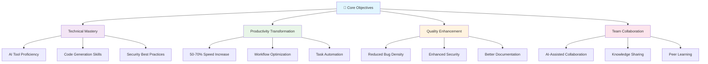
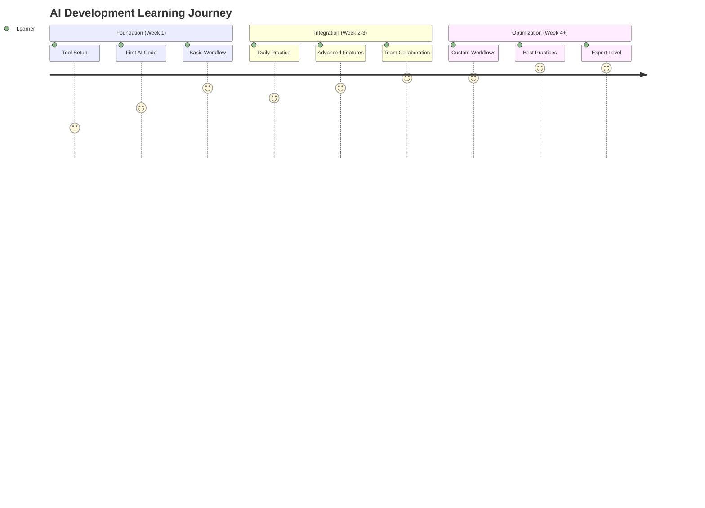
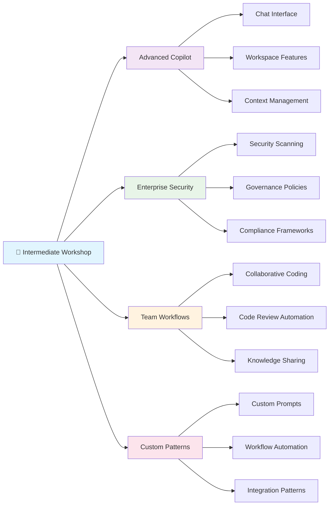
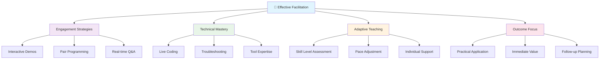
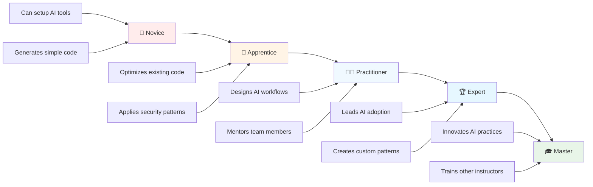
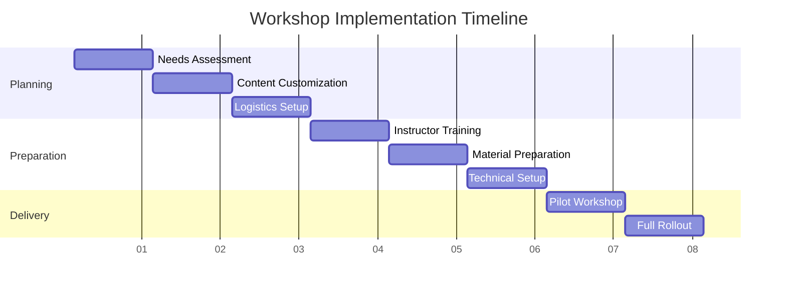
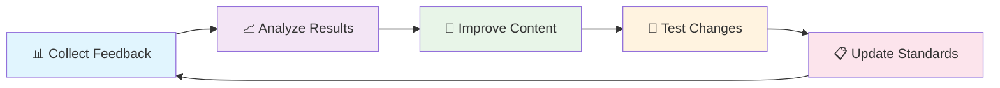

# 🏗️ AI-Powered Development Workshop Structure Guide
## Complete Framework for Transforming Teams to AI-Assisted Development


> **🎯 Transform teams from traditional to AI-powered development with proven workshop methodologies that deliver 50-70% productivity gains**

---

## 📋 Table of Contents

| 📚 Section | 🎯 Focus | ⏱️ Time | 🔗 Link |
|------------|----------|---------|---------|
| **🌟 Workshop Overview** | Framework and methodology | 5 min | [Jump to Section](#-workshop-overview) |
| **🎓 Learning Pathways** | Progressive skill development | 5 min | [Jump to Section](#-learning-pathways) |
| **🏗️ Workshop Modules** | Detailed structure breakdown | 10 min | [Jump to Section](#-workshop-modules) |
| **👨‍🏫 Facilitation Guide** | Instructor best practices | 8 min | [Jump to Section](#-facilitation-guide) |
| **📊 Assessment Framework** | Success measurement | 5 min | [Jump to Section](#-assessment-framework) |
| **🚀 Implementation Guide** | Practical execution | 7 min | [Jump to Section](#-implementation-guide) |

**Total Reading Time**: ~40 minutes  
**Target Audience**: Workshop Instructors, Training Managers, Team Leaders  
**Workshop Delivery**: [Start Planning →](complete_workshop_guide.md)

---

## 🌟 Workshop Overview

### 🎯 Workshop Philosophy

Our AI-powered development workshops follow a **proven 80/20 methodology**: 80% hands-on practice with immediate application, 20% conceptual foundation.

#### 📊 **Workshop Impact Matrix**

| 🎯 Workshop Type | ⏱️ Duration | 👥 Audience | 📈 Expected Outcome | 🏆 Success Rate |
|------------------|-------------|-------------|-------------------|----------------|
| **🌱 Basic Workshop** | 90 minutes | Beginners, first-time AI users | AI coding proficiency | 95% |
| **🔧 Intermediate Workshop** | 2 hours | Developers with basic AI experience | Advanced AI workflows | 90% |
| **⚡ Advanced Workshop** | 3+ hours | Senior developers, architects | Enterprise AI implementation | 85% |
| **🏢 Enterprise Track** | Full day | Teams, managers, decision makers | Organizational transformation | 80% |

### 🎯 Core Learning Objectives



### 🌍 Global Workshop Standards

#### 🏆 **Quality Assurance Framework**

| 📊 Quality Metric | 🎯 Target | 📏 Measurement | ✅ Success Criteria |
|-------------------|-----------|----------------|-------------------|
| **Participant Satisfaction** | 4.5+/5.0 | Post-workshop survey | 90% recommend to colleagues |
| **Technical Proficiency** | 80%+ pass rate | Hands-on assessments | Complete basic AI coding tasks |
| **Productivity Gain** | 30%+ immediate | Time-tracking exercises | Faster code completion |
| **Long-term Adoption** | 70%+ after 30 days | Follow-up surveys | Daily AI tool usage |

---

## 🎓 Learning Pathways

### 🛤️ Progressive Skill Development Model



### 🎯 Audience-Specific Learning Paths

#### 👨‍💻 **Developer Track**

| 📅 Phase | 🎯 Focus | 🛠️ Activities | 📊 Outcome | ⏱️ Duration |
|----------|----------|---------------|------------|-------------|
| **Foundation** | AI tool setup | GitHub Copilot installation, first code generation | Working AI environment | 30 min |
| **Practice** | Hands-on coding | Calculator, optimization, security exercises | Practical AI skills | 45 min |
| **Integration** | Workflow adoption | Daily development with AI assistance | Productivity boost | 15 min |

#### 👔 **Manager Track**

```yaml
Executive Focus Areas:
  Business Value: "ROI calculations and productivity metrics"
  Team Adoption: "Change management and rollout strategies"
  Governance: "Security policies and compliance frameworks"
  Success Metrics: "KPIs and measurement frameworks"

Delivery Format:
  Duration: "60 minutes focused session"
  Content: "Business case, demos, success stories"
  Outcome: "Clear implementation roadmap"
```

#### 🏗️ **Architect Track**

| 🎯 Technical Area | 📖 Content Focus | 🛠️ Hands-On Component | 📈 Depth Level |
|-------------------|------------------|----------------------|----------------|
| **System Design** | AI integration patterns | Architecture review with AI | Advanced |
| **Security** | AI governance frameworks | Policy implementation | Expert |
| **Performance** | AI-optimized workflows | Benchmark analysis | Advanced |
| **Scalability** | Enterprise deployment | Multi-team coordination | Expert |

---

## 🏗️ Workshop Modules

### 🌱 Basic Workshop Structure (90 Minutes)

#### 📅 **Detailed Timeline & Content Breakdown**

```mermaid
gantt
    title Basic Workshop Flow (90 Minutes)
    dateFormat X
    axisFormat %M
    
    section Introduction
    Welcome & Overview        :intro1, 0, 10
    AI Development Concepts   :intro2, 10, 15
    
    section Hands-On Practice
    Environment Setup         :setup, 15, 25
    First AI Code            :code1, 25, 45
    Performance Exercise     :perf, 45, 65
    Security Exercise        :sec, 65, 85
    
    section Wrap-Up
    Q&A and Next Steps       :outro, 85, 90
```



#### 🎯 **Module Breakdown with Learning Objectives**

| ⏱️ Time Slot | 📚 Module | 🎯 Learning Objective | 🛠️ Activities | ✅ Success Criteria |
|--------------|-----------|----------------------|---------------|-------------------|
| **0-15 min** | 🎪 **Introduction** | Understand AI development transformation | Presentation, live demo | Can explain AI benefits |
| **15-45 min** | 🚀 **First AI Code** | Generate code with AI assistance | Calculator class creation | Working AI-generated code |
| **45-65 min** | ⚡ **Performance** | Optimize code using AI | String performance comparison | 10x+ performance improvement |
| **65-85 min** | 🔒 **Security** | Fix vulnerabilities with AI | SQL injection prevention | Secure code implementation |
| **85-90 min** | 🎯 **Wrap-up** | Plan continued learning | Action planning, Q&A | Clear next steps defined |

### 🔧 Intermediate Workshop Structure (2 Hours)

#### 🚀 **Advanced Topics & Enterprise Features**



#### 📊 **Enterprise-Focused Content Modules**

| 📚 Module | 🎯 Enterprise Value | 🛠️ Practical Exercise | 📈 Business Impact |
|-----------|-------------------|----------------------|-------------------|
| **🤖 Advanced Copilot** | Enhanced productivity | Multi-file code generation | 60-80% faster development |
| **🔒 Enterprise Security** | Risk mitigation | Automated security scanning | 70% fewer vulnerabilities |
| **👥 Team Collaboration** | Standardized practices | Collaborative coding session | 40% faster code reviews |
| **⚙️ Custom Workflows** | Process optimization | Custom automation setup | 50% reduced manual tasks |

### ⚡ Advanced Workshop Structure (3+ Hours)

#### 🏢 **Enterprise Transformation Deep Dive**

```yaml
Advanced Workshop Architecture:
  
  Part 1 - Strategic Foundation (45 minutes):
    - "Enterprise AI adoption strategies"
    - "Multi-team coordination patterns"
    - "Governance and compliance frameworks"
    - "ROI measurement and optimization"
  
  Part 2 - Technical Implementation (90 minutes):
    - "Multi-agent system design"
    - "Azure AI services integration"
    - "Advanced security patterns"
    - "Performance optimization at scale"
  
  Part 3 - Organizational Change (60 minutes):
    - "Change management strategies"
    - "Training program design"
    - "Success metrics and KPIs"
    - "Long-term sustainability planning"
  
  Part 4 - Hands-On Lab (45 minutes):
    - "Real-world scenario implementation"
    - "Team-based problem solving"
    - "Best practices application"
    - "Peer review and feedback"
```

---

## 👨‍🏫 Facilitation Guide

### 🎯 Instructor Preparation Framework

#### 📋 **Pre-Workshop Checklist (1 Week Before)**

| ✅ Task | 🎯 Purpose | ⏱️ Time Required | 📋 Status |
|---------|------------|-----------------|----------|
| **🔧 Technical Setup** | Ensure all tools work perfectly | 2 hours | Validate all demos |
| **👥 Audience Analysis** | Customize content for participants | 1 hour | Survey responses reviewed |
| **📚 Content Preparation** | Finalize slides and exercises | 3 hours | Materials ready to go |
| **🎯 Learning Objectives** | Align with business goals | 1 hour | Clear outcomes defined |

#### 🗣️ **Facilitation Best Practices**



### 🎪 **Workshop Delivery Techniques**

#### ⚡ **The 10-3-1 Rule**

| ⏱️ Time Block | 🎯 Focus | 🛠️ Activity Type | 📊 Engagement Level |
|---------------|----------|-------------------|-------------------|
| **10 minutes** | Hands-on coding | Interactive exercise | High engagement |
| **3 minutes** | Concept explanation | Brief theory | Focused attention |
| **1 minute** | Quick validation | Check understanding | Active participation |

#### 🎯 **Engagement Strategies by Workshop Phase**

```yaml
Opening (15 minutes):
  Hook: "Live demo of AI generating complex code"
  Problem Statement: "Show pain points of traditional development"
  Value Proposition: "Demonstrate immediate productivity gains"

Main Content (60-150 minutes):
  Practice Cycles: "10 minutes hands-on, 3 minutes explanation"
  Progressive Complexity: "Start simple, build to advanced"
  Immediate Application: "Real-world scenarios throughout"

Closing (15 minutes):
  Synthesis: "Review key learnings and achievements"
  Action Planning: "Define specific next steps"
  Community Building: "Connect participants for ongoing support"
```

---

## 📊 Assessment Framework

### 🏆 Multi-Level Competency Assessment

#### 📈 **Skill Progression Model**



#### 🎯 **Assessment Criteria by Level**

| 🏆 Level | 📋 Assessment Criteria | 🛠️ Practical Demonstration | ⏱️ Time to Achieve |
|----------|----------------------|---------------------------|-------------------|
| **🌱 Novice** | Setup tools, generate basic code | Create simple calculator with AI | Workshop completion |
| **🔧 Apprentice** | Optimize performance, fix security issues | String optimization + SQL injection fix | 1-2 weeks practice |
| **👨‍💻 Practitioner** | Design workflows, review code | Custom AI workflow implementation | 1-2 months experience |
| **🏆 Expert** | Lead adoption, mentor others | Team training delivery | 6+ months experience |
| **🎓 Master** | Innovate practices, train trainers | Develop new workshop content | 1+ years experience |

### 📊 **Success Measurement Framework**

#### 🎯 **Immediate Assessment (During Workshop)**

```yaml
Real-Time Success Indicators:
  
  Technical Competency:
    - "Successfully generates first AI code"
    - "Completes performance optimization exercise"
    - "Implements secure coding pattern"
    - "Demonstrates workflow integration"
  
  Engagement Metrics:
    - "Active participation in exercises"
    - "Quality of questions asked"
    - "Peer collaboration effectiveness"
    - "Problem-solving approach"
  
  Understanding Validation:
    - "Explains AI benefits clearly"
    - "Identifies appropriate use cases"
    - "Recognizes security implications"
    - "Plans implementation steps"
```

#### 📈 **Long-Term Impact Tracking (30-90 Days)**

| 📊 Metric Category | 🎯 Success Indicator | 📏 Measurement Method | 📅 Timeline |
|-------------------|--------------------|--------------------|-----------|
| **Tool Adoption** | Daily AI tool usage | Usage analytics | 30 days |
| **Productivity** | Faster feature delivery | Development velocity | 60 days |
| **Code Quality** | Fewer production bugs | Defect tracking | 90 days |
| **Team Impact** | Knowledge sharing | Peer mentoring | 90 days |

---

## 🚀 Implementation Guide

### 📅 Workshop Planning Timeline

#### 🗓️ **8-Week Implementation Roadmap**



### 🎯 **Organizational Readiness Assessment**

#### 📊 **Readiness Checklist**

| 🎯 Readiness Factor | 📋 Assessment Questions | ✅ Ready | ⚠️ Needs Work | ❌ Not Ready |
|-------------------|------------------------|----------|---------------|-------------|
| **👥 Leadership Support** | Executive sponsorship confirmed? | Full commitment | Partial buy-in | No support |
| **🛠️ Technical Infrastructure** | AI tools accessible to all? | All platforms ready | Some limitations | Major gaps |
| **📚 Learning Culture** | Team open to new practices? | Highly motivated | Generally positive | Resistant |
| **⏱️ Time Allocation** | Dedicated workshop time? | Full schedule cleared | Partial availability | No time allocated |

### 🏢 **Enterprise Rollout Strategy**

#### 🚀 **Phase-Based Implementation**

```yaml
Phase 1 - Pilot Program (4 weeks):
  Scope: "1-2 development teams (10-20 developers)"
  Objective: "Validate workshop effectiveness and gather feedback"
  Success Metrics: "80%+ satisfaction, 30%+ productivity gain"
  
Phase 2 - Department Rollout (8 weeks):
  Scope: "Full development organization (50-200 developers)"
  Objective: "Scale proven workshop model across teams"
  Success Metrics: "Consistent adoption, knowledge sharing"
  
Phase 3 - Enterprise Deployment (12 weeks):
  Scope: "All technical teams organization-wide"
  Objective: "Complete digital transformation to AI-assisted development"
  Success Metrics: "Cultural shift, sustained productivity gains"

Phase 4 - Continuous Improvement (Ongoing):
  Scope: "All teams with regular refresh training"
  Objective: "Maintain cutting-edge AI development practices"
  Success Metrics: "Innovation metrics, competitive advantage"
```

### 📊 **Resource Requirements Planning**

#### 🛠️ **Workshop Resource Matrix**

| 🎯 Workshop Scale | 👥 Participants | 👨‍🏫 Instructors | 💻 Equipment | 📅 Duration | 💰 Investment |
|------------------|----------------|----------------|---------------|-------------|---------------|
| **Pilot** | 10-20 | 1 lead + 1 assistant | Standard dev machines | 2 days | $5K-10K |
| **Department** | 50-100 | 2-3 certified instructors | Dedicated lab space | 1 week | $20K-40K |
| **Enterprise** | 200+ | 5+ instructor team | Full training infrastructure | 4-6 weeks | $100K+ |

---

## 🎉 Workshop Excellence Standards

### 🏆 **Quality Assurance Framework**

> **🎯 Our workshop excellence standard: Transform every participant into a confident AI-powered developer who can immediately apply their skills in real-world scenarios.**

#### 📊 **Excellence Indicators**

| 🎯 Excellence Level | 📈 Participant Achievement | 📊 Measurable Outcome | 🏆 Recognition |
|-------------------|---------------------------|---------------------|----------------|
| **🥉 Good** | Basic AI tool proficiency | 70% complete all exercises | Workshop completion certificate |
| **🥈 Excellent** | Advanced feature usage | 85% demonstrate optimization skills | Advanced practitioner recognition |
| **🥇 Outstanding** | Innovation and mentoring | 95% teaching others within 30 days | Master practitioner certification |

### 🚀 **Continuous Improvement Process**



#### 🎯 **Success Progression Path**

**🚀 Ready to transform your development team?** Use this comprehensive framework to deliver world-class AI development workshops that create lasting impact and measurable business value.

---

## 🧭 Navigation

| Previous | Up | Next |
|----------|----|----- |
| [⬅️ Module 3: Troubleshooting](troubleshooting_guide.md) | [📖 Main README](../README.md) | [➡️ Module 5: Reorganization Checklist](reorganization-checklist.md) |

**Workshop Progress**: Module 4 of 6 • **Estimated Time**: 30 minutes (review)

**Quick Links**: [🚀 Module 1: Introduction](ai-dev-introduction.md) | [📚 Module 2: Workshop](complete_workshop_guide.md) | [🆘 Module 3: Troubleshooting](troubleshooting_guide.md)