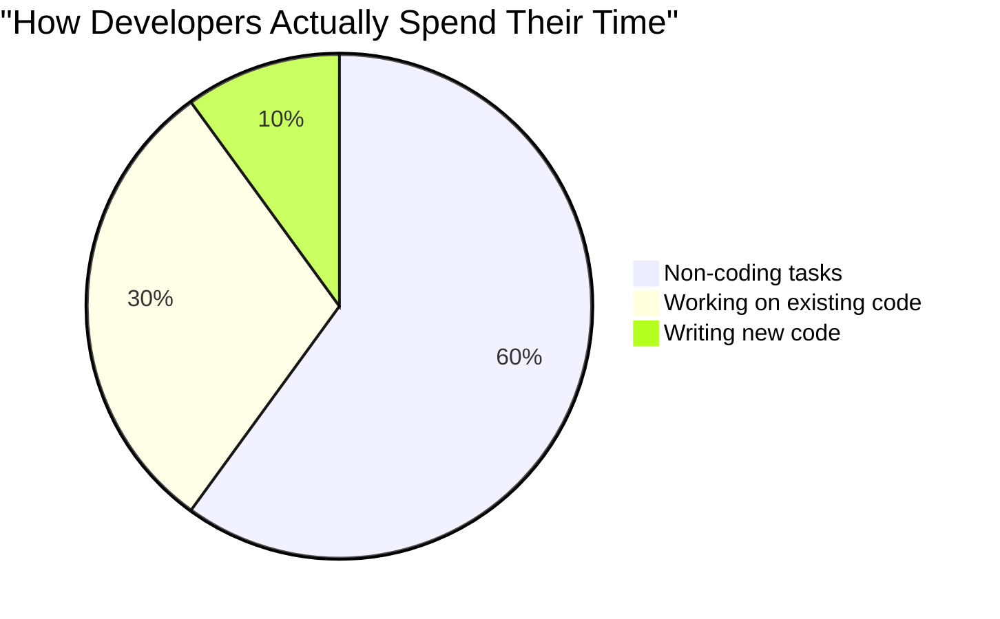
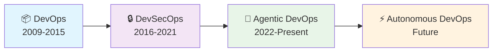
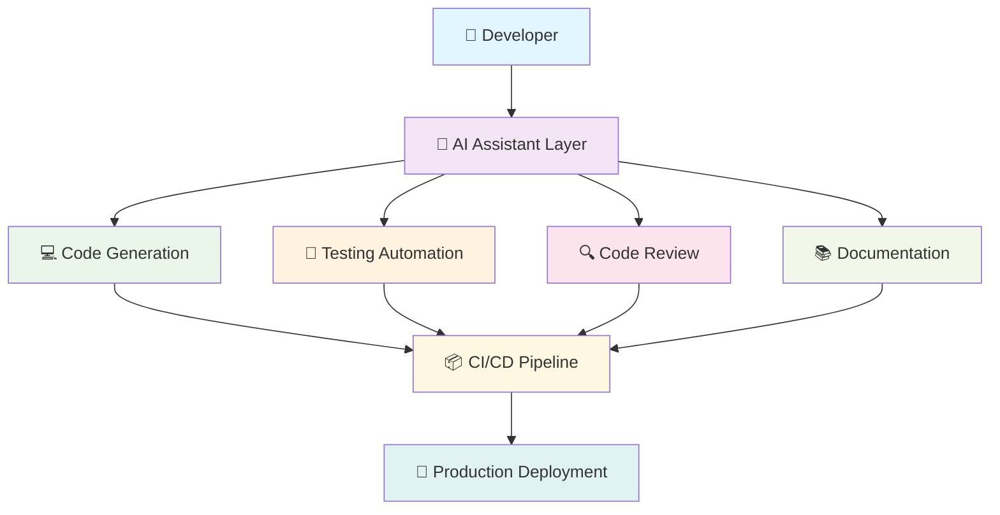
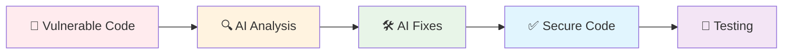
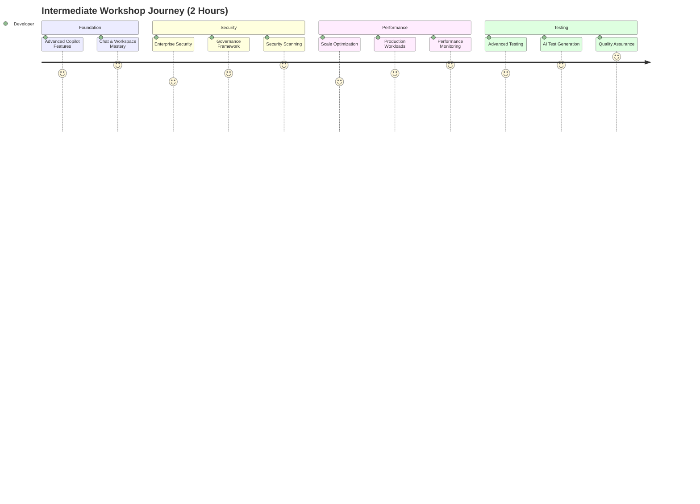
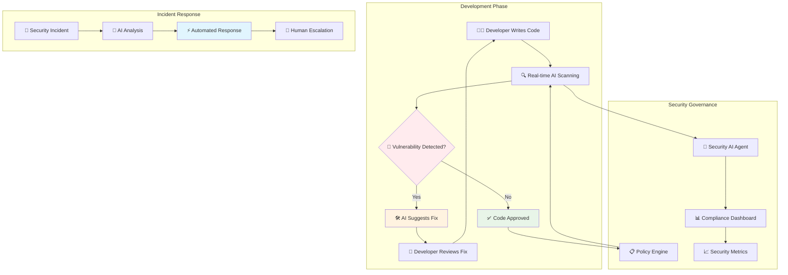
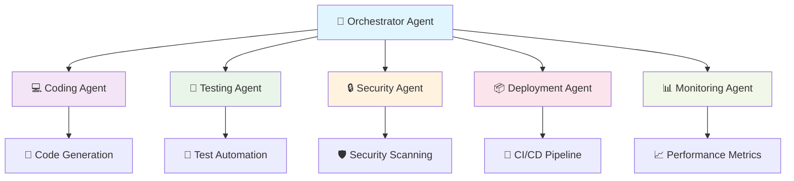
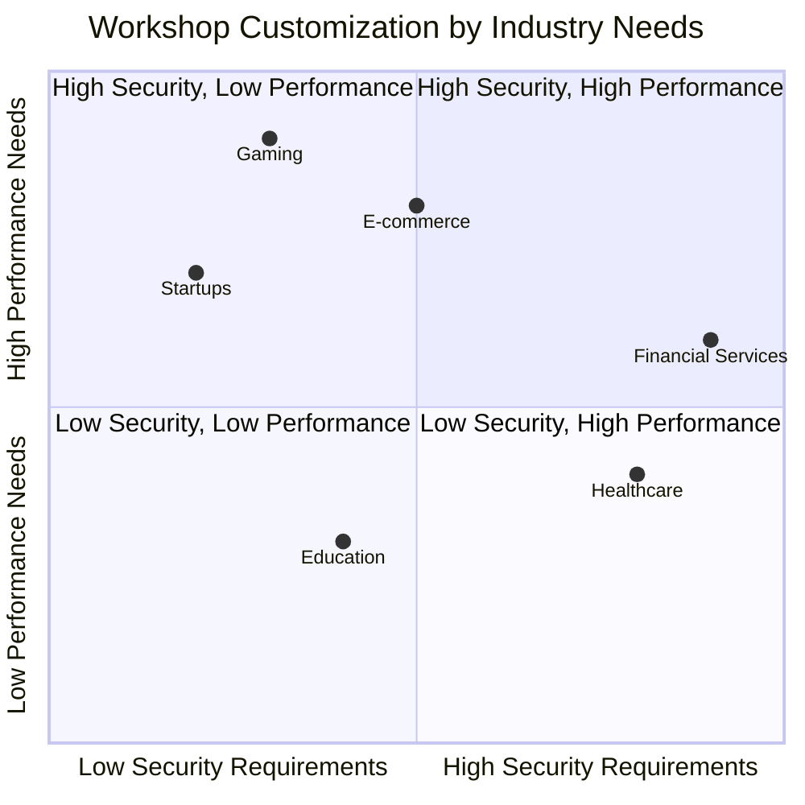
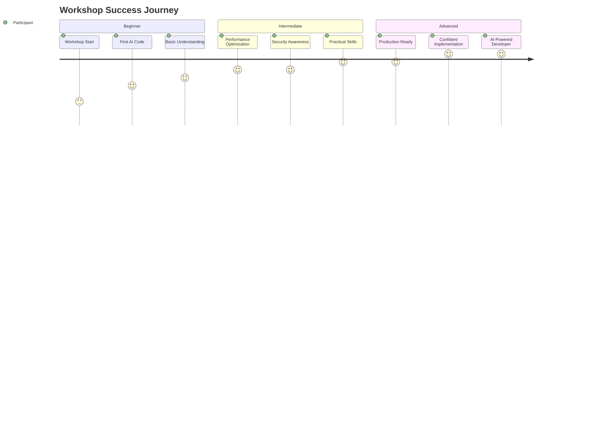

# 🤖 AI-Powered Development Workshop Guide
## 🏗️ Module 4: Enterprise Workshop Structure

> **🎯 Complete workshop framework for transforming teams from traditional to AI-powered development**

**Module Information:**
- 📊 **Difficulty:** Instructor/Advanced
- ⏱️ **Duration:** 30 minutes (review)
- 🎯 **Focus:** Workshop planning and execution
- 📈 **Objective:** Design effective AI development workshops

---

## 📋 Workshop Overview

| 🎯 Workshop Type | ⏱️ Duration | 👥 Audience | 📊 Complexity |
|------------------|-------------|-------------|----------------|
| **🌱 Basic Workshop** | 90 minutes | Beginners, first-time AI users | Low |
| **🔧 Intermediate Workshop** | 2 hours | Developers with basic AI experience | Medium |
| **⚡ Advanced Workshop** | 3+ hours | Senior developers, architects | High |
| **🏢 Enterprise Track** | Full day | Teams, managers, decision makers | Variable |

---

## 🎪 15-Minute Agentic DevOps Introduction

### 🚨 Opening: The Developer Productivity Challenge

**📊 Visual: Developer Time Allocation**



| 📊 Activity Category | ⏱️ Time Spent | 📖 Examples | 🤖 AI Impact Potential |
|---------------------|---------------|-------------|----------------------|
| **📋 Non-coding tasks** | **60%** | Planning, research, meetings, documentation | **HIGH - 70-80% automation** |
| **🔧 Existing code** | **30%** | Bug fixes, refactoring, migrations | **MEDIUM - 50-60% assistance** |
| **✨ New code** | **10%** | Writing new features | **HIGH - 100% enhancement** |

> **💡 Key Insight**: Developers spend most time on non-creative tasks that AI can help automate and optimize.

### 🔄 Evolution of DevOps

#### 📈 The DevOps Evolution Timeline



| 🔄 Era | 🎯 Focus | 🛠️ Key Tools | 📈 Productivity Gain |
|--------|----------|-------------|---------------------|
| **📦 DevOps** | Automation & Collaboration | Jenkins, Docker, Kubernetes | 2-3x |
| **🔒 DevSecOps** | Security Integration | SAST, DAST, Container scanning | 1.5-2x |
| **🤖 Agentic DevOps** | AI-Powered Assistance | GitHub Copilot, AI agents | 3-5x |
| **⚡ Autonomous DevOps** | Full Automation | Self-healing systems | 5-10x |

### 🤖 Agentic DevOps Definition

> **🎯 Agentic DevOps**: AI-powered agents operating as intelligent members of your development team, autonomously automating, optimizing, and accelerating every stage of the software development lifecycle.

#### 🧠 Core Characteristics

| 🎯 Characteristic | 📖 Description | 💪 Capability |
|-------------------|----------------|---------------|
| **🤖 Autonomous** | Operates independently with minimal supervision | Self-directed task execution |
| **🧠 Context-Aware** | Understands codebase, patterns, and business logic | Intelligent decision making |
| **🔄 Adaptive** | Learns from feedback and improves over time | Continuous optimization |
| **🤝 Collaborative** | Works seamlessly with human developers | Human-AI partnership |

---

## 🧩 Core Components Overview

### 🔧 AI-Powered Development Stack



#### 🎯 Component Breakdown

| 🔧 Component | 🎯 Purpose | 🛠️ Tools | 📊 Impact |
|--------------|------------|-----------|----------|
| **💻 Code Generation** | AI-assisted coding and completion | GitHub Copilot, Tabnine | 50-100% faster coding |
| **🧪 Testing Automation** | Automated test generation and execution | AI test generators | 80-90% test coverage |
| **🔍 Code Review** | Intelligent code analysis and feedback | AI code reviewers | 75% faster reviews |
| **📚 Documentation** | Auto-generated docs and comments | AI documentation tools | 90% time savings |
| **📦 CI/CD Integration** | AI-enhanced pipeline optimization | GitHub Actions, Azure DevOps | 40-60% faster deployments |

---

## 🌱 Basic Workshop (90 Minutes) Structure

### 📅 Detailed Timeline

| ⏱️ Time | 📚 Module | 🎯 Learning Objective | 🛠️ Activities |
|---------|-----------|----------------------|---------------|
| **0-15 min** | 🎪 **Introduction** | Understand AI-powered development | Presentation, Q&A |
| **15-35 min** | 🚀 **First AI Code** | Generate code with AI assistance | Hands-on coding exercise |
| **35-60 min** | ⚡ **Performance Optimization** | Optimize code using AI suggestions | String performance lab |
| **60-85 min** | 🔒 **Security Enhancement** | Fix vulnerabilities with AI help | SQL injection prevention |
| **85-90 min** | 🎯 **Wrap-up & Next Steps** | Plan continued AI adoption | Action planning |

### 🎯 Module 1: Introduction (15 minutes)

#### 📋 Content Outline

```yaml
Opening Hook (3 min):
  Question: "How much time do you spend writing NEW code vs fixing/maintaining?"
  Reveal: "Only 10% on new code - AI can change this"

Problem Statement (5 min):
  Current State: "Traditional development inefficiencies"
  Future State: "AI-augmented development capabilities"
  Gap Analysis: "Skills and tools needed for transformation"

Solution Preview (7 min):
  Demo: "Live GitHub Copilot demonstration"
  Benefits: "Immediate productivity gains"
  Workshop Overview: "What you'll learn today"
```

### 🚀 Module 2: First AI Code (20 minutes)

#### 🛠️ Hands-on Exercise Structure

| 📋 Step | ⏱️ Duration | 🎯 Activity | ✅ Success Criteria |
|---------|-------------|-------------|-------------------|
| **1** | 5 min | **Setup Verification** | VS Code + Copilot working |
| **2** | 10 min | **Calculator Creation** | AI generates complete class |
| **3** | 3 min | **Code Analysis** | Understanding AI suggestions |
| **4** | 2 min | **Testing** | Code compiles and runs |

#### 💻 Expected Code Output

```java
// Students will type this comment:
// Create a simple calculator class with add, subtract, multiply, and divide methods

// AI will generate:
public class Calculator {
    public double add(double a, double b) { return a + b; }
    public double subtract(double a, double b) { return a - b; }
    public double multiply(double a, double b) { return a * b; }
    public double divide(double a, double b) {
        if (b == 0) throw new IllegalArgumentException("Cannot divide by zero");
        return a / b;
    }
}
```

### ⚡ Module 3: Performance Optimization (25 minutes)

#### 📊 Performance Lab Structure

| 🔬 Experiment | ⏱️ Time | 🎯 Goal | 📈 Expected Result |
|---------------|---------|---------|-------------------|
| **🐌 Baseline Test** | 5 min | Measure inefficient string concatenation | Slow performance |
| **🤖 AI Optimization** | 10 min | Let AI suggest StringBuilder | Fast performance |
| **📊 Comparison** | 5 min | Compare performance metrics | 10-100x improvement |
| **🧠 Learning** | 5 min | Understand why optimization works | Deep comprehension |

#### 📈 Performance Metrics

```yaml
Test Results (10,000 string concatenations):
  String Concatenation: "~14,000ms (slow)"
  StringBuilder: "~15ms (fast)" 
  Improvement: "930x faster performance"
  
Memory Usage:
  String Concatenation: "High memory allocation"
  StringBuilder: "Efficient buffer management"
```

### 🔒 Module 4: Security Enhancement (25 minutes)

#### 🛡️ Security Exercise Flow



| 📋 Phase | 🎯 Objective | 🛠️ Method | 📊 Outcome |
|----------|--------------|-----------|-----------|
| **🚨 Identify** | Find SQL injection vulnerability | Code review with AI | Security issue detected |
| **🔍 Analyze** | Understand the risk | AI explanation | Threat comprehension |
| **🛠️ Fix** | Apply secure coding practices | AI-suggested parameterized queries | Vulnerability eliminated |
| **🧪 Validate** | Confirm security improvement | Testing and verification | Secure implementation |

---

## 🔧 Intermediate Workshop (2 Hours) Structure

### 🔄 Intermediate Workshop Flow



### 📈 Advanced Topics Coverage

| ⏱️ Time Block | 📚 Advanced Module | 🎯 Learning Outcome | 🛠️ Complexity Level |
|---------------|-------------------|--------------------|--------------------|
| **0-30 min** | 🤖 **Advanced Copilot Features** | Master Chat and workspace features | Medium |
| **30-70 min** | 🔒 **Enterprise Security** | Implement security governance | High |
| **70-105 min** | ⚡ **Performance at Scale** | Optimize for production workloads | High |
| **105-120 min** | 🧪 **Advanced Testing** | AI-generated comprehensive tests | Medium-High |

### 🤖 Advanced Copilot Features (30 minutes)

#### 💬 Copilot Chat Deep Dive

```yaml
Chat Techniques:
  Code Analysis: "Analyze this code for potential issues"
  Architecture Questions: "What's the best pattern for this use case?"
  Debugging Help: "This code is throwing an exception, help me debug"
  Refactoring Guidance: "How can I improve this code following SOLID principles?"

Expected Outcomes:
  - Context-aware code suggestions
  - Architecture recommendations
  - Debugging assistance
  - Code quality improvements
```

### 🔒 Enterprise Security Integration (40 minutes)

#### 🛡️ AI-Powered Security Architecture



#### 🛡️ Security Governance Framework

| 🔧 Security Layer | 🎯 Implementation | 🛠️ Tools | 📊 Coverage |
|-------------------|-------------------|-----------|-------------|
| **🔍 Code Scanning** | Real-time vulnerability detection | GitHub Advanced Security | 95% of common vulnerabilities |
| **📋 Policy Enforcement** | Automated compliance checking | Custom AI rules | 100% policy compliance |
| **🚨 Incident Response** | AI-powered threat analysis | Security AI agents | 80% faster response |
| **📚 Security Training** | AI-assisted learning | Interactive tutorials | 60% faster skill development |

---

## ⚡ Advanced Workshop (3+ Hours) Structure

### 🏢 Enterprise Transformation Journey

```mermaid
gantt
    title Advanced Workshop: Enterprise AI Transformation
    dateFormat X
    axisFormat %H:%M
    
    section Foundation
    Agentic Architecture          :arch, 0, 45
    
    section Cloud Integration
    Azure AI Services             :azure, 45, 105
    
    section Governance
    Enterprise Policies           :gov, 105, 150
    
    section Operations
    Monitoring & SRE             :ops, 150, 180
    
    section Scaling
    Organizational Change         :scale, 180, 195
```



### 🏢 Enterprise-Scale Implementation

#### 📋 Comprehensive Module Breakdown

| 🕐 Time | 📚 Module | 🎯 Enterprise Focus | 🏆 Business Value |
|---------|-----------|-------------------|------------------|
| **0-45 min** | 🤖 **Agentic Architecture** | Multi-agent coordination | 50-70% automation |
| **45-105 min** | ☁️ **Azure AI Integration** | Cloud-scale AI services | Enterprise scalability |
| **105-150 min** | 📋 **Governance Framework** | Enterprise policies | Risk management |
| **150-180 min** | 📊 **Monitoring & SRE** | Production optimization | 40% incident reduction |
| **180-195 min** | 🌍 **Organizational Scaling** | Change management | Company-wide adoption |

### 🤖 Agentic Architecture Implementation

#### 🏗️ Multi-Agent System Design



#### 🎯 Agent Capabilities Matrix

| 🤖 Agent Type | 🛠️ Primary Function | 🎯 Autonomy Level | 📊 Impact |
|---------------|-------------------|------------------|----------|
| **💻 Coding Agent** | Generate and refactor code | High | 2-3x faster development |
| **🧪 Testing Agent** | Create and execute tests | Medium-High | 90% test coverage |
| **🔒 Security Agent** | Scan and fix vulnerabilities | High | 60% fewer security issues |
| **📦 Deployment Agent** | Manage CI/CD pipelines | Medium | 50% faster deployments |
| **📊 Monitoring Agent** | Track and optimize performance | High | 40% fewer incidents |

---

## 📊 Workshop Success Metrics

### 🎯 Immediate Learning Outcomes

| 📈 Metric | 📊 Target | 📏 Measurement Method | ⏱️ Assessment Time |
|-----------|-----------|---------------------|-------------------|
| **🤖 Tool Proficiency** | 90% participants using AI effectively | Hands-on exercise completion | During workshop |
| **💡 Concept Understanding** | 85% comprehension of AI benefits | Quiz and Q&A | End of workshop |
| **🛠️ Practical Skills** | 80% can optimize code with AI | Live coding assessment | During exercises |
| **😊 Satisfaction** | 4.5/5 average rating | Post-workshop survey | Immediately after |

### 📈 Long-term Impact Tracking

```yaml
30-Day Follow-up Metrics:
  Productivity: "Measure coding speed improvements"
  Quality: "Track bug reduction rates"
  Adoption: "Monitor daily AI tool usage"
  Innovation: "Count new AI-assisted projects"

90-Day Business Impact:
  Time-to-Market: "Measure feature delivery speed"
  Cost Reduction: "Calculate development cost savings"
  Team Satisfaction: "Survey developer happiness"
  Competitive Advantage: "Compare against industry benchmarks"
```

---

## 🎯 Workshop Customization Guide

### 🔄 Industry Customization Matrix



### 🏢 Industry-Specific Adaptations

| 🏭 Industry | 🎯 Focus Areas | 🛠️ Custom Examples | 📊 Specific Metrics |
|-------------|---------------|-------------------|-------------------|
| **🏦 Financial Services** | Security, compliance, regulatory | Banking API development | Audit trail, compliance |
| **🏥 Healthcare** | Data privacy, HIPAA compliance | Medical record systems | Patient data security |
| **🛒 E-commerce** | Performance, scalability | Shopping cart optimization | Conversion rates, uptime |
| **🎮 Gaming** | Real-time processing, graphics | Game engine development | Frame rates, user engagement |

### 👥 Role-Based Learning Paths

```mermaid
sankey
    Participants,Developer,150
    Participants,Architect,75
    Participants,Manager,50
    Participants,Security,35
    
    Developer,Hands-on Coding,120
    Developer,Architecture,30
    
    Architect,System Design,45
    Architect,Governance,30
    
    Manager,Business Value,35
    Manager,ROI Analysis,15
    
    Security,Security Framework,25
    Security,Compliance,10
```

| 👤 Role | 🎯 Learning Focus | 📚 Recommended Modules | ⏱️ Time Investment |
|---------|-------------------|----------------------|-------------------|
| **👩‍💻 Developer** | Hands-on coding with AI | All practical modules | Full workshop |
| **🏗️ Architect** | System design with AI | Architecture and governance | 2-3 hours |
| **👔 Manager** | Business value and ROI | Introduction and metrics | 1 hour |
| **🔒 Security** | AI security implications | Security-focused modules | 1.5 hours |

---

## 🚀 Getting Started

### 📋 Pre-Workshop Preparation Checklist

| ✅ Item | 🎯 Owner | ⏱️ Timeline | 📖 Status |
|---------|----------|-------------|----------|
| **📧 Send prerequisites email** | Organizer | 1 week before | Required |
| **🛠️ Test all demo environments** | Technical team | 2 days before | Critical |
| **📚 Prepare workshop materials** | Instructor | 3 days before | Required |
| **🎯 Customize for audience** | Content team | 1 week before | Recommended |

### 🎓 Instructor Preparation

```yaml
Technical Requirements:
  - GitHub Copilot Business license
  - VS Code with extensions installed
  - Demo repositories prepared
  - Backup internet connection

Content Preparation:
  - Industry-specific examples ready
  - Troubleshooting scenarios practiced
  - Advanced questions anticipated
  - Success stories prepared

Logistics:
  - Room setup with good WiFi
  - Participant laptop requirements verified
  - Support team contact information
  - Workshop feedback forms ready
```

---

## 🎉 Workshop Success Framework

### 🏆 Success Progression Model



### 🏆 Excellence Standards

> **🎯 A successful AI development workshop transforms participants from curious observers to confident AI-powered developers in a single session.**

#### 📊 Success Indicators

| 🎯 Success Level | 📈 Participants Achievement | 📊 Measurable Outcome |
|------------------|---------------------------|---------------------|
| **🥉 Basic Success** | Can use GitHub Copilot for simple tasks | 70% complete basic exercises |
| **🥈 Good Success** | Understands optimization and security | 80% complete intermediate challenges |
| **🥇 Excellent Success** | Ready to implement in production | 90% express confidence to use AI at work |

**🚀 Ready to transform your development team?** Use this structure to deliver world-class AI development workshops that create lasting impact and measurable business value.

---

## 🧭 Navigation

| Previous | Up | Next |
|----------|----|----- |
| [⬅️ Module 3: Troubleshooting](troubleshooting_guide.md) | [📖 Main README](../README.md) | [➡️ Module 5: Reorganization Checklist](reorganization-checklist.md) |

**Workshop Progress**: Module 4 of 6 • **Estimated Time**: 30 minutes (review)

**Quick Links**: [🚀 Module 1: Introduction](ai-dev-introduction.md) | [📚 Module 2: Workshop](complete_workshop_guide.md) | [🆘 Module 3: Troubleshooting](troubleshooting_guide.md)