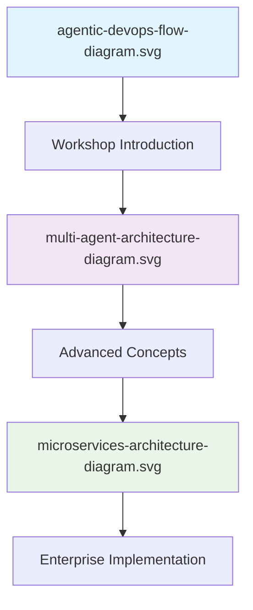

# 🎨 Workshop Visual Assets

This directory contains visual diagrams and illustrations that support the **AI-Powered Development Workshop** documentation and presentations.


## 📋 Overview

The visual assets provide professional diagrams for understanding AI-powered development concepts, including:

- **Architecture Diagrams** showing system design and component relationships
- **Workflow Illustrations** demonstrating AI-assisted development processes
- **Process Flow Charts** for understanding multi-agent and agentic DevOps patterns
- **Enterprise-Grade Visuals** suitable for presentations and documentation

## 🖼️ Available Diagrams

### 📊 Architecture and Flow Diagrams

| 🎨 Diagram | 📖 Description | 🎯 Usage | 📐 Specifications |
|------------|----------------|----------|-------------------|
| [`agentic-devops-flow-diagram.svg`](agentic-devops-flow-diagram.svg) | Complete agentic DevOps workflow visualization | Main workshop introduction, README hero image | SVG format, scalable vector graphics |
| [`multi-agent-architecture-diagram.svg`](multi-agent-architecture-diagram.svg) | Multi-agent system architecture for enterprise AI | Advanced workshop modules, enterprise discussions | SVG format, detailed component view |
| [`microservices-architecture-diagram.svg`](microservices-architecture-diagram.svg) | Microservices implementation with AI integration | Architecture planning, system design sessions | SVG format, enterprise architecture |

### 🎯 Diagram Usage Matrix

| 📚 Documentation Section | 🖼️ Primary Diagram | 🎯 Purpose |
|--------------------------|-------------------|-------------|
| **Main README** | `agentic-devops-flow-diagram.svg` | Overview and introduction |
| **AI Introduction** | `multi-agent-architecture-diagram.svg` | Concept explanation |
| **Complete Workshop** | All diagrams | Comprehensive visual support |
| **Enterprise Track** | `microservices-architecture-diagram.svg` | Advanced architecture patterns |

## 🚀 Quick Integration

### 📝 Markdown Usage

```markdown
# In your documentation
<div align="center">
  
</div>

# For presentations

```

### 🎨 HTML Integration

```html
<!-- Responsive image with custom styling -->
<div class="diagram-container">
  
</div>
```

### 📊 Presentation Usage

All diagrams are optimized for:
- **Workshop Slides**: High-resolution display suitable for projectors
- **Documentation**: Embedded in README files and guides
- **Print Materials**: Vector format ensures crisp printing at any size
- **Web Display**: Lightweight SVG format for fast loading

## 🛠️ Technical Specifications

### 📐 Format Details

| 🎯 Specification | 📖 Value | ✅ Benefits |
|------------------|----------|-------------|
| **File Format** | SVG (Scalable Vector Graphics) | Infinite scalability, small file size |
| **Color Scheme** | Professional enterprise palette | Suitable for corporate presentations |
| **Compatibility** | All modern browsers, editors | Universal support |
| **Accessibility** | Alt text and semantic markup | Screen reader friendly |

### 🎨 Design Principles

- **🎯 Clarity**: Clean, easy-to-understand visual representation
- **📊 Consistency**: Unified color scheme and typography across all diagrams
- **⚡ Performance**: Optimized file sizes for fast web loading
- **🏢 Professional**: Enterprise-grade visual quality
- **♿ Accessibility**: Proper contrast and semantic structure

## 🔄 Diagram Relationships

### 📈 Visual Learning Flow



### 🎯 Usage Recommendations

| 👥 Audience Level | 🖼️ Recommended Diagrams | 📚 Context |
|-------------------|------------------------|-------------|
| **🆕 Beginners** | `agentic-devops-flow-diagram.svg` | Overview and motivation |
| **🥈 Intermediate** | `multi-agent-architecture-diagram.svg` | Technical architecture understanding |
| **🥇 Advanced** | All diagrams + `microservices-architecture-diagram.svg` | Complete enterprise perspective |

## 📝 Contributing Visual Assets

### 🎨 Creating New Diagrams

If you need to create additional diagrams:

1. **Format**: Use SVG format for scalability
2. **Tools**: Recommended tools include Figma, Draw.io, or Adobe Illustrator
3. **Style**: Follow the existing color scheme and visual patterns
4. **Naming**: Use descriptive, kebab-case filenames
5. **Documentation**: Update this README with new diagram information

### ✅ Quality Guidelines

- **Resolution**: Vector format ensures infinite scalability
- **File Size**: Optimize for web usage (< 100KB per diagram)
- **Accessibility**: Include meaningful alt text and descriptions
- **Consistency**: Match existing visual style and branding

## 🔗 Related Resources

| 🎯 Resource Type | 📖 Description | 🔗 Location |
|------------------|----------------|-------------|
| **Documentation** | Workshop guides and modules | [`/docs`](../docs/) |
| **Code Examples** | Automation scripts and templates | [`/resources`](../resources/) |
| **Main Repository** | Complete workshop materials | [`README.md`](../README.md) |

## 📊 Usage Analytics

These visual assets enhance the learning experience by:

- **📈 Improved Comprehension**: Visual learners benefit from diagram-supported explanations
- **🎯 Faster Onboarding**: Complex concepts become immediately understandable
- **💼 Professional Presentation**: Enterprise-grade visuals for corporate training
- **🔄 Better Retention**: Visual memory aids reinforce technical concepts

---

**🎨 Need custom diagrams for your implementation?** These assets provide a foundation for creating additional visuals that match the workshop's professional aesthetic and educational approach.