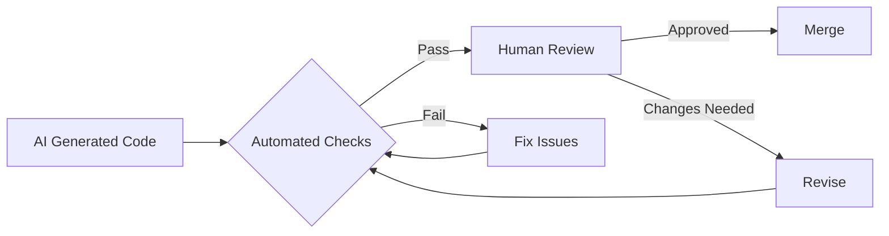
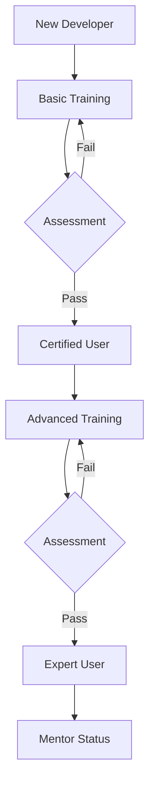

# 🏛️ Enterprise AI Development Governance Policy

## 📋 Executive Summary

This governance policy establishes guidelines for the responsible and effective use of AI-powered development tools within our organization. It ensures security, compliance, quality, and ethical standards while maximizing productivity benefits.

## 🎯 Policy Objectives

1. **Enable Innovation** - Empower developers with AI tools while maintaining control
2. **Ensure Security** - Protect intellectual property and sensitive data
3. **Maintain Compliance** - Meet regulatory and industry requirements
4. **Guarantee Quality** - Uphold code quality and reliability standards
5. **Promote Ethics** - Use AI responsibly and transparently

## 🔐 Security Guidelines

### Data Classification and Handling

| Data Type | AI Tool Usage | Requirements |
|-----------|---------------|--------------|
| **Public** | ✅ Allowed | Standard precautions |
| **Internal** | ✅ Allowed with restrictions | Remove sensitive identifiers |
| **Confidential** | ⚠️ Limited use | Approval required, audit trail |
| **Restricted** | ❌ Prohibited | No AI tool exposure |

### Code Security Requirements

```yaml
security_requirements:
  code_scanning:
    - frequency: "Every commit"
    - tools: ["SonarQube", "Checkmarx", "GitHub Security"]
    - severity_threshold: "No critical, max 3 high"
    
  secrets_management:
    - no_hardcoded_credentials: true
    - use_key_vault: true
    - rotate_keys_quarterly: true
    
  ai_generated_code:
    - mandatory_review: true
    - security_scan_required: true
    - attribution_required: true
```

## 📝 Usage Guidelines

### Acceptable Use

✅ **ALLOWED:**
- Code generation for standard business logic
- Documentation and comment generation
- Test case creation
- Code refactoring suggestions
- Performance optimization
- Bug fixing assistance

❌ **PROHIBITED:**
- Processing classified/restricted data
- Generating code for security-critical functions without review
- Bypassing code review processes
- Using for malicious purposes
- Sharing proprietary algorithms

### Code Attribution

All AI-generated code must include attribution:

```java
/**
 * AI-Assisted Development Notice
 * Tool: GitHub Copilot v1.x
 * Date: 2024-01-15
 * Developer: John Doe
 * Review Status: Approved by Jane Smith
 */
```

## 🏗️ Quality Standards

### Code Review Process



### Quality Gates

| Gate | Requirement | Enforcement |
|------|-------------|-------------|
| **Code Coverage** | Minimum 80% | CI/CD pipeline |
| **Complexity** | Cyclomatic < 10 | SonarQube |
| **Documentation** | All public APIs | PR review |
| **Security Scan** | Zero critical issues | Automated |
| **Performance** | Meet SLA benchmarks | Load testing |

## 📊 Compliance Framework

### Regulatory Requirements

- **GDPR**: No personal data in AI tools
- **SOC 2**: Audit trail for all AI usage
- **HIPAA**: Healthcare data isolation
- **PCI-DSS**: Payment data protection
- **ISO 27001**: Information security controls

### Audit Trail Requirements

```json
{
  "ai_usage_log": {
    "timestamp": "2024-01-15T10:30:00Z",
    "developer": "john.doe@company.com",
    "tool": "GitHub Copilot",
    "action": "code_generation",
    "file": "UserService.java",
    "lines_generated": 45,
    "review_status": "pending",
    "security_scan": "passed",
    "approver": null
  }
}
```

## 👥 Roles and Responsibilities

### AI Governance Committee

| Role | Responsibility | Authority |
|------|----------------|-----------|
| **Chief Technology Officer** | Strategic oversight | Policy approval |
| **Chief Information Security Officer** | Security standards | Veto on security issues |
| **Head of Development** | Implementation oversight | Tool selection |
| **Legal Counsel** | Compliance assurance | Legal guidance |
| **AI Ethics Officer** | Ethical guidelines | Ethics review |

### Development Teams

**Developers:**
- Follow all usage guidelines
- Document AI assistance
- Complete required training
- Report security concerns

**Team Leads:**
- Enforce policy compliance
- Review AI-generated code
- Track team metrics
- Provide feedback

**Architects:**
- Define acceptable patterns
- Review architecture changes
- Ensure scalability
- Maintain standards

## 📚 Training Requirements

### Mandatory Training Modules

1. **AI Tools Fundamentals** (4 hours)
   - Tool capabilities and limitations
   - Best practices
   - Security considerations

2. **Ethical AI Usage** (2 hours)
   - Bias prevention
   - Transparency requirements
   - Responsible development

3. **Security and Compliance** (3 hours)
   - Data classification
   - Compliance requirements
   - Incident reporting

4. **Advanced Techniques** (8 hours)
   - Prompt engineering
   - Multi-agent systems
   - Performance optimization

### Certification Path



## 🚨 Incident Response

### Incident Classification

| Severity | Description | Response Time | Escalation |
|----------|-------------|---------------|------------|
| **Critical** | Data breach, IP exposure | Immediate | CISO + Legal |
| **High** | Security vulnerability | 4 hours | Security Team |
| **Medium** | Policy violation | 24 hours | Team Lead |
| **Low** | Minor non-compliance | 48 hours | Document only |

### Response Procedures

1. **Identify** - Detect and classify incident
2. **Contain** - Prevent further damage
3. **Investigate** - Determine root cause
4. **Remediate** - Fix the issue
5. **Document** - Record lessons learned
6. **Improve** - Update policies/procedures

## 📈 Metrics and Monitoring

### Key Performance Indicators

```yaml
productivity_metrics:
  - code_velocity_improvement: ">30%"
  - bug_reduction_rate: ">40%"
  - time_to_market_improvement: ">25%"

quality_metrics:
  - code_coverage: ">80%"
  - security_score: ">90"
  - technical_debt_ratio: "<5%"

compliance_metrics:
  - policy_adherence: "100%"
  - training_completion: ">95%"
  - incident_rate: "<2_per_quarter"
```

### Monitoring Dashboard

- Real-time AI tool usage
- Security scan results
- Compliance status
- Quality metrics
- Cost tracking

## 🔄 Policy Maintenance

### Review Schedule

- **Quarterly**: Metrics review and minor updates
- **Semi-Annual**: Security and compliance review
- **Annual**: Full policy review and update

### Change Management

1. Propose changes through governance committee
2. Impact assessment and stakeholder review
3. Pilot testing with select teams
4. Full rollout with training
5. Monitor and adjust

## 📞 Support and Resources

### Internal Resources

- **AI Center of Excellence**: ai-coe@company.com
- **Security Team**: security@company.com
- **Training Portal**: training.company.com/ai
- **Policy Wiki**: wiki.company.com/ai-governance

### External Resources

- GitHub Copilot Documentation
- Industry Best Practices
- Regulatory Guidelines
- Ethics Frameworks

## ✅ Acknowledgment

By using AI development tools, I acknowledge that I have read, understood, and agree to comply with this governance policy.

```
Employee Name: _______________________
Date: _______________________
Signature: _______________________
```

---

**Version:** 1.0  
**Effective Date:** January 1, 2024  
**Next Review:** April 1, 2024  
**Owner:** AI Governance Committee 